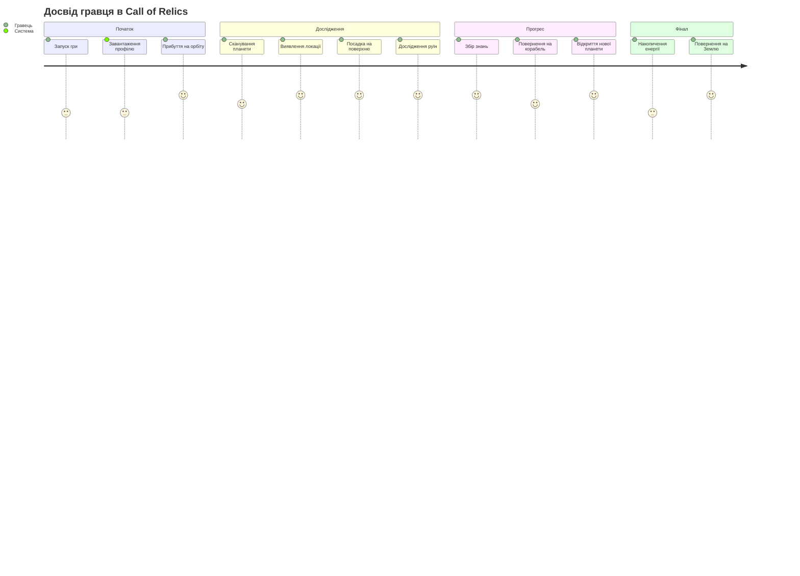
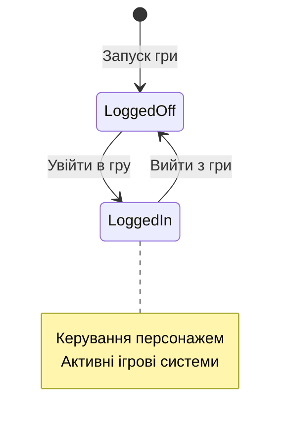
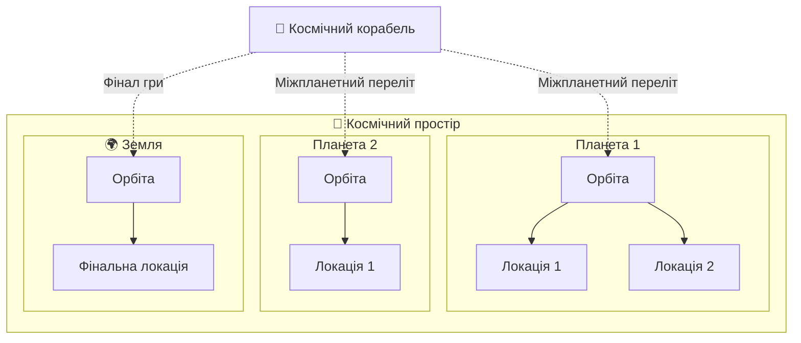
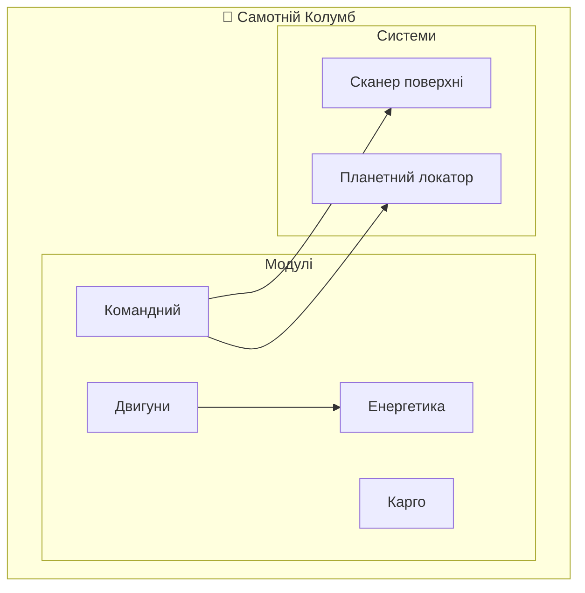
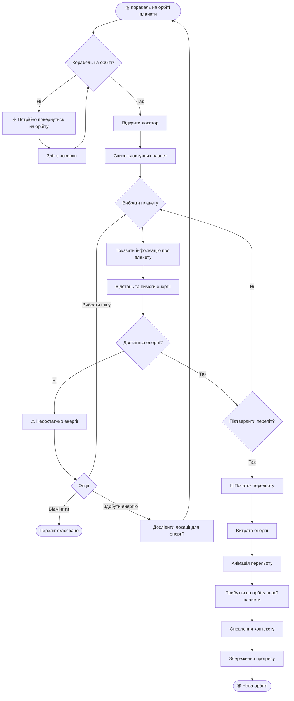
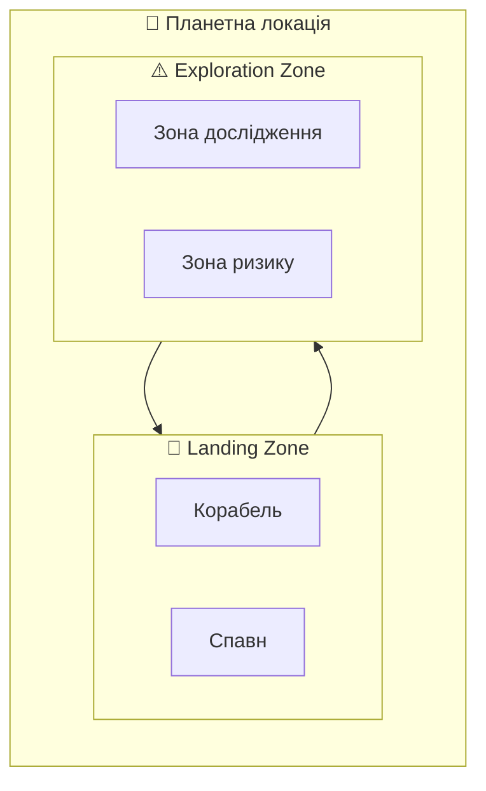
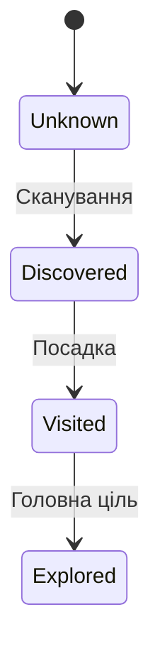
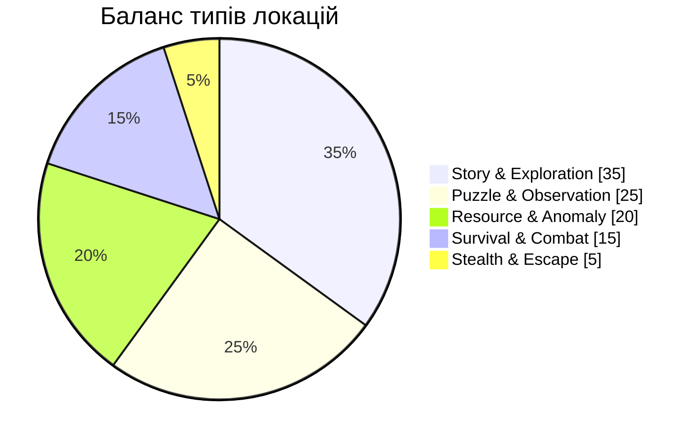

# GAME DESIGN DOCUMENT  
## Call of Relics: Orbital Silence

**Жанр:** Однокористувацька дослідницька рольова гра (Single-player Exploration RPG)  
**Платформа:** Roblox  
**Версія документа:** Draft 1.4
**Статус:** Active Development  

---

## Призначення документа

Цей документ описує ігрову концепцію, сценарну основу, світ, ролі гравця,
базові правила та ключові системи гри **Call of Relics: Orbital Silence**.

Game Design Document призначений для:
- геймдизайнера
- сценариста
- технічної команди
- подальшої деталізації в **Technical Design Document (TDD)** та **Lore Document**

Документ є живим і буде доповнюватися та уточнюватися у процесі розробки.

---

# 1. ЗАГАЛЬНА КОНЦЕПЦІЯ

**Call of Relics: Orbital Silence** — це однокористувацька дослідницька рольова гра
про покинуті планети, загадкові місця на їх поверхні, таємні знання
та сигнали давньої цивілізації, які ніколи не замовкли.

Гравець — землянин, освідчений науковець-дослідник,
учасник далекої міжзоряної експедиції,
який опиняється ізольованим далеко від Землі
через втрату можливості міжзоряного повернення.

Гра не є історією про війну або завоювання.
Вона зосереджена на:
- дослідженні
- спостереженні
- поступовому відкритті сенсу
- відповідальності за знання

Ключова фантазія гравця:
> *Ти — не герой.
> Ти — той, хто відповів на сигнал.*

### Шлях гравця (Player Journey)

---

# 2. ПЕРСОНАЖ ГРАВЦЯ (PLAYER CHARACTER)

Гравець керує одним персонажем — землянином, освідченим науковцем-дослідником, учасником міжзоряної експедиції до джерела загадкових сигналів.

> *Ти — не герой. Ти — той, хто відповів на сигнал.*

### Глобальні стани

| Стан | Опис |
|------|------|
| **Logged Off** | Заставка гри, ігрові системи неактивні |
| **Logged In** | Керування персонажем, збереження прогресу |

### Роль персонажа

| Роль | Опис |
|------|------|
| Науковець-дослідник | Універсальний спеціаліст широкого профілю |
| Пілот корабля | Керує космічним кораблем «Самотній Колумб» |
| Дослідник планет | Сканує та досліджує планетні локації |
| Збирач знань | Накопичує knowledge (ніколи не втрачається) |

### Початкові знання

На початку гри персонаж володіє базовими знаннями у галузях:
виживання, астрономія, геологія, фізика, хімія, комп'ютерні науки.

> **Детальніше:** Див. [PLAYER.md](PLAYER.md) — повний опис персонажа, профілю гравця, глобальних станів, системи знань та прогресії.

---

# 3. ОГЛЯД ІГРОВОГО СВІТУ (WORLD OVERVIEW)

Події гри відбуваються у відкритому космічному просторі.

Космічний простір поділений на окремі **планети**,
кожна з яких є самостійним ігровим світом
з власними фізичними та атмосферними характеристиками.

---

## 3.1. Планети

Кожна планета:
- має власну атмосферу
- має власну гравітацію
- може мати унікальні фізичні або хімічні умови
- випромінює закодовані електромагнітні сигнали

Саме ці сигнали є причиною дослідження.

Планети:
- не є відкритими світами
- складаються з ізольованих локацій
- доступні для дослідження лише через корабель

---

## 3.2. Планетні локації

Кожна планета містить кілька **планетних локацій**.

Планетна локація:
- є окремою ділянкою поверхні планети
- має власний сюжет, правила та ігрові механіки
- є самостійною аркадною грою
- вимагає фізичної присутності гравця для дослідження

Локація вважається дослідженою
лише після досягнення її головної цілі.

---

## 3.3. Космічний корабель як частина світу

Космічний корабель гравця:
- постійно перебуває на орбіті поточної планети
- або здійснює посадку на планетну локацію
- не є частиною поверхні планети

Корабель виконує роль:
- мобільної бази
- точки спавну
- зони збереження прогресу
- наративного центру гри

З корабля гравець бачить:
- зоряне небо, характерне для регіону
- поточну планету з орбіти

Світ змінюється залежно від того,
біля якої планети перебуває корабель.

---
# 4. НАРАТИВНА ЗАВ’ЯЗКА (NARRATIVE SETUP)

Початок гри пов’язаний із науковим відкриттям,
яке змінює уявлення людства про життя у Всесвіті.

---

## 4.1. Виявлення сигналів

Космічний науково-дослідницький телескоп землян
фіксує серію аномальних електромагнітних сигналів,
що надходять з кількох віддалених планет.

Особливості сигналів:
- вони мають складну, повторювану структуру
- не відповідають жодним відомим природним явищам
- виглядають як навмисно створені або підтримувані

Сигнали не є повідомленням у звичному розумінні.
Вони радше нагадують **постійний запит або маяк**.

Це явище отримує неофіційну назву — *The Call* («Поклик»).

---

## 4.2. Ініціація експедиції

Виявлення сигналів привертає увагу:
- наукової спільноти
- урядів
- великих приватних корпорацій

Велика і фінансово потужна земна аерокосмічна корпорація  
**«Нащаддя Ілона»** бере на себе ініціативу
створення експериментальної міжзоряної експедиції.

Мета експедиції:
- досягти джерела сигналів
- дослідити планети
- з’ясувати походження феномену
- зібрати наукові та технологічні дані

---

## 4.3. Крах початкового плану

Для експедиції будується унікальний автономний корабель
з розрахунком на тривале перебування у глибокому космосі.

Під час міжзоряного перельоту:
- корабель витрачає майже весь запас енергії
  для міжзоряних двигунів

Після прибуття:
- міжзоряний переліт у зворотному напрямку стає неможливим
- повернення на Землю відкладається на невизначений термін

Це перетворює наукову місію
на довготривалу автономну експедицію.

---

# 5. КОСМІЧНИЙ КОРАБЕЛЬ (SPACE SHIP)

Космічний корабель **«Самотній Колумб»** є ключовим елементом гри — як геймплейним, так і наративним.

### Роль корабля

| Роль | Опис |
|------|------|
| Мобільна база | Постійне місце перебування гравця |
| Точка спавну | Гравець з'являється на кораблі після входу в гру |
| Збереження | Автоматичне збереження при переходах |
| Командний центр | Прийняття ключових рішень |

### Модулі корабля

| Модуль | Призначення |
|--------|-------------|
| Командний | Навігація, сканування, планування |
| Двигуни | Орбітальні маневри, міжпланетні перельоти |
| Енергетика | Живлення всіх систем |
| Карго | Зберігання ресурсів та артефактів |

### Орбітальний стан vs Поверхня

| Аспект | Орбіта | Поверхня |
|--------|--------|----------|
| Режим | Стратегічний | Тактичний |
| Сканери | Доступні | Недоступні |
| Ризик | Безпека | Активна загроза |

### Обмеження на старті

На початку гри корабель:
- Не має достатньо енергії для повернення на Землю
- Може виконувати лише локальні орбітальні маневри
- Може здійснювати посадки та зльоти в межах планети

> **Детальніше:** Див. [SPACESHIP.md](SPACESHIP.md) — повний опис корабля, модулів, робочих місць, системи сканування, трапу та орбітального стану.

---

# 6. МІЖПЛАНЕТНІ ПЕРЕЛЬОТИ (INTERPLANETARY TRAVEL)

Міжпланетні перельоти є ключовим елементом розширення ігрового світу.

---

## 6.1. Загальні правила перельотів

Подорож між планетами:

- можлива лише з орбіти
- потребує енергії міжзоряних двигунів
- залежить від відстані до планети

Чим далі планета:
- тим більше енергії потрібно
- тим вищі вимоги до корабля

---

## 6.2. Енергія як обмежуючий фактор

Енергія використовується для:
- міжпланетних перельотів
- підтримки корабельних систем
- роботи сканерів

Нестача енергії:
- обмежує доступні маршрути
- змушує гравця повертатися до досліджень
- формує довготривалу прогресію

### Activity Diagram: Міжпланетний переліт

---

## 6.3. Повернення на Землю як фінальна мета

Повернення на Землю:

- потребує значно більшої кількості енергії
- вимагає повного розвитку корабля
- є фінальною ціллю гри

На ранніх етапах гри:
- цей маршрут недоступний
- навіть якщо Земля відома гравцю

Це створює:
- довгострокову мотивацію
- чітку кінцеву мету
- логічне завершення історії

---
# 7. ПЛАНЕТНІ ЛОКАЦІЇ (PLANET LOCATIONS)

Планетні локації є основними одиницями ігрового контенту. Гра масштабується через множину планет і локальних сценаріїв.

### Стани локації

| Стан | Опис |
|------|------|
| Unknown | Не виявлена |
| Discovered | Знайдена з орбіти, доступна для посадки |
| Visited | Гравець фізично відвідав |
| Explored | Головна ціль досягнута |

### Класифікація локацій (12 типів)

| Тип | Фокус | Ризик |
|-----|-------|-------|
| Story | Наратив та лор | Мінімальний |
| Exploration | Дослідження простору | Низький |
| Puzzle | Логічні задачі | Середній |
| Survival | Виживання | Високий |
| Combat | Бойове протистояння | Високий |

### Невдалі стани

| Результат | Знання | Ресурси | Прогрес |
|-----------|--------|---------|---------|
| ✅ Успіх | Збережено | Збережено | Зараховано |
| 🏃 Втеча | Збережено | Частково втрачено | Не зараховано |
| 💀 Смерть | **Збережено** | Втрачено | Не зараховано |

> *Невдача є частиною дослідження, а не покаранням.*

> **Детальніше:** Див. [PLANET_LOCATIONS.md](PLANET_LOCATIONS.md) — повний опис системи локацій, класифікації, станів, критеріїв дослідження та наслідків невдач.

---

# 8. ЗБЕРЕЖЕННЯ ПРОГРЕСУ ТА PERSISTENCE (RPG)

Гра є однокористувацькою RPG.
Увесь прогрес належить конкретному гравцю і має зберігатися між ігровими сесіями.

---

## 8.1. Дані, що зберігаються

Для кожного гравця зберігається:

### Стан космічного корабля
- рівень розвитку модулів
- доступні системи
- поточний запас енергії

### Місце перебування корабля
- поточна планета
- орбітальний стан

### Планети
- список виявлених планет

### Планетні локації
- isDiscovered
- isVisited
- статус дослідження

### Дані гравця
- накопичені знання
- ресурси
- сюжетні відкриття

---

## 8.2. Точка збереження

Базова точка збереження:
- поява гравця на Космічному Кораблі

Збереження відбувається:
- при вході в гру
- при виході з гри
- після повернення з локації
- після ключових подій (TODO)

---

## 8.3. Відновлення прогресу

При повторному вході у гру:

- гравець з’являється на Космічному Кораблі
- корабель перебуває на орбіті останньої планети, де був гравець
- весь прогрес відновлюється

Альтернативний сценарій: Гравець спавниься в кабіні пілота Корабля на останній планетній локації

Це забезпечує:
- безперервність RPG-досвіду
- логічний контекст гри
- відсутність примусових рестартів

---
# 9. ПОЧАТОК ГРИ ТА ПОВЕРНЕННЯ ГРАВЦЯ

Цей розділ описує сценарій першого входу гравця у світ гри,
а також правила повернення досвідченого гравця.

### Етапи прогресії гравця (Gantt)

```mermaid
gantt
    title Прогресія гравця в Call of Relics
    dateFormat X
    axisFormat %s

    section Початок
    Boot Sequence           :a1, 0, 5
    Перша орбіта           :a2, after a1, 10

    section Планета 1
    Сканування             :b1, after a2, 5
    Локація 1 - Story      :b2, after b1, 15
    Локація 2 - Exploration :b3, after b2, 20

    section Розвиток
    Апгрейд сканера        :c1, after b3, 5
    Пошук нової планети    :c2, after c1, 10

    section Планета 2+
    Нові локації           :d1, after c2, 30
    Збір енергії           :d2, after d1, 20

    section Фінал
    Шлях до Землі          :e1, after d2, 10
    Повернення             :e2, after e1, 5
```

---

## 9.1. Перший запуск гри (New Player)

Під час першого входу у гру:

1. Гравець перебуває у стані Logged Off (заставка гри).
2. Після входу у гру (Logged In):
   - ініціалізується ігровий світ
   - створюється контекст першої планети
3. Гравець з’являється на Космічному Кораблі **«Самотній Колумб**, який перебуває  на орбіті першої планети експедиції.

На цьому етапі:
- корабель має базову комплектацію
- доступні лише початкові системи
- більшість можливостей обмежені

Гравець поступово знайомиться з:
- інтерфейсом корабля
- сканерами
- концепцією локацій

---

## 9.2. Повернення досвідченого гравця

Якщо гравець вже має збережений прогрес:

- гра відновлюється з Космічного Корабля
- корабель перебуває на орбіті останньої планети
- весь збережений контекст відновлюється

Це дозволяє:
- не повторювати вже виконані дії
- продовжувати гру з логічної точки
- зберігати відчуття безперервності історії

---

# 10. ПЕРША ПЛАНЕТА — «Біллі Рубін»

Перша планета гри виконує роль
навчального та наративного вступу.

---

## 10.1. Загальний опис планети

Назва планети: **Біллі Рубін**

Характеристики:
- відносно стабільна атмосфера
- помірна гравітація
- мінімальні екстремальні умови

Планета:
- безпечна для початкового дослідження
- не містить надмірних загроз
- дозволяє гравцю освоїти базові механіки

---

## 10.2. Планетні локації планети «Біллі Рубін»

### Планетна локація 1: «Візитка»
Тип: **Story Location**

Призначення:
- перше знайомство з лором гри
- пояснення природи сигналів
- формування відчуття загадки

Рівень ризику: мінімальний

---

### Планетна локація 2: «Садочок»
Тип: **Exploration Location**

Призначення:
- вільне дослідження простору
- навчання навігації
- знайомство з ресурсами

Рівень ризику: низький

---

## 10.3. Роль першої планети

Планета «Біллі Рубін»:
- не карає гравця суворо
- заохочує дослідження
- формує базове розуміння гри

Це планета навчання,
а не перевірки.

---

# 11. ТЕМИ ТА АТМОСФЕРА

Гра будується навколо чітко визначених тем
та емоційного тону.

---

## 11.1. Основні теми

- Самотність у космосі
- Відповідальність за знання
- Контакт без прямого діалогу
- Дослідження без гарантій
- Спадщина зниклих цивілізацій

---

## 11.2. Атмосфера

Атмосфера гри:
- стримана
- напружено-тиха
- медитативна

Візуально та звуково:
- мінімалістичний інтерфейс
- приглушені кольори
- атмосферні звуки космосу і планет

Гра уникає:
- надмірної динаміки
- постійної небезпеки
- перевантаження інформацією

---

# 12. ПРИНЦИПИ ДИЗАЙНУ

Ці принципи є базовими для всіх дизайнерських рішень у грі.

---

## 12.1. Принципи

1. **Дослідження важливіше за швидкість**
2. **Невідоме має залишатися невідомим**
3. **Знання цінніше за ресурси**
4. **Невдача — частина досвіду**
5. **Гравець не обраний — він відповідальний**

---

## 12.2. Обмеження як інструмент

Обмеження (енергія, доступ, ризики) використовуються не для покарання, а для формування рішень.

---

# 13. ІДЕЇ ПОДАЛЬШОГО РОЗВИТКУ ГРИ (FUTURE IDEAS)

Цей розділ містить потенційні напрямки розвитку гри і не є частиною базового релізу.

---

## 13.1. Нові типи планет

- Планети з екстремальними умовами
- Нестабільні або аномальні світи
- Зруйновані або штучні планети

---

## 13.2. Поглиблення лору

- Багаторівневі сигнали
- Часткове розшифрування
- Суперечливі інтерпретації

---

## 13.3. Розвиток корабля

- Нові модулі
- Альтернативні конфігурації
- Моральні вибори в апгрейдах

---

## 13.4. Альтернативні фінали

- Повернення на Землю
- Залишитися у космосі
- Втручання у сигнал
- Розрив контакту

---

## 13.5. Метагеймплей

- Архів відкриттів
- Хронологія експедиції
- Аналітичні журнали

---

# CHANGELOG

| Версія | Дата | Зміни |
|--------|------|-------|
| Draft 1.4 | 2026-01-21 | Декомпозиція: об'єднано секції 2+5→PLAYER.md, 6+7+8+9→SPACESHIP.md, 11-15→PLANET_LOCATIONS.md; перенумеровано розділи 1-13 |
| Draft 1.3 | 2026-01-21 | Додано розширені Mermaid діаграми: Journey (1), Pie chart, Quadrant chart, Gantt |
| Draft 1.2 | 2026-01-21 | Додано UseCase діаграму, Activity діаграми для дослідження, сканування, перельотів |
| Draft 1.1 | 2026-01-15 | Початкова повна версія документа |

---

**КІНЕЦЬ GAME DESIGN DOCUMENT**

