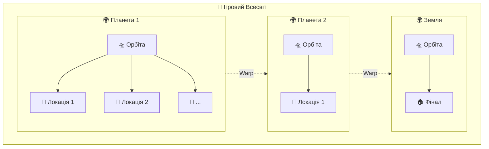
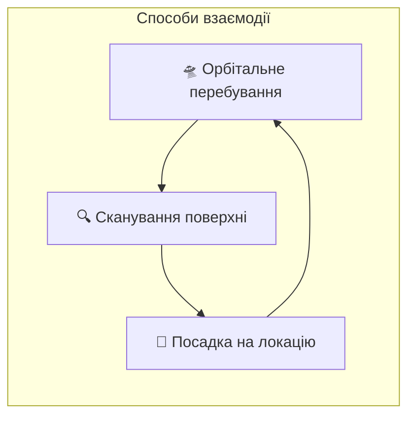
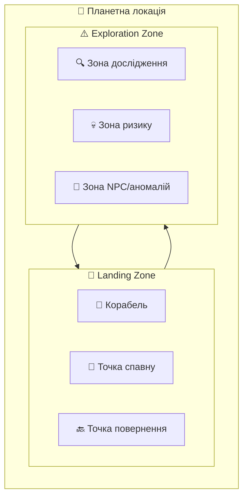
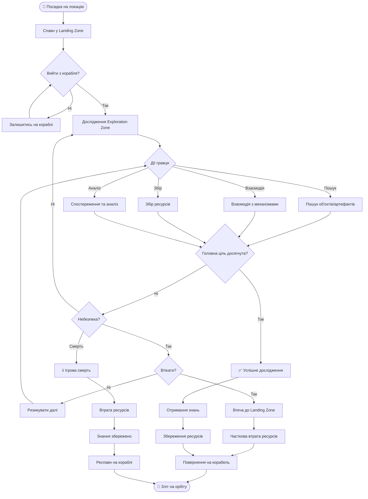
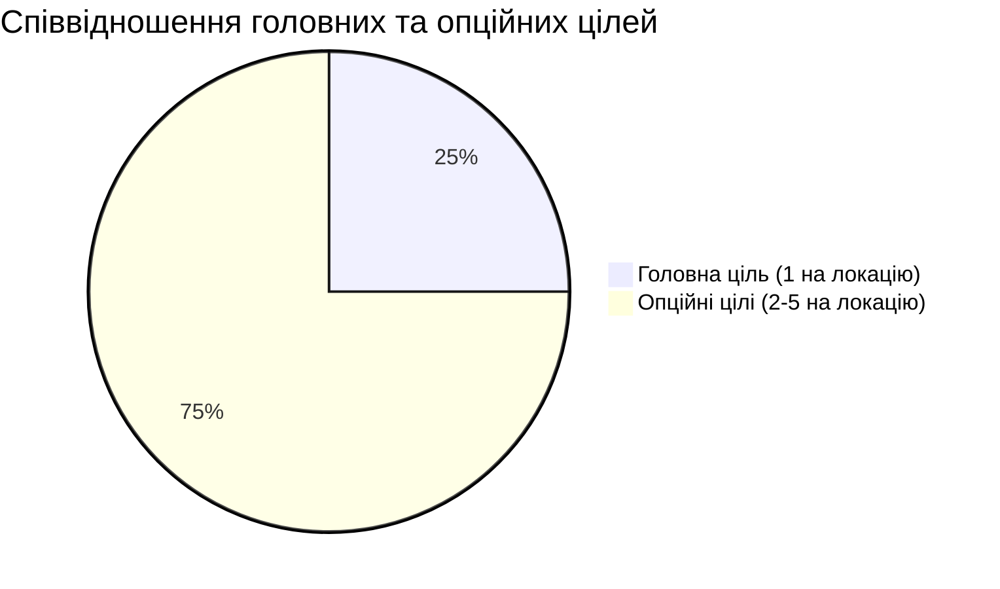
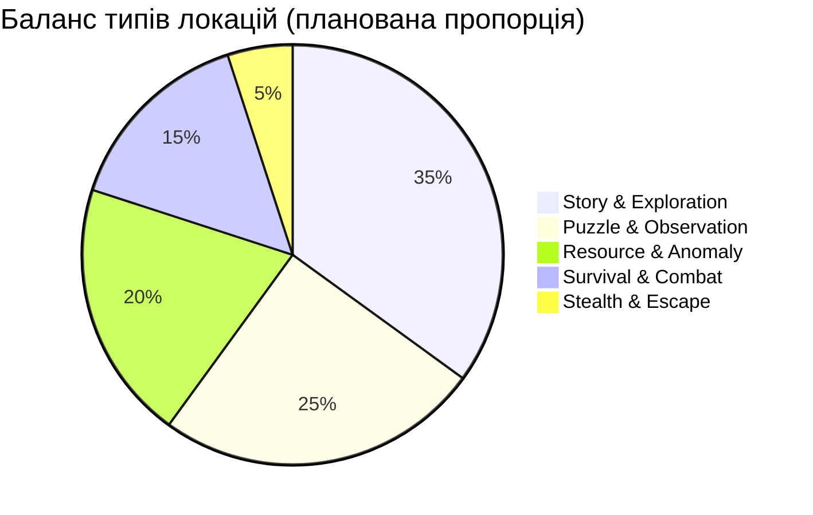
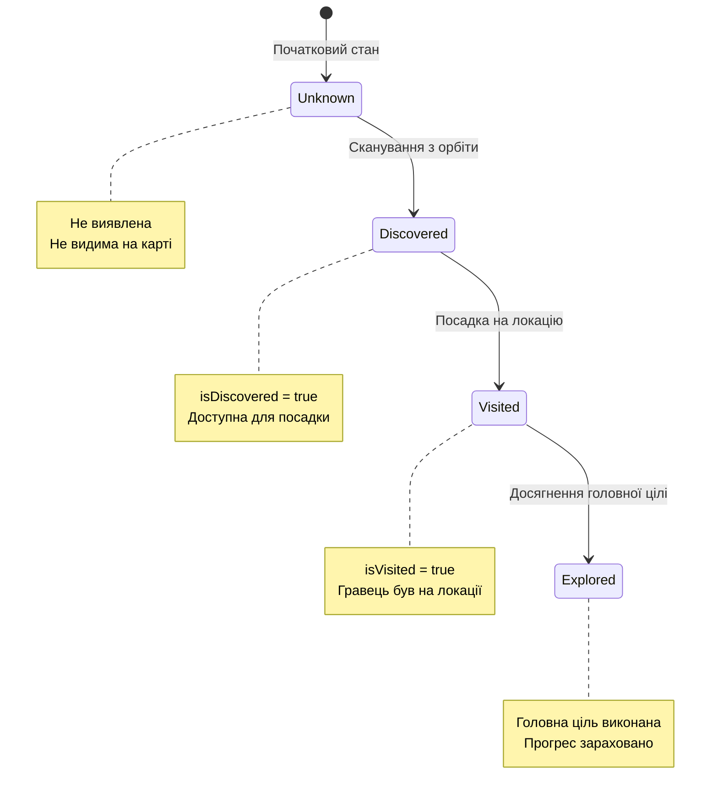
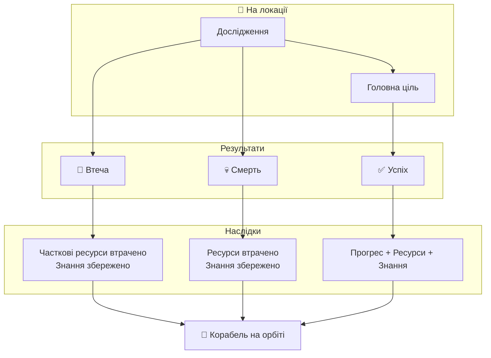

# Планетні Локації — Система Дослідження
**Project:** Call of Relics: Orbital Silence
**Document Type:** Game Design — Planet Locations System

---

## 1. ЗАГАЛЬНИЙ ОПИС

Планетні локації є основними одиницями ігрового контенту. Гра масштабується не за рахунок одного великого світу, а через множину окремих планет і локальних сценаріїв.

### Ключова концепція

> *Кожна локація — це окрема "гра в грі" зі своїми правилами, цілями та ризиками.*

### Ієрархія ігрового світу

---

## 2. ПЛАНЕТА ЯК ІГРОВА ОДИНИЦЯ

Планета:
- є тематичним контейнером
- має власну атмосферу, гравітацію та візуальний стиль
- містить кілька планетних локацій
- випромінює один або кілька аномальних сигналів

Планета **не є** ігровою локацією у класичному сенсі. Гравець **ніколи не пересувається по всій планеті** безпосередньо.

### Взаємодія з планетою

| Спосіб | Опис |
|--------|------|
| Орбіта | Стратегічне планування, безпечна зона |
| Сканування | Виявлення нових локацій |
| Посадка | Фізичне дослідження |

---

## 3. СТРУКТУРА ПЛАНЕТНОЇ ЛОКАЦІЇ

Кожна планетна локація:
- є ізольованою ділянкою поверхні планети
- доступна лише шляхом посадки корабля
- має власний сценарій, правила та цілі
- є самостійною аркадною грою

### Landing Zone (Безпечна зона)

| Елемент | Опис |
|---------|------|
| Корабель | Місце посадки, точка збереження |
| Точка спавну | Місце появи гравця |
| Точка повернення | Зона для повернення на корабель |

### Exploration Zone (Зона дослідження)

| Елемент | Опис |
|---------|------|
| Зона дослідження | Основна ігрова територія |
| Зона ризику | Активні загрози та небезпеки |
| Зона NPC/аномалій | Спеціальні об'єкти та істоти |

---

## 4. ЛОКАЦІЯ ЯК АРКАДНА ГРА

Кожна планетна локація — це **"гра в грі"**:
- має чіткий початок (посадка)
- має власні правила
- має головну ціль
- може мати кілька опційних цілей
- має чіткий або умовний фінал

### Activity Diagram: Дослідження локації

### Можливі дії гравця

| Дія | Опис |
|-----|------|
| Дослідження простору | Пересування по локації |
| Пошук об'єктів | Знаходження артефактів |
| Проходження пасток | Уникання небезпек |
| Взаємодія з механізмами | Активація пристроїв |
| Втеча | Екстрене повернення |
| Боротьба | Протистояння з NPC |
| Спостереження | Аналіз явищ |

---

## 5. СИСТЕМА ЦІЛЕЙ

### Головна ціль

| Властивість | Опис |
|-------------|------|
| Обов'язковість | Потрібна для прогресу |
| Визначення | Фіксується сценарно |
| Завершення | Визначає успішне дослідження |

### Опційні цілі

| Властивість | Опис |
|-------------|------|
| Обов'язковість | Не обов'язкові |
| Зміна | Можуть оновлюватися |
| Винагорода | Додаткові ресурси/знання |

### Порівняння типів цілей

---

## 6. КЛАСИФІКАЦІЯ ЛОКАЦІЙ (12 типів)

Для уніфікації дизайну використовується система типів локацій. Кожна локація має:
- **Primary Type** — основний тип
- **Secondary Type** (опціонально) — другорядний тип

### 6.1. Story Location
**Фокус:** Наратив та лор
- Мінімальний ризик
- Максимальний контекст
- Розповідь історії світу

### 6.2. Exploration Location
**Фокус:** Дослідження простору
- Відкриття територій
- Картографування
- Збір базових ресурсів

### 6.3. Puzzle Location
**Фокус:** Логічні задачі
- Взаємодія з системами
- Розв'язання головоломок
- Механічні загадки

### 6.4. Survival Location
**Фокус:** Виживання
- Небезпечні умови
- Обмежені ресурси
- Таймери та тиск

### 6.5. Combat Location
**Фокус:** Бойове протистояння
- NPC або істоти
- Активна загроза
- Тактичні рішення

### 6.6. Hybrid Location
**Фокус:** Комбінація типів
- Змішані механіки
- Варіативний геймплей
- Складна структура

### 6.7. Stealth Location
**Фокус:** Приховане пересування
- Уникання виявлення
- Тіньова механіка
- Патрулі та зони видимості

### 6.8. Escape Location
**Фокус:** Втеча
- Небезпечна ситуація
- Швидкість рішень
- Часовий тиск

### 6.9. Resource Location
**Фокус:** Збір ресурсів
- Високий видобуток
- Присутній ризик
- Економічна вигода

### 6.10. Anomaly Location
**Фокус:** Дивні явища
- Нестабільність
- Незрозумілі правила
- Експериментування

### 6.11. Observation Location
**Фокус:** Спостереження
- Аналіз подій
- Пасивне дослідження
- Збір інформації

### 6.12. Trial / Test Location
**Фокус:** Перевірка
- Тестування навичок
- Виклики гравцю
- Оцінка знань

### Розподіл типів локацій

### Матриця ризик/винагорода

### Ризик vs Винагорода

| Тип | Ризик | Винагорода | Квадрант |
|-----|-------|------------|----------|
| Story | Низький | Висока | Безпечний прогрес |
| Exploration | Низький | Середня | Безпечний прогрес |
| Puzzle | Середній | Висока | Безпечний прогрес |
| Observation | Низький | Середня | Навчальні |
| Resource | Середній | Висока | Високий потенціал |
| Anomaly | Високий | Висока | Високий потенціал |
| Survival | Високий | Висока | Небезпечні |
| Combat | Високий | Дуже висока | Небезпечні |
| Stealth | Високий | Середня | Небезпечні |
| Escape | Високий | Середня | Небезпечні |

### Таблиця характеристик типів

| Тип | Ризик | Винагорода | Складність |
|-----|-------|------------|------------|
| Story | ⭐ | ⭐⭐⭐ | ⭐ |
| Exploration | ⭐⭐ | ⭐⭐ | ⭐⭐ |
| Puzzle | ⭐⭐ | ⭐⭐⭐ | ⭐⭐⭐ |
| Observation | ⭐ | ⭐⭐ | ⭐⭐ |
| Resource | ⭐⭐⭐ | ⭐⭐⭐⭐ | ⭐⭐ |
| Anomaly | ⭐⭐⭐ | ⭐⭐⭐⭐ | ⭐⭐⭐⭐ |
| Survival | ⭐⭐⭐⭐ | ⭐⭐⭐⭐ | ⭐⭐⭐ |
| Combat | ⭐⭐⭐⭐⭐ | ⭐⭐⭐⭐⭐ | ⭐⭐⭐⭐ |
| Stealth | ⭐⭐⭐⭐ | ⭐⭐⭐ | ⭐⭐⭐⭐ |
| Escape | ⭐⭐⭐⭐ | ⭐⭐⭐ | ⭐⭐⭐ |
| Hybrid | ⭐⭐⭐ | ⭐⭐⭐⭐ | ⭐⭐⭐⭐ |
| Trial | ⭐⭐⭐ | ⭐⭐⭐⭐ | ⭐⭐⭐⭐⭐ |

### SF-сценарії за типами локацій

Кожен тип локації може бути наповнений конкретним сценарієм, заснованим на літературних SF-джерелах. Тип не унікальний — один тип може породити кілька різних сценаріїв.

> **Джерела:** [SF_REFERENCES.md](SF_REFERENCES.md) та файли за періодами

| Тип | Сценарій | SF-джерела |
|-----|----------|------------|
| **Story** | Порожнє місто з голографічними записами зниклих мешканців, які програються по колу — уривки побуту, ритуалів, останніх днів | Сімак «Місто», Вулф «Книга Нового Сонця» |
| **Story** | Бібліотека вимерлої цивілізації, де «книги» вбудовані в стіни як геологічні формації — треба навчитися їх читати | Вулф «Книга Нового Сонця», Брін «Піднесення» (Бібліотека) |
| **Story** | Монумент-маяк, що транслює послання від зниклої раси: пояснення їхнього відходу через трансценденцію | Кларк «2001: Космічна одіссея», Іган «Діаспора» |
| **Story** | Підземний храм з фресками, що зображують історію контакту зниклої раси з ще давнішою цивілізацією | Рейнольдс «Простір Одкровення» (Амарантіни), Нортон «Фореруннер» |
| **Story** | Кімната Промовця: зал з акустичним резонансом, де стіни «розповідають» історію загиблого, якщо стати в центрі | Кард «Голос тих, хто відійшов» |
| **Exploration** | Кладовище кораблів: поле давніх суден різних рас, вбитих у ґрунт планети — кожен корабель із залишками технологій | Брін «Зоряний прилив» (флот Прогеніторів), Рейнольдс «Запоруки вічності» |
| **Exploration** | Тераформована поверхня з покинутою біологічною технологією: живі машини, що ще працюють, але без господарів | Чайковські «Діти часу» (павуча технологія), Робінсон «Марсіанська трилогія» |
| **Exploration** | Підземний лабіринт з архітектурою для нелюдських тіл: коридори вертикальні, кімнати сферичні, двері — діафрагми | Чайковські «Діти часу», Герберт «Вулик Хельстрома» |
| **Exploration** | Покинута орбітальна фабрика, де автоматика продовжує створювати незрозумілі скульптури з космічного сміття | Гібсон «Граф Нуль» (скульптури ШІ), Стерлінг «Схізматриця» |
| **Puzzle** | Давній механізм-портал, що вимагає правильної послідовності активації — підказки розкидані по локації як символи | Кларк «Рама» (внутрішні системи), Стругацькі «Пікнік на узбіччі» |
| **Puzzle** | Лінгвістична загадка: дешифрування написів зниклої раси, де письмо нелінійне — кожен символ є цілим реченням | Чан «Історія твого життя» (Гептапод Б), Ділейні «Вавилон-17» |
| **Puzzle** | Гравітаційна головоломка на планеті зі змінною гравітацією: шлях через структуру залежить від маси та інерції | Клемент «Експедиція "Тяжіння"», Лем «Едем» |
| **Puzzle** | Музична шкатулка-планетарій: налаштування резонансних частот активує карту зоряного неба з маршрутом | Лем «Голос Господа» (амбівалентний сигнал), Кларк «2001» (маяк-послідовність) |
| **Puzzle** | Система замкнутого всесвіту: пройшовши крізь структуру, гравець опиняється на початку, але щось змінилося | Чан «Вежа Вавилону», Желязни «Хроніки Амбера» |
| **Survival** | Планета з циклічним «вимиканням»: зірка періодично гасне, температура падає, треба встигнути до укриття | Віндж «Глибина в небі» (зірка ОнОфф), Олдісс «Теплиця» |
| **Survival** | Ворожа біосфера, що активно трансформує вторгнення: спори змінюють зір, ліс росте навколо, шлях зникає | Вандермеєр «Анігіляція» (Зона Ікс), Батлер «Світанок» (Оанкалі) |
| **Survival** | Руїни з вичерпаною атмосферою: кисень лише в запечатаних камерах, треба планувати маршрут між ними | Пол «Ворота» (ризик як механіка), Голдеман «Нескінченна війна» |
| **Survival** | Сонячний шторм: періодичні електромагнітні хвилі вимикають обладнання, треба ховатися за металевими стінами | Бенфорд «У океані ночі», Лю Цісінь «Задача трьох тіл» (софони) |
| **Combat** | Автоматичні захисні системи руїн: дрони-стражі, лазерні сітки, механічні ловушки — все ще працюють через тисячоліття | Бенфорд «Великий Потік Ночі» (Меки), Сіммонс «Гіперіон» (Шрайк) |
| **Combat** | Біологічні охоронці, вирощені вимерлою расою: нерозумні, але ефективні хижаки, запрограмовані на захист території | Герберт «Дюна» (піщані черви), Чайковські «Діти руїн» (Ноден) |
| **Combat** | Рій мікродронів, що реагує на рух: повільне пересування безпечне, швидке — провокує атаку | Лем «Непереможний» (хмара мікроавтоматів), Воттс «Сліпобачення» (скремблери) |
| **Hybrid** | Жива структура, що реагує на присутність: створює коридори (exploration), генерує голоси (puzzle), атакує при помилках (combat) | Воттс «Сліпобачення» (Роршах), Вандермеєр «Анігіляція» |
| **Hybrid** | Гробниці Часу: структури, де час тече інакше — треба досліджувати (exploration), розгадувати часові парадокси (puzzle), виживати при зсувах (survival) | Сіммонс «Гіперіон» (Гробниці Часу), Віндж «Зони Думки» |
| **Hybrid** | Покинута станція між двома ворогуючими автоматичними системами: треба пройти (stealth), зібрати дані (resource), не потрапити під перехресний вогонь (combat) | Черрі «Даунбілоу Стейшн», Бенкс «Ексцесія» |
| **Stealth** | Руїни з активними ШІ-вартовими, що патрулюють за фіксованими маршрутами — виявлення = негайна атака | Бенкс «Інверсії» (приховані агенти), Лекі «Слуги правосуддя» |
| **Stealth** | Територія «Темного лісу»: давня система спостереження слухає сигнали — будь-яке випромінювання видає позицію | Лю Цісінь «Темний ліс», Бенфорд «Через море сонць» («тихо, вони слухають») |
| **Stealth** | Гніздо сплячих біомеханічних сутностей: будь-який шум розбудить їх — треба пройти повз, збираючи артефакти | Віндж «Пламя над безоднею» (Чума), Герберт «Дюна» (йти без ритму) |
| **Escape** | Активація артефакту запускає ланцюгову реакцію: структура руйнується, треба встигнути до корабля | Стругацькі «Пікнік на узбіччі» (Зона), Рейнольдс «Простір Одкровення» (пробудження Інгібіторів) |
| **Escape** | Пробуджена давня загроза: дослідження розбудило щось, що спало мільйони років — тепер воно прокинулось | Віндж «Пламя над безоднею» (Чума з Трансценді), Бенфорд «Великий Потік Ночі» |
| **Escape** | Гравітаційна аномалія наростає: планета починає розриватися, уламки здіймаються в повітря — зворотний відлік | Пол «Ворота» (непередбачуваний FTL), Лю Цісінь «Кінець смерті» (вимірна зброя) |
| **Resource** | Мінеральні жили в стінах руїн, але стіни випромінюють радіацію — обмежений час видобутку | Стерлінг «Схізматриця» (орбітальне сміття як ресурс), Нівен «Світ-Кільце» |
| **Resource** | Біологічне жнива: інопланетна флора виробляє цінні речовини, але збирання привертає хижаків | Герберт «Дюна» (збір спайсу), Олдісс «Теплиця» (небезпечна біосфера) |
| **Resource** | Архів даних зниклої цивілізації: тисячі інформаційних кристалів, але лише частину можна забрати на корабель | Брін «Піднесення» (Бібліотека), Віндж «Глибина в небі» (Архів Ченів) |
| **Anomaly** | Зона спотворення реальності: фізичні закони працюють інакше, об'єкти змінюють форму, простір нелінійний | Стругацькі «Пікнік на узбіччі» (Зона), Вандермеєр «Анігіляція» (Зона Ікс) |
| **Anomaly** | Океан/поверхня, що імітує спостерігача: копіює форми, відтворює спогади, генерує фантоми з минулого | Лем «Соляріс» (океан-мімікрія), Воттс «Сліпобачення» (Роршах-імітація) |
| **Anomaly** | Часова аномалія: об'єкти старіють у зворотному напрямку, квіти згортаються в бутони, руїни «відбудовуються» | Сіммонс «Гіперіон» (Рахіль старіє назад), Чан «Історія твого життя» |
| **Anomaly** | Кишеньковий всесвіт всередині артефакту: вхід у нього переносить у мініатюрну реальність з іншими законами | Іган «Місто Перестановок» (Автоверс), Лю Цісінь «Кінець смерті» (кишеньковий всесвіт) |
| **Observation** | Орбітальний артефакт транслює нерозбірливий сигнал — треба спостерігати, фіксувати патерни, аналізувати | Лем «Голос Господа», Кларк «2001» (монолітний маяк) |
| **Observation** | Інопланетна екосистема з ознаками емерджентного розуму: рухи стад, сигнальні спалахи, синхронна поведінка | Лем «Соляріс», Чайковські «Діти часу» (павуки до розумності) |
| **Observation** | Покинутий пост спостереження зниклої раси: їхні прилади ще працюють, показуючи дані, які треба інтерпретувати | Черрі «Чужинець» (спостереження за Атеві), Бредбері «Марсіанські хроніки» |
| **Observation** | Поле артефактів-«аспектів»: кожен містить збережену особистість предка зниклої раси, що «говорить» при наближенні | Бенфорд «Великий Потік Ночі» (аспекти), Мартін «Пам'ять під назвою Імперія» (імаго) |
| **Trial** | Симуляційна камера: давня раса створила тест для оцінки розуму — серія зростаючих випробувань | Кард «Гра Ендера» (Бойова школа), Кларк «2001» (тест через маяки) |
| **Trial** | Лабіринт знань: прохід відкривається лише при демонстрації розуміння принципів зниклої цивілізації | Брін «Піднесення» (доступ до Бібліотеки), Вулф «Книга Довгого Сонця» (ШІ-боги) |
| **Trial** | Етичне випробування: артефакт ставить моральну дилему — правильної відповіді немає, важлива сама реакція | Кард «Голос тих, хто відійшов» (розуміння через empatнy), Ле Ґуїн «Знедолені» |
| **Trial** | Імітація контакту: штучна ситуація «першого контакту» з голограмою чужого — оцінка здатності до діалогу | Чан «Історія твого життя» (протокол контакту), Черрі «Чужинець» (дипломатія) |

---

## 7. СТАНИ ПЛАНЕТНОЇ ЛОКАЦІЇ

Кожна планетна локація має такі логічні стани:

### Таблиця станів

| Стан | Прапор | Опис |
|------|--------|------|
| **Unknown** | — | Локація не знайдена, не видима |
| **Discovered** | `isDiscovered = true` | Знайдена з орбіти, доступна для посадки |
| **Visited** | `isVisited = true` | Гравець фізично відвідав локацію |
| **Explored** | Головна ціль виконана | Прогрес зараховано |

### Persistence

Всі стани локацій зберігаються між ігровими сесіями у профілі гравця.

---

## 8. КРИТЕРІЇ ДОСЛІДЖЕННЯ

### Мінімальний критерій

Локація вважається дослідженою, якщо гравець **досяг головної цілі локації**.

**Недостатньо:**
- ❌ Сканування
- ❌ Дистанційний аналіз
- ❌ Інформація з орбіти

**Необхідно:**
- ✅ Фізична присутність
- ✅ Взаємодія з середовищем
- ✅ Досягнення головної цілі

### Фізична присутність

> Локація не вважається дослідженою, поки гравець фізично не перебував у її межах та не досяг головної цілі.

---

## 9. РЕСУРСИ ЛОКАЦІЇ

### Правила ресурсів

| Візит | Кількість ресурсів | Примітка |
|-------|-------------------|----------|
| Перший | 100% | Повний доступ |
| Повторний | Зменшена | Часткове відновлення |
| Унікальні | Одноразово | Тільки при першому візиті |

### Стимулювання

Система ресурсів стимулює:
- Уважне первинне дослідження
- Зважене рішення про повторні візити
- Пріоритезацію нових локацій

---

## 10. ПОВТОРНЕ ВІДВІДУВАННЯ

При повторному відвідуванні:

| Аспект | Зміна |
|--------|-------|
| Головна ціль | Вже виконана |
| Ресурси | Зменшені або відсутні |
| Опційні цілі | Можуть бути іншими |
| Контекст | Може відкривати новий |

Повторні візити **не є обов'язковими**, але заохочуються для:
- Нових опційних цілей
- Додаткового контексту
- Залишкових ресурсів

---

## 11. НЕВДАЛІ СТАНИ ТА НАСЛІДКИ

Гра допускає невдале завершення дослідження локації. Невдача не означає кінець гри, але має відчутні наслідки.

### 11.1. Втеча з локації

| Аспект | Наслідок |
|--------|----------|
| Головна ціль | Не виконана |
| Статус локації | Не досліджена |
| Ресурси | Частково втрачені |
| Знання | Збережені |

Втеча є **допустимим рішенням** і частиною геймплейної стратегії.

### 11.2. Ігрова смерть

**Причини:**
- Небезпечні умови
- Пастки
- NPC або істоти
- Сценарні події

**Наслідки:**

| Аспект | Наслідок |
|--------|----------|
| Ресурси | Втрачені |
| Головна ціль | Не зарахована |
| Знання | **Збережені** |
| Респавн | Корабель на орбіті |

### 11.3. Філософія невдачі

> *Невдача є частиною дослідження, а не покаранням.*

Невдача у грі:
- Не карає гравця повним відкатом
- Зберігає отримані знання
- Заохочує повторні спроби з новим підходом

---

## 12. ПОРІВНЯННЯ РЕЗУЛЬТАТІВ

### Збереження прогресу за результатом

| Результат | Збережено (%) |
|-----------|---------------|
| ✅ Успіх | 100% |
| 🏃 Втеча | 60% |
| 💀 Смерть | 30% |

| Результат | Знання | Ресурси | Прогрес |
|-----------|--------|---------|---------|
| ✅ Успіх | 100% | 100% | 100% |
| 🏃 Втеча | 100% | ~50% | 0% |
| 💀 Смерть | 100% | 0% | 0% |

---

## 13. ПРОГРЕСІЯ ДОСЛІДЖЕННЯ

### Gantt: Типовий шлях дослідження планети

```mermaid
gantt
    title Прогресія дослідження планети
    dateFormat X
    axisFormat %s

    section Орбіта
    Прибуття на орбіту       :a1, 0, 5
    Перше сканування         :a2, after a1, 3

    section Локація 1 (Story)
    Посадка                  :b1, after a2, 2
    Дослідження              :b2, after b1, 10
    Повернення               :b3, after b2, 2

    section Розвиток
    Друге сканування         :c1, after b3, 3

    section Локація 2 (Exploration)
    Посадка                  :d1, after c1, 2
    Дослідження              :d2, after d1, 15
    Повернення               :d3, after d2, 2

    section Завершення
    Підготовка до warp       :e1, after d3, 5
```

---

## 14. ЗВ'ЯЗОК З GDD

Цей документ деталізує **Розділи 11-15 GDD**:
- Розділ 11: Планети та планетні локації
- Розділ 12: Локації як аркадні ігри
- Розділ 13: Класифікація локацій
- Розділ 14: Прогресія та критерії
- Розділ 15: Невдалі стани

---

## 15. ПОВ'ЯЗАНІ ДОКУМЕНТИ

| Документ | Опис |
|----------|------|
| [GDD.md](GDD.md) | Головний Game Design Document |
| [PLAYER.md](PLAYER.md) | Персонаж гравця та профіль |
| [SPACESHIP.md](SPACESHIP.md) | Космічний корабель |
| [Planets/README.md](Planets/README.md) | Реєстр планет |
| [Planets/Planet_1/README.md](Planets/Planet_1/README.md) | Планета "Біллі Рубін" |
| [SF_REFERENCES.md](SF_REFERENCES.md) | Літературні SF-референси (індекс) |

---

**Версія документа:** 1.2
**Дата:** 2026-02-07

**Changelog:**

- 1.2: Додано таблицю «SF-сценарії за типами локацій» (40 сценаріїв на основі SF_REFERENCES)
- 1.1: Виправлено Mermaid діаграми (pie синтаксис, замінено quadrantChart та xychart-beta на таблиці)
- 1.0: Початкова версія — витяг з GDD.md секцій 11-15 з додаванням діаграм

> **Примітка:** Технічна реалізація описана в `Docs/TechDesign/TDD.md`
