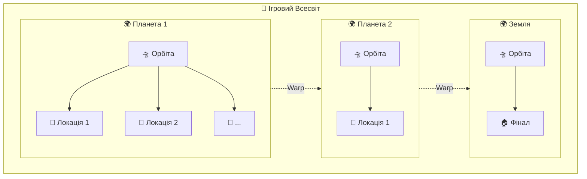
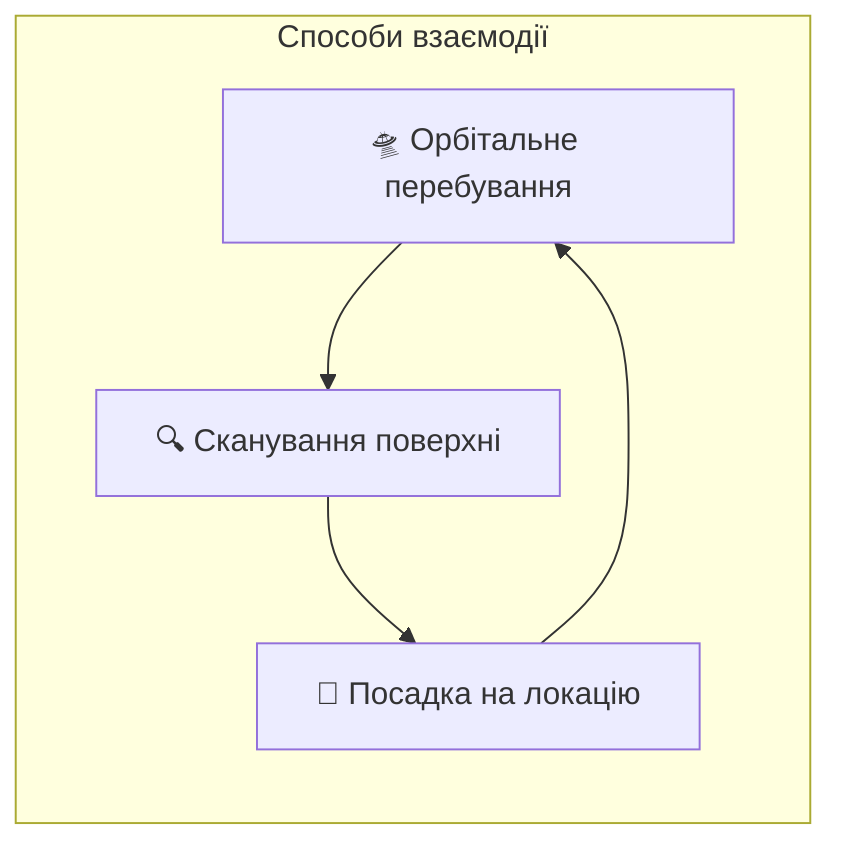
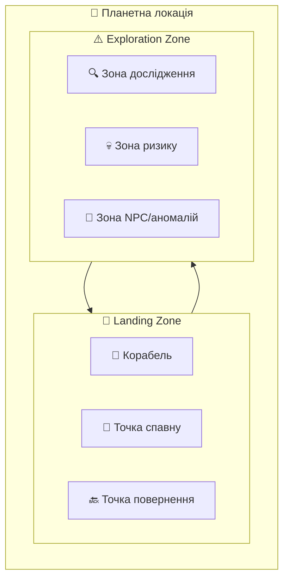
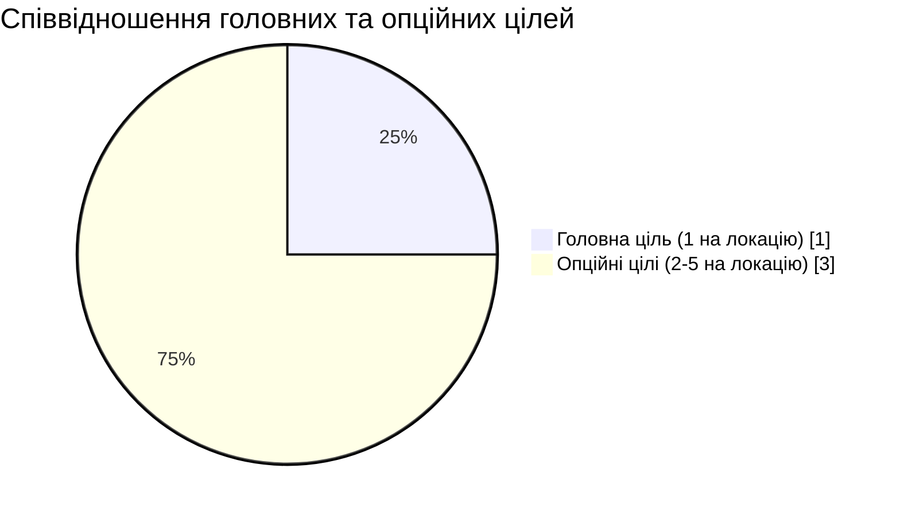
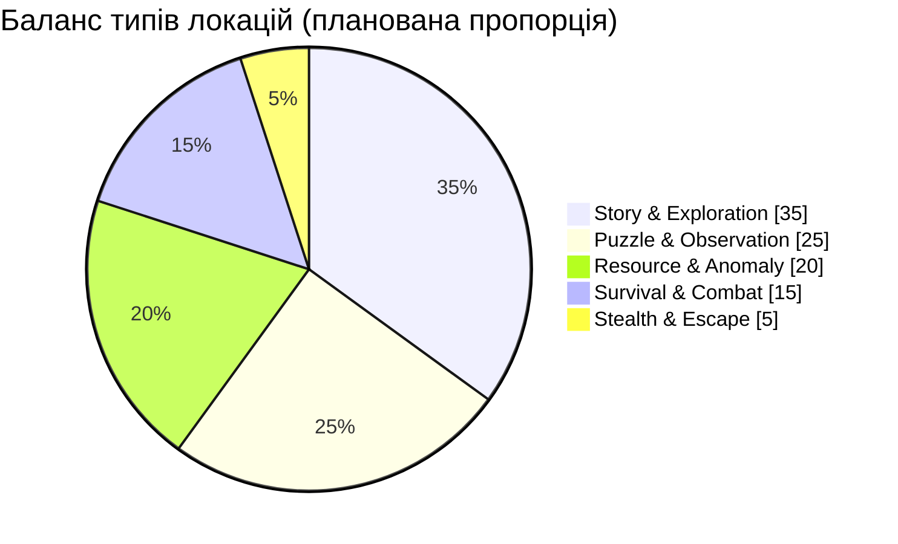
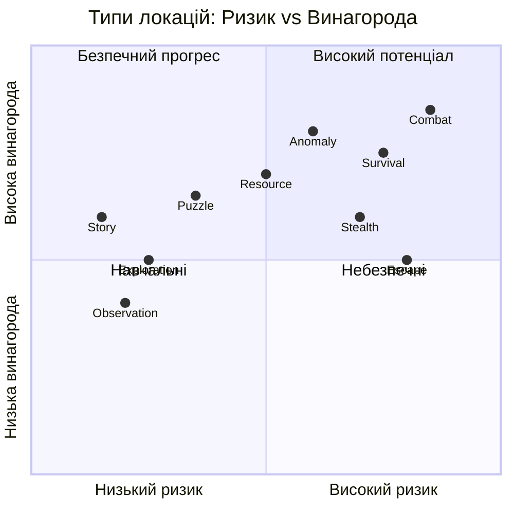
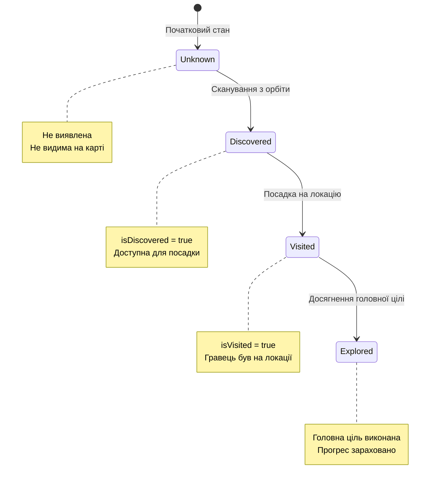
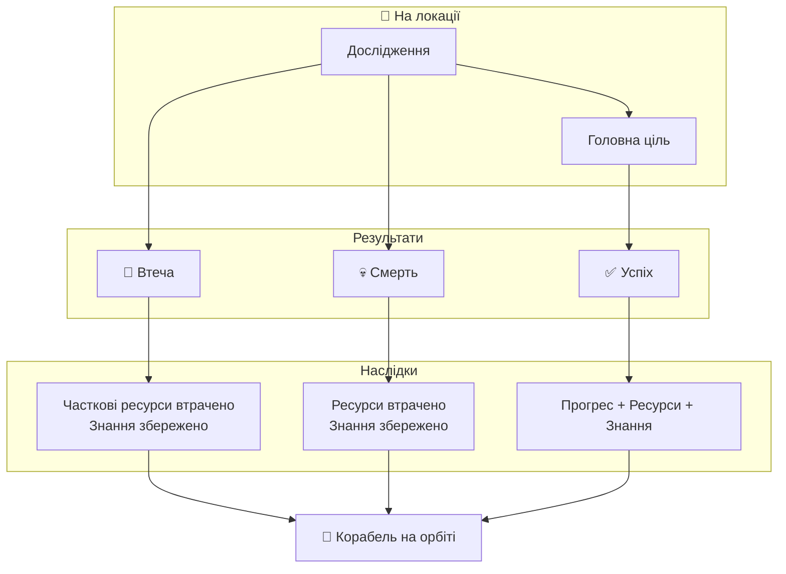

# Планетні Локації — Система Дослідження
**Project:** Call of Relics: Orbital Silence
**Document Type:** Game Design — Planet Locations System

---

## 1. ЗАГАЛЬНИЙ ОПИС

Планетні локації є основними одиницями ігрового контенту. Гра масштабується не за рахунок одного великого світу, а через множину окремих планет і локальних сценаріїв.

### Ключова концепція

> *Кожна локація — це окрема "гра в грі" зі своїми правилами, цілями та ризиками.*

### Ієрархія ігрового світу



---

## 2. ПЛАНЕТА ЯК ІГРОВА ОДИНИЦЯ

Планета:
- є тематичним контейнером
- має власну атмосферу, гравітацію та візуальний стиль
- містить кілька планетних локацій
- випромінює один або кілька аномальних сигналів

Планета **не є** ігровою локацією у класичному сенсі. Гравець **ніколи не пересувається по всій планеті** безпосередньо.

### Взаємодія з планетою



| Спосіб | Опис |
|--------|------|
| Орбіта | Стратегічне планування, безпечна зона |
| Сканування | Виявлення нових локацій |
| Посадка | Фізичне дослідження |

---

## 3. СТРУКТУРА ПЛАНЕТНОЇ ЛОКАЦІЇ

Кожна планетна локація:
- є ізольованою ділянкою поверхні планети
- доступна лише шляхом посадки корабля
- має власний сценарій, правила та цілі
- є самостійною аркадною грою



### Landing Zone (Безпечна зона)

| Елемент | Опис |
|---------|------|
| Корабель | Місце посадки, точка збереження |
| Точка спавну | Місце появи гравця |
| Точка повернення | Зона для повернення на корабель |

### Exploration Zone (Зона дослідження)

| Елемент | Опис |
|---------|------|
| Зона дослідження | Основна ігрова територія |
| Зона ризику | Активні загрози та небезпеки |
| Зона NPC/аномалій | Спеціальні об'єкти та істоти |

---

## 4. ЛОКАЦІЯ ЯК АРКАДНА ГРА

Кожна планетна локація — це **"гра в грі"**:
- має чіткий початок (посадка)
- має власні правила
- має головну ціль
- може мати кілька опційних цілей
- має чіткий або умовний фінал

### Activity Diagram: Дослідження локації


### Можливі дії гравця

| Дія | Опис |
|-----|------|
| Дослідження простору | Пересування по локації |
| Пошук об'єктів | Знаходження артефактів |
| Проходження пасток | Уникання небезпек |
| Взаємодія з механізмами | Активація пристроїв |
| Втеча | Екстрене повернення |
| Боротьба | Протистояння з NPC |
| Спостереження | Аналіз явищ |

---

## 5. СИСТЕМА ЦІЛЕЙ

### Головна ціль

| Властивість | Опис |
|-------------|------|
| Обов'язковість | Потрібна для прогресу |
| Визначення | Фіксується сценарно |
| Завершення | Визначає успішне дослідження |

### Опційні цілі

| Властивість | Опис |
|-------------|------|
| Обов'язковість | Не обов'язкові |
| Зміна | Можуть оновлюватися |
| Винагорода | Додаткові ресурси/знання |

### Порівняння типів цілей



---

## 6. КЛАСИФІКАЦІЯ ЛОКАЦІЙ (12 типів)

Для уніфікації дизайну використовується система типів локацій. Кожна локація має:
- **Primary Type** — основний тип
- **Secondary Type** (опціонально) — другорядний тип

### 6.1. Story Location
**Фокус:** Наратив та лор
- Мінімальний ризик
- Максимальний контекст
- Розповідь історії світу

### 6.2. Exploration Location
**Фокус:** Дослідження простору
- Відкриття територій
- Картографування
- Збір базових ресурсів

### 6.3. Puzzle Location
**Фокус:** Логічні задачі
- Взаємодія з системами
- Розв'язання головоломок
- Механічні загадки

### 6.4. Survival Location
**Фокус:** Виживання
- Небезпечні умови
- Обмежені ресурси
- Таймери та тиск

### 6.5. Combat Location
**Фокус:** Бойове протистояння
- NPC або істоти
- Активна загроза
- Тактичні рішення

### 6.6. Hybrid Location
**Фокус:** Комбінація типів
- Змішані механіки
- Варіативний геймплей
- Складна структура

### 6.7. Stealth Location
**Фокус:** Приховане пересування
- Уникання виявлення
- Тіньова механіка
- Патрулі та зони видимості

### 6.8. Escape Location
**Фокус:** Втеча
- Небезпечна ситуація
- Швидкість рішень
- Часовий тиск

### 6.9. Resource Location
**Фокус:** Збір ресурсів
- Високий видобуток
- Присутній ризик
- Економічна вигода

### 6.10. Anomaly Location
**Фокус:** Дивні явища
- Нестабільність
- Незрозумілі правила
- Експериментування

### 6.11. Observation Location
**Фокус:** Спостереження
- Аналіз подій
- Пасивне дослідження
- Збір інформації

### 6.12. Trial / Test Location
**Фокус:** Перевірка
- Тестування навичок
- Виклики гравцю
- Оцінка знань

### Розподіл типів локацій



### Матриця ризик/винагорода



### Таблиця характеристик типів

| Тип | Ризик | Винагорода | Складність |
|-----|-------|------------|------------|
| Story | ⭐ | ⭐⭐⭐ | ⭐ |
| Exploration | ⭐⭐ | ⭐⭐ | ⭐⭐ |
| Puzzle | ⭐⭐ | ⭐⭐⭐ | ⭐⭐⭐ |
| Observation | ⭐ | ⭐⭐ | ⭐⭐ |
| Resource | ⭐⭐⭐ | ⭐⭐⭐⭐ | ⭐⭐ |
| Anomaly | ⭐⭐⭐ | ⭐⭐⭐⭐ | ⭐⭐⭐⭐ |
| Survival | ⭐⭐⭐⭐ | ⭐⭐⭐⭐ | ⭐⭐⭐ |
| Combat | ⭐⭐⭐⭐⭐ | ⭐⭐⭐⭐⭐ | ⭐⭐⭐⭐ |
| Stealth | ⭐⭐⭐⭐ | ⭐⭐⭐ | ⭐⭐⭐⭐ |
| Escape | ⭐⭐⭐⭐ | ⭐⭐⭐ | ⭐⭐⭐ |
| Hybrid | ⭐⭐⭐ | ⭐⭐⭐⭐ | ⭐⭐⭐⭐ |
| Trial | ⭐⭐⭐ | ⭐⭐⭐⭐ | ⭐⭐⭐⭐⭐ |

---

## 7. СТАНИ ПЛАНЕТНОЇ ЛОКАЦІЇ

Кожна планетна локація має такі логічні стани:



### Таблиця станів

| Стан | Прапор | Опис |
|------|--------|------|
| **Unknown** | — | Локація не знайдена, не видима |
| **Discovered** | `isDiscovered = true` | Знайдена з орбіти, доступна для посадки |
| **Visited** | `isVisited = true` | Гравець фізично відвідав локацію |
| **Explored** | Головна ціль виконана | Прогрес зараховано |

### Persistence

Всі стани локацій зберігаються між ігровими сесіями у профілі гравця.

---

## 8. КРИТЕРІЇ ДОСЛІДЖЕННЯ

### Мінімальний критерій

Локація вважається дослідженою, якщо гравець **досяг головної цілі локації**.

**Недостатньо:**
- ❌ Сканування
- ❌ Дистанційний аналіз
- ❌ Інформація з орбіти

**Необхідно:**
- ✅ Фізична присутність
- ✅ Взаємодія з середовищем
- ✅ Досягнення головної цілі

### Фізична присутність

> Локація не вважається дослідженою, поки гравець фізично не перебував у її межах та не досяг головної цілі.

---

## 9. РЕСУРСИ ЛОКАЦІЇ

### Правила ресурсів

| Візит | Кількість ресурсів | Примітка |
|-------|-------------------|----------|
| Перший | 100% | Повний доступ |
| Повторний | Зменшена | Часткове відновлення |
| Унікальні | Одноразово | Тільки при першому візиті |

### Стимулювання

Система ресурсів стимулює:
- Уважне первинне дослідження
- Зважене рішення про повторні візити
- Пріоритезацію нових локацій

---

## 10. ПОВТОРНЕ ВІДВІДУВАННЯ

При повторному відвідуванні:

| Аспект | Зміна |
|--------|-------|
| Головна ціль | Вже виконана |
| Ресурси | Зменшені або відсутні |
| Опційні цілі | Можуть бути іншими |
| Контекст | Може відкривати новий |

Повторні візити **не є обов'язковими**, але заохочуються для:
- Нових опційних цілей
- Додаткового контексту
- Залишкових ресурсів

---

## 11. НЕВДАЛІ СТАНИ ТА НАСЛІДКИ

Гра допускає невдале завершення дослідження локації. Невдача не означає кінець гри, але має відчутні наслідки.



### 11.1. Втеча з локації

| Аспект | Наслідок |
|--------|----------|
| Головна ціль | Не виконана |
| Статус локації | Не досліджена |
| Ресурси | Частково втрачені |
| Знання | Збережені |

Втеча є **допустимим рішенням** і частиною геймплейної стратегії.

### 11.2. Ігрова смерть

**Причини:**
- Небезпечні умови
- Пастки
- NPC або істоти
- Сценарні події

**Наслідки:**

| Аспект | Наслідок |
|--------|----------|
| Ресурси | Втрачені |
| Головна ціль | Не зарахована |
| Знання | **Збережені** |
| Респавн | Корабель на орбіті |

### 11.3. Філософія невдачі

> *Невдача є частиною дослідження, а не покаранням.*

Невдача у грі:
- Не карає гравця повним відкатом
- Зберігає отримані знання
- Заохочує повторні спроби з новим підходом

---

## 12. ПОРІВНЯННЯ РЕЗУЛЬТАТІВ

```mermaid
xychart-beta
    title "Збереження прогресу за результатом"
    x-axis [Успіх, Втеча, Смерть]
    y-axis "Збережено (%)" 0 --> 100
    bar [100, 60, 30]
```

| Результат | Знання | Ресурси | Прогрес |
|-----------|--------|---------|---------|
| ✅ Успіх | 100% | 100% | 100% |
| 🏃 Втеча | 100% | ~50% | 0% |
| 💀 Смерть | 100% | 0% | 0% |

---

## 13. ПРОГРЕСІЯ ДОСЛІДЖЕННЯ

### Gantt: Типовий шлях дослідження планети

```mermaid
gantt
    title Прогресія дослідження планети
    dateFormat X
    axisFormat %s

    section Орбіта
    Прибуття на орбіту       :a1, 0, 5
    Перше сканування         :a2, after a1, 3

    section Локація 1 (Story)
    Посадка                  :b1, after a2, 2
    Дослідження              :b2, after b1, 10
    Повернення               :b3, after b2, 2

    section Розвиток
    Друге сканування         :c1, after b3, 3

    section Локація 2 (Exploration)
    Посадка                  :d1, after c1, 2
    Дослідження              :d2, after d1, 15
    Повернення               :d3, after d2, 2

    section Завершення
    Підготовка до warp       :e1, after d3, 5
```



---

## 14. ЗВ'ЯЗОК З GDD

Цей документ деталізує **Розділи 11-15 GDD**:
- Розділ 11: Планети та планетні локації
- Розділ 12: Локації як аркадні ігри
- Розділ 13: Класифікація локацій
- Розділ 14: Прогресія та критерії
- Розділ 15: Невдалі стани

---

## 15. ПОВ'ЯЗАНІ ДОКУМЕНТИ

| Документ | Опис |
|----------|------|
| [GDD.md](GDD.md) | Головний Game Design Document |
| [PLAYER.md](PLAYER.md) | Персонаж гравця та профіль |
| [SPACESHIP.md](SPACESHIP.md) | Космічний корабель |
| [Planets/README.md](Planets/README.md) | Реєстр планет |
| [Planets/Planet_1/README.md](Planets/Planet_1/README.md) | Планета "Біллі Рубін" |

---

**Версія документа:** 1.0
**Дата:** 2026-01-21

**Changelog:**
- 1.0: Початкова версія — витяг з GDD.md секцій 11-15 з додаванням діаграм (flowchart, stateDiagram, pie, quadrantChart, xychart-beta, gantt, activity diagram)

> **Примітка:** Технічна реалізація описана в `Docs/TechDesign/TDD.md`
