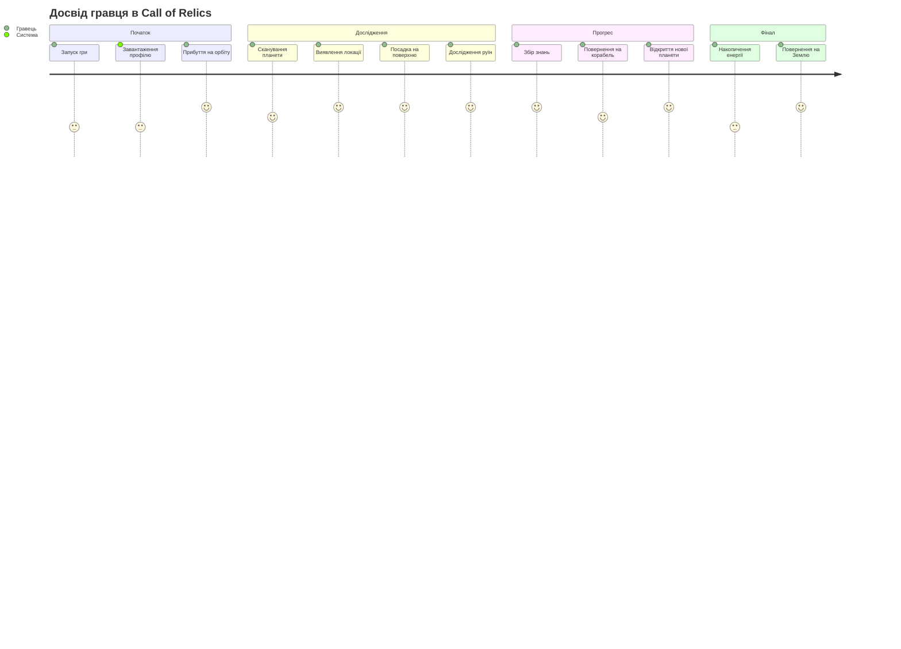
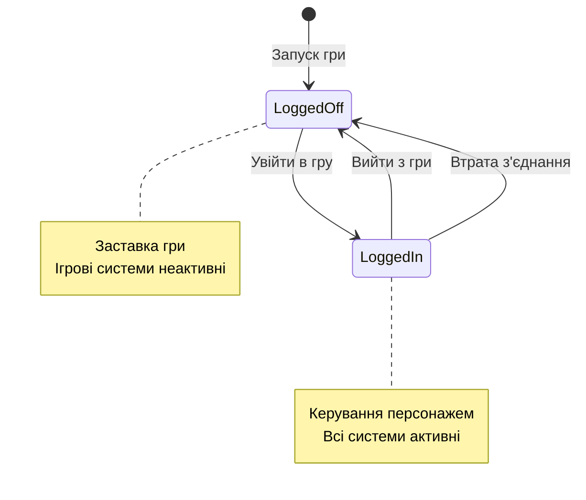
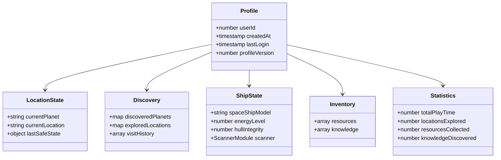
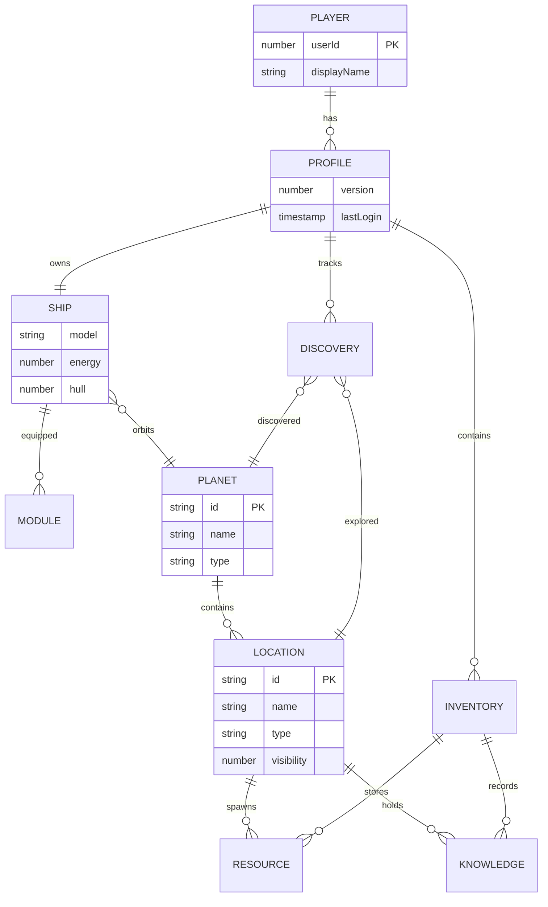
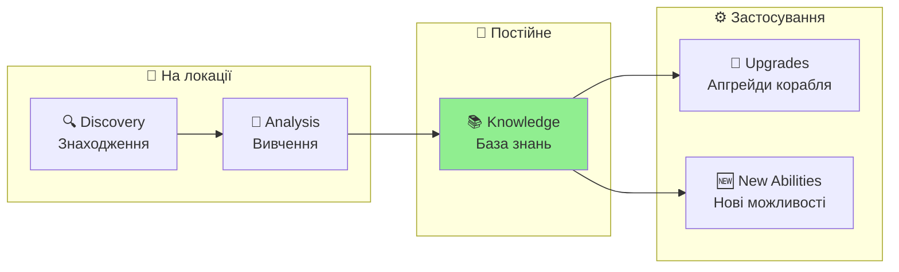
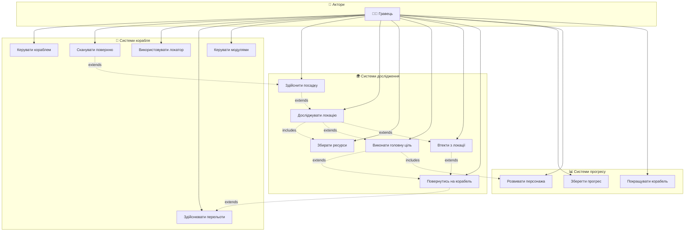

# Персонаж Гравця — Космічний Дослідник
**Project:** Call of Relics: Orbital Silence
**Document Type:** Game Design — Player Character & Profile System

---

## 1. ЗАГАЛЬНИЙ ОПИС

Гравець керує одним персонажем — землянином, освідченим науковцем-дослідником, учасником міжзоряної експедиції до джерела загадкових сигналів.

### Ключова фантазія

> *Ти — не герой.*
> *Ти — той, хто відповів на сигнал.*

### Роль у геймплеї

| Роль | Опис |
|------|------|
| Науковець-дослідник | Універсальний спеціаліст широкого профілю |
| Пілот корабля | Керує космічним кораблем «Самотній Колумб» |
| Дослідник планет | Сканує та досліджує планетні локації |
| Збирач знань | Накопичує knowledge (ніколи не втрачається) |
| Ресурсодобувач | Збирає ресурси (можуть бути втрачені) |

### Шлях гравця (Player Journey)

---

## 2. ГЛОБАЛЬНІ СТАНИ ГРАВЦЯ

Гравець може перебувати у двох глобальних станах, які визначають, чи активний ігровий світ.

### 2.1. Поза грою (Logged Off)

У стані **Logged Off** гравець:
- Бачить заставку гри
- Бачить свій аватар Roblox
- Бачить ім'я гравця
- Має можливість увійти у гру

Цей стан:
- Не впливає на ігровий світ
- Не запускає ігрові системи
- Є безпечним і нейтральним

Стан **Logged Off** використовується:
- Перед початком гри
- Після виходу з гри
- Після втрати з'єднання

### 2.2. У грі (Logged In)

У стані **Logged In**:
- Гравець керує персонажем
- Активні всі ігрові системи
- Відбувається збереження прогресу

Гравець може:
- Добровільно вийти з гри та перейти в Logged Off
- Автоматично перейти в Logged Off у разі втрати з'єднання

### 2.3. Втрата з'єднання

Якщо гравець втрачає підключення:
- Після таймауту він переводиться у стан Logged Off
- Ігровий прогрес зберігається
- При повторному вході гра відновлюється з корабля

---

## 3. ПОХОДЖЕННЯ ТА ПЕРЕДІСТОРІЯ

### 2.1. Експедиція

- **Організатор:** Корпорація «Нащаддя Ілона»
- **Мета:** Дослідити джерело сигналів *The Call* («Поклик»)
- **Корабель:** Експериментальний автономний «Самотній Колумб»

### 2.2. Початкова ситуація

Після міжзоряного перельоту:
- Корабель витратив майже всю енергію
- Повернення на Землю неможливе
- Місія перетворилася на довготривалу автономну експедицію

### 2.3. Початкові знання

На старті гри персонаж володіє базовими знаннями:
- Виживання
- Астрономія
- Геологія
- Фізика
- Хімія
- Комп'ютерні науки

---

## 4. ПРОФІЛЬ ГРАВЦЯ (PLAYER PROFILE)

Профіль зберігається в DataStore і містить всю прогресію гравця.

### Зв'язки між ігровими сутностями (ER Diagram)

### 4.1. Ідентифікація

| Поле | Тип | Опис |
|------|-----|------|
| userId | number | Roblox User ID |
| createdAt | timestamp | Час створення профілю |
| lastLogin | timestamp | Останній вхід |
| profileVersion | number | Версія схеми (поточна: 2) |

### 4.2. Поточний стан (Location State)

| Поле | Тип | Початкове значення | Опис |
|------|-----|-------------------|------|
| currentPlanet | string | "Planet_1" | ID поточної планети |
| currentLocation | string | "Orbit" | ID поточної локації |
| lastSafeState | object | {planetId, locationName, timestamp} | Остання безпечна точка |

**lastSafeState** оновлюється коли гравець на орбіті (safe zone).

### 4.3. Відкриття (Discovery Tracking)

| Поле | Тип | Опис |
|------|-----|------|
| discoveredPlanets | {[planetId]: timestamp} | Відкриті планети |
| exploredLocations | {[planetId]: {[locationId]: data}} | Досліджені локації |
| visitHistory | array | Історія відвідувань (макс. 100) |

**exploredLocations[planetId][locationId]:**
- `discoveredAt` — час відкриття
- `visitCount` — кількість відвідувань

### 4.4. Корабель (Ship State)

| Поле | Тип | Початкове значення | Опис |
|------|-----|-------------------|------|
| spaceShipModel | string | "SpaceShip" | Модель корабля |
| shipState.energyLevel | number | 100 | Рівень енергії корабля |
| shipState.hullIntegrity | number | 100 | Цілісність корпусу |

**Модулі корабля (shipState.modules):**

| Модуль | Поле | Початкове значення | Опис |
|--------|------|-------------------|------|
| scanner | batteryCharge | 500 | Заряд батареї сканера |
| scanner | scanCount | 0 | Кількість сканувань (зношення) |

---

## 5. ІНВЕНТАР (INVENTORY)

### 5.1. Ресурси (Resources)

| Властивість | Опис |
|-------------|------|
| Тип | Колекція предметів |
| Початкове значення | Порожній інвентар |
| При невдачі | **Можуть бути втрачені** |

Кожен ресурс має:
- ID (унікальний ідентифікатор)
- Кількість
- Час отримання

### 5.2. Знання (Knowledge)

| Властивість | Опис |
|-------------|------|
| Тип | Колекція записів |
| Початкове значення | Порожня база |
| При невдачі | **Ніколи не втрачаються** |

Кожен запис знань має:
- ID та назва
- Час відкриття
- Місце знаходження (планета/локація)

> **Ключова механіка:** Знання зберігаються негайно і ніколи не втрачаються (навіть при смерті персонажа або виході з гри).

---

## 6. СТАТИСТИКА (STATISTICS)

| Поле | Тип | Початкове значення | Опис |
|------|-----|-------------------|------|
| totalPlayTime | number | 0 | Загальний час гри (секунди) |
| locationsExplored | number | 1 | Кількість досліджених локацій |
| resourcesCollected | number | 0 | Загальна кількість зібраних ресурсів |
| knowledgeDiscovered | number | 0 | Кількість відкритих записів знань |

---

## 7. ЗБЕРЕЖЕННЯ ПРОГРЕСУ

### 7.1. Автоматичне збереження

| Подія | Опис |
|-------|------|
| PlayerRemoving | При виході гравця з гри |
| PilotSeat sit | Коли гравець сідає в пілотське крісло (якщо профіль змінився) |
| Knowledge added | Негайно при отриманні нових знань |

### 7.2. Безпечний стан (Safe State)

При переході на орбіту оновлюється `lastSafeState`:
- Планета, на якій перебував гравець
- Локація (зазвичай "Orbit")
- Час збереження

При критичній невдачі гравець повертається до останнього безпечного стану.

---

## 8. РОЗВИТОК ПЕРСОНАЖА

### 8.1. RPG-аспект

У процесі гри персонаж:
- Накопичує нові знання
- Розширює свою компетенцію
- Відкриває нові наукові та технічні можливості

### 8.2. Зв'язок з кораблем

Розвиток персонажа:
- Зберігається між ігровими сесіями
- Напряму пов'язаний із дослідженням локацій
- Впливає на розвиток корабля

### 8.3. Прогресія знань

| Етап | Опис |
|------|------|
| Discovery | Знаходження об'єкта/артефакту |
| Analysis | Вивчення та аналіз |
| Knowledge | Запис у базу знань (permanent) |
| Application | Використання знань для апгрейдів |

---

## 9. ВЗАЄМОДІЯ ГРАВЦЯ З СИСТЕМАМИ

### UseCase Diagram

Наступна діаграма показує основні варіанти використання (Use Cases) доступні гравцю:

### Опис ключових Use Cases

| Use Case | Опис | Передумова |
|----------|------|------------|
| Сканувати поверхню | Виявлення нових локацій на планеті | Корабель на орбіті |
| Використовувати локатор | Пошук нових планет | Корабель на орбіті |
| Здійснити посадку | Приземлення на виявлену локацію | Локація виявлена |
| Досліджувати локацію | Пересування та взаємодія на поверхні | Корабель приземлився |
| Виконати головну ціль | Завершення основного завдання локації | Фізична присутність |
| Втекти з локації | Екстрене повернення без завершення | Небезпека або вибір |

---

## 10. ЗВ'ЯЗОК З GDD

Цей документ деталізує **Розділи 2 та 5 GDD**:
- Розділ 2: Глобальні стани гравця
- Розділ 5: Персонаж гравця
- Походження і роль
- Початкові знання
- Розвиток персонажа

---

## 11. ПОВ'ЯЗАНІ ДОКУМЕНТИ

| Документ | Опис |
|----------|------|
| [GDD.md](GDD.md) | Головний Game Design Document |
| [SPACESHIP.md](SPACESHIP.md) | Космічний корабель |
| [Planets/README.md](Planets/README.md) | Планетарна система |
| [PLANET_LOCATIONS.md](PLANET_LOCATIONS.md) | Система планетних локацій |

> Технічна реалізація (ProfileService, DataStore) описана в `Docs/TechDesign/TDD.md`

---

**Версія документа:** 1.4
**Дата:** 2026-01-21

**Changelog:**
- 1.4: Додано секцію 2 (Глобальні стани), секцію 9 (UseCase), journey діаграму; перенумеровано розділи
- 1.3: Додано ER діаграму для зв'язків між ігровими сутностями
- 1.2: Видалено технічну реалізацію (ProfileService API, DataStore) — фокус на Game Design
- 1.1: Додано Mermaid діаграми (Profile schema, Knowledge progression)
- 1.0: Початкова версія документа
