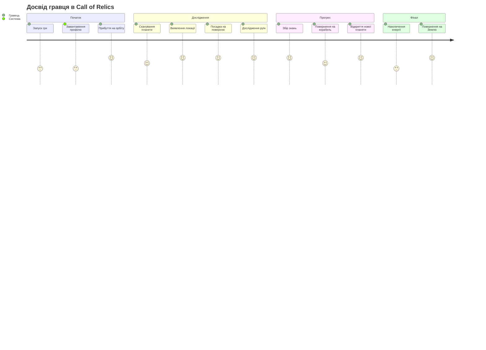
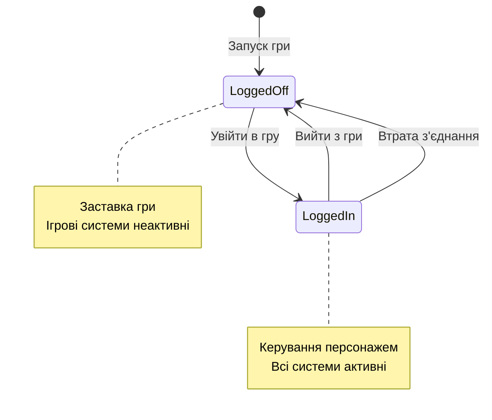
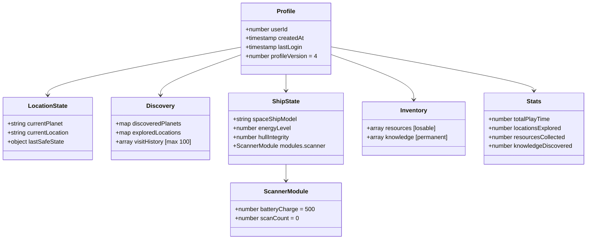
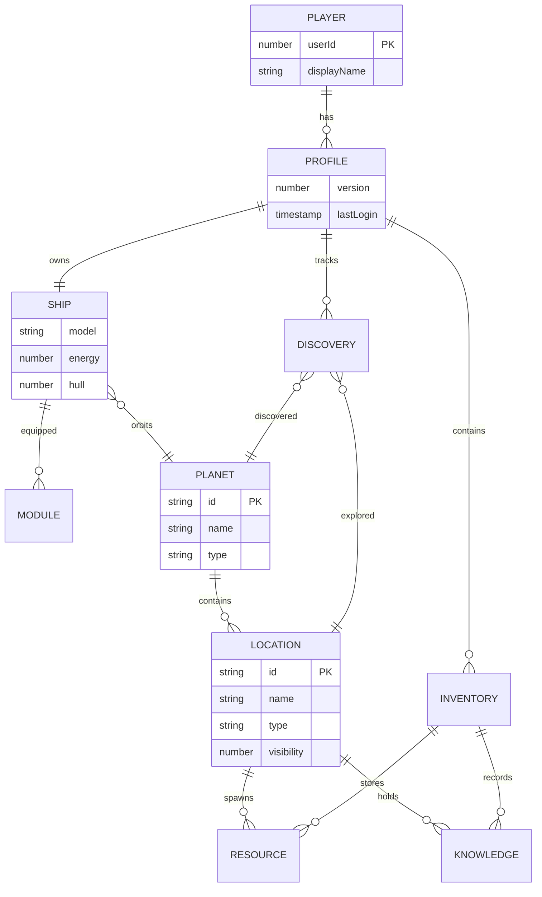
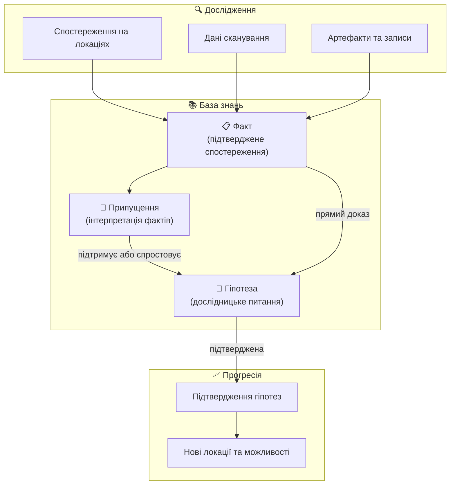
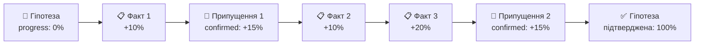
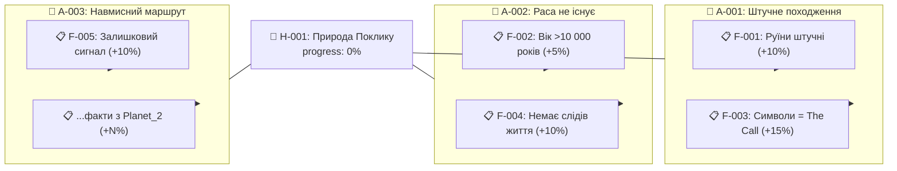
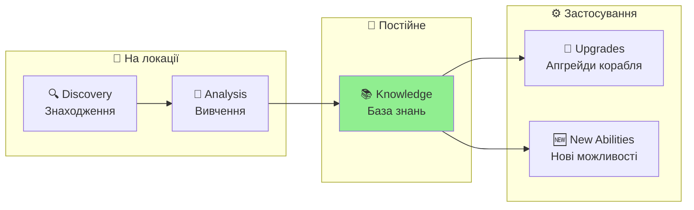
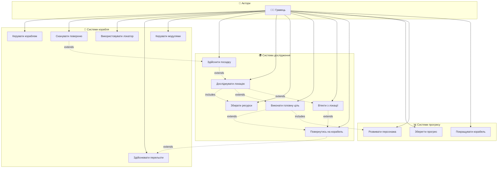

# Персонаж Гравця — Космічний Дослідник
**Project:** Call of Relics: Orbital Silence
**Document Type:** Game Design — Player Character & Profile System

---

## 1. ЗАГАЛЬНИЙ ОПИС

Гравець керує одним персонажем — землянином, освідченим науковцем-дослідником, учасником міжзоряної експедиції до джерела загадкових сигналів.

### Ключова фантазія

> *Ти — не герой.*
> *Ти — той, хто відповів на сигнал.*

### Роль у геймплеї

| Роль | Опис |
|------|------|
| Науковець-дослідник | Універсальний спеціаліст широкого профілю |
| Пілот корабля | Керує космічним кораблем «Самотній Колумб» |
| Дослідник планет | Сканує та досліджує планетні локації |
| Збирач знань | Накопичує knowledge (ніколи не втрачається) |
| Ресурсодобувач | Збирає ресурси (можуть бути втрачені) |

### Шлях гравця (Player Journey)



---

## 2. ГЛОБАЛЬНІ СТАНИ ГРАВЦЯ

Гравець може перебувати у двох глобальних станах, які визначають, чи активний ігровий світ.



### 2.1. Поза грою (Logged Off)

У стані **Logged Off** гравець:
- Бачить заставку гри
- Бачить свій аватар Roblox
- Бачить ім'я гравця
- Має можливість увійти у гру

Цей стан:
- Не впливає на ігровий світ
- Не запускає ігрові системи
- Є безпечним і нейтральним

Стан **Logged Off** використовується:
- Перед початком гри
- Після виходу з гри
- Після втрати з'єднання

### 2.2. У грі (Logged In)

У стані **Logged In**:
- Гравець керує персонажем
- Активні всі ігрові системи
- Відбувається збереження прогресу

Гравець може:
- Добровільно вийти з гри та перейти в Logged Off
- Автоматично перейти в Logged Off у разі втрати з'єднання

### 2.3. Втрата з'єднання

Якщо гравець втрачає підключення:
- Після таймауту він переводиться у стан Logged Off
- Ігровий прогрес зберігається
- При повторному вході гра відновлюється з корабля

---

## 3. ПОХОДЖЕННЯ ТА ПЕРЕДІСТОРІЯ

### 3.1. Експедиція

- **Організатор:** Корпорація «Нащаддя Ілона»
- **Мета:** Дослідити джерело сигналів *The Call* («Поклик»)
- **Корабель:** Експериментальний автономний «Самотній Колумб»

### 3.2. Початкова ситуація

Після міжзоряного перельоту:
- Корабель витратив майже всю енергію
- Повернення на Землю неможливе
- Місія перетворилася на довготривалу автономну експедицію

### 3.3. Початкові знання

На старті гри персонаж володіє базовими знаннями:
- Виживання
- Астрономія
- Геологія
- Фізика
- Хімія
- Комп'ютерні науки

---

## 4. ПРОФІЛЬ ГРАВЦЯ (PLAYER PROFILE)

Профіль зберігається в DataStore і містить всю прогресію гравця.



### Зв'язки між ігровими сутностями (ER Diagram)



### 4.1. Ідентифікація

| Поле | Тип | Опис |
|------|-----|------|
| userId | number | Roblox User ID |
| createdAt | timestamp | Час створення профілю |
| lastLogin | timestamp | Останній вхід |
| profileVersion | number | Версія схеми (поточна: **4**) |

**Історія версій профілю:**

| Версія | Зміна |
|--------|-------|
| 1 | Початкова схема |
| 2 | exploredLocations — з масиву на per-planet структуру |
| 3 | Очистка debug-локацій, скидання сканера |
| 4 | Повторне скидання сканера після debug-тестування |

> Міграція виконується автоматично при завантаженні профілю (`MigrateProfile()`).

### 4.2. Поточний стан (Location State)

| Поле | Тип | Початкове значення | Опис |
|------|-----|-------------------|------|
| currentPlanet | string | "Planet_1" | ID поточної планети |
| currentLocation | string | "Orbit" | ID поточної локації |
| lastSafeState | object | {planetId, locationName, timestamp} | Остання безпечна точка |

**lastSafeState** оновлюється коли гравець на орбіті (safe zone).

### 4.3. Відкриття (Discovery Tracking)

| Поле | Тип | Опис |
|------|-----|------|
| discoveredPlanets | {[planetId]: timestamp} | Відкриті планети |
| exploredLocations | {[planetId]: {[locationId]: data}} | Досліджені локації |
| visitHistory | array | Історія відвідувань (макс. 100, rolling buffer) |

**exploredLocations[planetId][locationId]:**
- `discoveredAt` — час відкриття
- `visitCount` — кількість відвідувань

**Початковий стан:** Planet_1 відкрита, Orbit відвідана з visitCount=1.

### 4.4. Корабель (Ship State)

| Поле | Тип | Початкове значення | Опис |
|------|-----|-------------------|------|
| spaceShipModel | string | "SpaceShip" | Модель корабля |
| shipState.energyLevel | number | 100 | Рівень енергії (макс. 1000 з SpaceShipConfig) |
| shipState.hullIntegrity | number | 100 | Цілісність корпусу (%) |

**Модулі корабля (shipState.modules):**

| Модуль | Поле | Початкове значення | Опис |
|--------|------|-------------------|------|
| scanner | batteryCharge | 500 | Заряд батареї сканера (макс. 500) |
| scanner | scanCount | 0 | Кількість сканувань (зношення: -5%/скан) |

---

## 5. ІНВЕНТАР (INVENTORY)

### 5.1. Ресурси (Resources)

| Властивість | Опис |
|-------------|------|
| Тип | Колекція предметів |
| Початкове значення | Порожній інвентар |
| При невдачі | **Можуть бути втрачені** |

Кожен ресурс має:
- ID (унікальний ідентифікатор)
- Кількість
- Час отримання

### 5.2. Знання (Knowledge)

| Властивість | Опис |
|-------------|------|
| Тип | Колекція записів |
| Початкове значення | Стартовий набір (див. розділ 6) |
| При невдачі | **Ніколи не втрачаються** |

> **Ключова механіка:** Знання зберігаються негайно і ніколи не втрачаються (навіть при смерті персонажа або виході з гри). Детальна система знань описана в розділі 6.

---

## 6. ЗНАННЯ ГРАВЦЯ

Знання — головний ресурс прогресії в Call of Relics. На відміну від фізичних ресурсів, знання ніколи не втрачаються і накопичуються протягом усієї гри.

### 6.1. Три типи знань



| Тип | Символ | Збереження | Як з'являється | Приклад |
|-----|--------|-----------|----------------|---------|
| **Факт** | 📋 | Назавжди | Знайдений на локації, результат сканування | «Руїни на Planet_1 мають вік >10 000 років» |
| **Припущення** | 💭 | Назавжди | Автоматично при поєднанні фактів | «Зниклі мешканці покинули планету добровільно» |
| **Гіпотеза** | 🔬 | Назавжди | Стартова або розблокована фактами | «Поклик — штучний сигнал розумної раси» |

### 6.2. Факти (Facts)

Факти — це підтверджені спостереження, які гравець отримує через дослідження. Кожен факт є об'єктивним і незмінним.

**Структура факту:**

| Поле | Тип | Опис |
|------|-----|------|
| id | string | Унікальний ідентифікатор |
| title | string | Короткий заголовок |
| description | string | Детальний опис (1-3 речення) |
| discoveredAt | timestamp | Час відкриття |
| planetId | string | Планета, де знайдено |
| locationId | string | Локація, де знайдено |
| category | string | Категорія: archaeology, biology, physics, signal, technology |
| linkedHypotheses | array | Гіпотези, до яких факт є доказом |

**Категорії фактів:**

| Категорія | Що описує | Де знаходити |
|-----------|----------|--------------|
| archaeology | Руїни, артефакти, структури | Story, Exploration локації |
| biology | Екосистеми, організми, сліди життя | Observation, Anomaly локації |
| physics | Аномалії, випромінювання, поля | Anomaly, Puzzle локації |
| signal | Дані про The Call, частоти, патерни | Сканування, Trial локації |
| technology | Інопланетні пристрої, механізми | Puzzle, Resource локації |

### 6.3. Припущення (Assumptions)

Припущення — це інтерпретації фактів, які гравець (або бортовий ШІ) формулює на основі зібраних даних. Припущення можуть бути підтверджені або спростовані подальшими фактами.

**Структура припущення:**

| Поле | Тип | Опис |
|------|-----|------|
| id | string | Унікальний ідентифікатор |
| title | string | Формулювання припущення |
| status | enum | pending / confirmed / refuted |
| basedOn | array | Факти, на яких ґрунтується |
| confirmedBy | array | Факти, що підтверджують (якщо confirmed) |
| refutedBy | array | Факти, що спростовують (якщо refuted) |
| linkedHypothesis | string | Гіпотеза, до якої належить |

**Стани припущення:**

| Стан | Опис | Вплив на гіпотезу |
|------|------|-------------------|
| pending | Не перевірено | Нейтральний (+0% до прогресу) |
| confirmed | Підтверджено фактами | Додає прогрес (+N% до гіпотези) |
| refuted | Спростовано фактами | Може змінити напрямок дослідження |

### 6.4. Система гіпотез (Hypothesis System)

Гіпотеза — це центральне дослідницьке питання, що рухає гравця вперед. Кожна гіпотеза має прогрес підтвердження, який зростає з кожним знайденим фактом та підтвердженим припущенням.

**Структура гіпотези:**

| Поле | Тип | Опис |
|------|-----|------|
| id | string | Унікальний ідентифікатор |
| title | string | Назва гіпотези |
| question | string | Ключове питання |
| description | string | Розгорнутий опис (контекст та мотивація) |
| status | enum | active / confirmed / refuted / archived |
| progress | number | 0-100% (прогрес підтвердження) |
| assumptions | array | Пов'язані припущення |
| facts | array | Прямі докази (факти) |
| unlockedAt | timestamp | Коли стала доступною |

**Прогрес гіпотези:**



Прогрес нараховується:
- **+5-20%** за кожен релевантний факт (залежно від значущості)
- **+10-20%** за кожне підтверджене припущення
- Прогрес **не зменшується** при спростуванні припущень — це перенаправляє дослідження

**Стани гіпотези:**

| Стан | Прогрес | Опис | Наслідок |
|------|---------|------|----------|
| active | 0-99% | Дослідження в процесі | Показується в Hypothesis Base |
| confirmed | 100% | Повністю підтверджена | Розблоковує нові гіпотези / можливості |
| refuted | будь-який | Спростована критичним фактом | Замінюється новою гіпотезою |
| archived | будь-який | Неактуальна | Зберігається в історії |

### 6.5. Стартова гіпотеза: «Природа Поклику»

При старті гри гравець має одну активну гіпотезу, яка визначає мету всієї експедиції.

**ГІПОТЕЗА H-001: «Природа Поклику (The Call)»**

| Поле | Значення |
|------|----------|
| ID | H-001 |
| Назва | Природа Поклику |
| Питання | Що є джерелом сигналу The Call, хто його створив і з якою метою? |
| Статус | active |
| Прогрес | 0% |

**Опис:**
> Корпорація «Нащаддя Ілона» зареєструвала повторюваний сигнал невідомого походження з глибокого космосу — The Call. Сигнал має структуру, що виключає природне походження. Експедиція «Самотнього Колумба» відправлена для дослідження джерела. Після міжзоряного перельоту корабель опинився в системі невідомих планет. Що створило цей сигнал? Чи існує відправник? Чому він кличе?

**Стартові припущення (3 шт.):**

| ID | Припущення | Статус | Що потрібно для перевірки |
|----|-----------|--------|--------------------------|
| A-001 | Сигнал має штучне походження — його створила розумна раса | pending | Аналіз структури сигналу (Scanner), знахідки технології |
| A-002 | Раса-відправник більше не існує — залишились лише артефакти | pending | Дослідження руїн, пошук слідів біологічної активності |
| A-003 | Планети на маршруті — навмисні «точки маршруту», а не випадковість | pending | Дослідження 2+ планет, порівняння артефактів між ними |

**Факти, що розблоковуються дослідженням:**

| ID | Факт | Де знайти | Вплив на прогрес |
|----|------|-----------|------------------|
| F-001 | Руїни на Planet_1 мають штучне походження | Location_2 (Ancient Ruins) | +10% до H-001, підтримує A-001 |
| F-002 | Вік руїн перевищує 10 000 років | Location_2 (Ancient Ruins) | +5% до H-001, підтримує A-002 |
| F-003 | Записи зниклої раси містять символи, подібні до структури The Call | Location_2 (Ancient Ruins) | +15% до H-001, підтримує A-001 |
| F-004 | На Planet_1 відсутні сліди біологічної активності розумних істот | Location_1 (Landing Site) | +10% до H-001, підтримує A-002 |
| F-005 | Сканер фіксує залишковий сигнал тієї ж частоти на орбіті Planet_1 | Orbit (Scanner) | +10% до H-001, підтримує A-003 |

**Дерево прогресу H-001:**



### 6.6. Наступні гіпотези (розблоковуються прогресом)

| ID | Назва | Умова розблокування | Опис |
|----|-------|--------------------|----- |
| H-002 | Технологія зниклих | H-001 progress >= 30% | Як працювали технології зниклої раси? Чи можна їх використати? |
| H-003 | Причина зникнення | H-001 progress >= 50% | Чому раса-відправник зникла? Катастрофа чи вибір? |
| H-004 | Шлях додому | H-001 progress >= 80% | Чи можна використати технологію Поклику для повернення на Землю? |

> **Принцип:** Кожна підтверджена гіпотеза відкриває нові питання. Гравець ніколи не залишається без напрямку дослідження.

### 6.7. Стимулювання дослідження через знання

| Що бачить гравець | Що це стимулює |
|-------------------|---------------|
| Гіпотеза з 0% прогресу | Шукати перші факти на поточній планеті |
| Припущення зі статусом pending | Досліджувати конкретні локації для перевірки |
| Прогрес гіпотези 30-50% | Сканувати нові локації для додаткових фактів |
| Нова розблокована гіпотеза | Планувати перельот до наступної планети |
| Спростоване припущення | Переглянути стратегію, шукати альтернативні пояснення |

---

## 7. СТАТИСТИКА (STATISTICS)

Статистика зберігається в об'єкті `stats` профілю (не в окремих полях).

| Поле | Тип | Початкове значення | Авто-інкремент | Опис |
|------|-----|-------------------|----------------|------|
| stats.totalPlayTime | number | 0 | Ні (заплановано) | Загальний час гри (секунди) |
| stats.locationsExplored | number | 1 | Так (при discovery) | Кількість досліджених локацій |
| stats.resourcesCollected | number | 0 | Так (при AddResources) | Загальна кількість зібраних ресурсів |
| stats.knowledgeDiscovered | number | 0 | Так (при AddKnowledge) | Кількість відкритих записів знань |

**Стан реалізації:**
- `locationsExplored` — інкрементується в `MarkLocationDiscovered()`, рахує лише поверхневі локації
- `resourcesCollected` — інкрементується в `AddResources()`, рахує загальну кількість (не унікальні типи)
- `knowledgeDiscovered` — інкрементується в `AddKnowledge()`, рахує унікальні записи
- `totalPlayTime` — поле існує, але автоматичний підрахунок ще не реалізовано

---

## 8. ЗБЕРЕЖЕННЯ ПРОГРЕСУ

### 8.1. Автоматичне збереження

| Подія | Опис | Деталі |
|-------|------|--------|
| PlayerRemoving | При виході гравця з гри | Повне збереження всіх змін |
| PilotSeat sit | Коли гравець сідає в крісло пілота | Лише якщо прапорець `profileChanged` |
| Knowledge added | Негайно при отриманні нових знань | Синхронне збереження (не батчеве) |

**Механізм збереження:**
- DataStoreService з ключем `Player_{UserId}`
- 3 спроби з exponential backoff (1, 2, 4 секунди)
- Fallback до тимчасового in-memory профілю при недоступності DataStore

### 8.2. Безпечний стан (Safe State)

При переході на орбіту оновлюється `lastSafeState`:
- Планета, на якій перебував гравець
- Локація (зазвичай "Orbit")
- Час збереження

При критичній невдачі гравець повертається до останнього безпечного стану.

---

## 9. РОЗВИТОК ПЕРСОНАЖА

### 9.1. RPG-аспект

У процесі гри персонаж:
- Накопичує нові знання
- Розширює свою компетенцію
- Відкриває нові наукові та технічні можливості

### 9.2. Зв'язок з кораблем

Розвиток персонажа:
- Зберігається між ігровими сесіями
- Напряму пов'язаний із дослідженням локацій
- Впливає на розвиток корабля

### 9.3. Прогресія знань



| Етап | Опис |
|------|------|
| Discovery | Знаходження об'єкта/артефакту |
| Analysis | Вивчення та аналіз |
| Knowledge | Запис у базу знань (permanent) |
| Application | Використання знань для апгрейдів |

---

## 10. ПЕРСОНАЛЬНИЙ КОМП'ЮТЕР

Персональний комп'ютер (Seat Personal Computer) — це робоче місце на кораблі, де гравець переглядає свій профіль, статистику дослідження та стан корабля. Інтерфейс стилізований під ретро-термінал Apple II (зелений фосфорний CRT-монітор, 1980-х).

### 10.1. Візуальний стиль

| Параметр | Значення |
|----------|----------|
| Розмір CRT-екрану | 540 x 504 px |
| Колірна палітра | Green Phosphor (#33FF00) |
| Power LED | Зелений індикатор (нижній лівий кут) |
| Terminal ID | KM-OP/01 (нижній правий кут) |
| Анімація | CRT power-on/off fade через CanvasGroup |

### 10.2. Інформаційні блоки

Екран персонального комп'ютера відображає 5 секцій:

**1. Оператор (верхня частина)**

| Поле | Джерело даних |
|------|---------------|
| Контекст | "ОРБIТА" або "ПОВЕРХНЯ" (з TransitionConfig) |
| Ім'я оператора | Player.DisplayName |
| Корабель | GameConfig.ShipName ("Самотній Колумб") |
| Клас | "Дослiдник" (фіксовано) |

**2. База знань (Knowledge Base)**

| Показник | Джерело даних |
|----------|---------------|
| Планети відкриті | Кількість з `profile.discoveredPlanets` |
| Локації досліджені | Кількість з `profile.exploredLocations` (без Orbit) |
| Реліквії знайдені | `profile.stats.knowledgeDiscovered` |
| Сканувань проведено | `profile.shipState.modules.scanner.scanCount` |

**3. Стан корабля (Ship Status)**

| Показник | Джерело даних |
|----------|---------------|
| Корпус (Hull) | % від maxHull (SpaceShipConfig.defense) |
| Щит (Shield) | % від maxShield (SpaceShipConfig.defense) |
| Характеристики | Корпус / Щит / Швидкість (з SpaceShipConfig) |

**4. Місія (Mission Overview)**

| Показник | Стан |
|----------|------|
| Поточна місія | Фіксований текст (заплановано: динамічний) |

**5. База гіпотез (Hypothesis Base)**

Окрема секція CRT-терміналу, що показує поточний стан дослідницьких гіпотез гравця (див. розділ 6.4).

| Елемент | Відображення | Джерело даних |
|---------|-------------|---------------|
| Активна гіпотеза | Назва + прогрес-бар (ASCII: `[████░░░░░░] 40%`) | `profile.knowledge.hypotheses[].progress` |
| Статус | `ACTIVE` / `CONFIRMED` / `REFUTED` (колір CRT) | `profile.knowledge.hypotheses[].status` |
| Факти зібрано | `FACTS: 3/5` — кількість знайдених / необхідних | `profile.knowledge.hypotheses[].facts` |
| Припущення | `ASSUMPTIONS: 1 pending, 1 confirmed` | `profile.knowledge.hypotheses[].assumptions` |
| Наступна підказка | Короткий текст: де шукати наступний факт | Обчислюється з незнайдених фактів |

**Приклад відображення на CRT:**

```
╔══════════════════════════════════╗
║  HYPOTHESIS BASE                 ║
╠══════════════════════════════════╣
║                                  ║
║  H-001: ПРИРОДА ПОКЛИКУ         ║
║  STATUS: ACTIVE                  ║
║  [████████░░░░░░░░░░░░] 40%     ║
║                                  ║
║  FACTS:     3/5 collected        ║
║  ASSUME:    1 pending            ║
║             1 confirmed          ║
║                                  ║
║  > HINT: Scan orbit for signal   ║
║          residual frequency      ║
║                                  ║
╚══════════════════════════════════╝
```

> При підтвердженні гіпотези (100%) екран показує анімацію `[HYPOTHESIS CONFIRMED]` з CRT-ефектом мерехтіння.

### 10.3. Оновлення даних

Дані надходять через `ProfileUpdate` RemoteEvent від сервера:
- При завантаженні профілю
- При зміні стану (discovery, scan, location change)

### 10.4. Стан реалізації

| Функція | Статус |
|---------|--------|
| Відображення статистики | ✅ Реалізовано |
| CRT-анімація power-on/off | ✅ Реалізовано |
| Контекст орбіта/поверхня | ✅ Реалізовано |
| Інтерактивний інвентар | ❌ Заплановано (PersonalComputerService v0.1 — stub) |
| Детальний перегляд знань | ❌ Заплановано |
| База гіпотез (Hypothesis Base) | ❌ Заплановано (дизайн в розділі 10.2) |
| Динамічна місія | ❌ Заплановано |

---

## 11. ВЗАЄМОДІЯ ГРАВЦЯ З СИСТЕМАМИ

### UseCase Diagram

Наступна діаграма показує основні варіанти використання (Use Cases) доступні гравцю:



### Опис ключових Use Cases

| Use Case | Опис | Передумова |
|----------|------|------------|
| Сканувати поверхню | Виявлення нових локацій на планеті | Корабель на орбіті |
| Використовувати локатор | Пошук нових планет | Корабель на орбіті |
| Здійснити посадку | Приземлення на виявлену локацію | Локація виявлена |
| Досліджувати локацію | Пересування та взаємодія на поверхні | Корабель приземлився |
| Виконати головну ціль | Завершення основного завдання локації | Фізична присутність |
| Втекти з локації | Екстрене повернення без завершення | Небезпека або вибір |

---

## 12. ЗВ'ЯЗОК З GDD

Цей документ деталізує **Розділ 2 GDD** — «Персонаж гравця» та частково **Розділ 5** — «Космічний корабель» (щодо профілю та стану корабля).

| Тема | GDD | Цей документ |
|------|-----|--------------|
| Глобальні стани гравця | Розділ 2 | Розділ 2: LoggedOff / LoggedIn |
| Походження та роль | Розділ 2 | Розділ 3: Експедиція, початкові знання |
| Профіль гравця | Розділ 2 | Розділ 4: Повна схема профілю v4 |
| Інвентар | Розділ 2 | Розділ 5: Resources + Knowledge |
| Знання та гіпотези | Розділ 2 | Розділ 6: Факти, припущення, система гіпотез |
| Стан корабля (в профілі) | Розділ 5 | Розділ 4.4: shipState, модулі |
| Персональний комп'ютер | Розділ 5 | Розділ 10: CRT-інтерфейс, 5 блоків (+ Hypothesis Base) |
| Збереження прогресу | Розділ 2 | Розділ 8: DataStore, автозбереження |

---

## 13. ПОВ'ЯЗАНІ ДОКУМЕНТИ

| Документ | Опис |
|----------|------|
| [GDD.md](GDD.md) | Головний Game Design Document |
| [SPACESHIP.md](SPACESHIP.md) | Космічний корабель |
| [Planets/README.md](Planets/README.md) | Планетарна система |
| [PLANET_LOCATIONS.md](PLANET_LOCATIONS.md) | Система планетних локацій |

> Технічна реалізація (ProfileService, DataStore) описана в `Docs/TechDesign/TDD.md`

---

**Версія документа:** 1.6
**Дата:** 2026-02-07

**Changelog:**
- 1.6: Додано розділ 6 (Знання гравця — факти, припущення, система гіпотез, стартова гіпотеза H-001 «Природа Поклику», дерево прогресу, ланцюг розблокування H-002..H-004); додано базу гіпотез до персонального комп'ютера (5-й інформаційний блок з ASCII прогрес-баром та CRT-макетом); оновлено зв'язок з GDD; перенумеровано розділи 7-13
- 1.5: Актуалізовано профіль до v4 (історія міграцій); додано розділ 9 (Персональний комп'ютер — CRT-інтерфейс, 4 інформаційні блоки); оновлено статистику (stats об'єкт, авто-інкремент); деталізовано збереження (DataStore, retry, fallback); виправлено нумерацію підрозділів 3.x; оновлено зв'язок з GDD (таблиця відповідностей); перенумеровано розділи 10-12
- 1.4: Додано секцію 2 (Глобальні стани), секцію 9 (UseCase), journey діаграму; перенумеровано розділи
- 1.3: Додано ER діаграму для зв'язків між ігровими сутностями
- 1.2: Видалено технічну реалізацію (ProfileService API, DataStore) — фокус на Game Design
- 1.1: Додано Mermaid діаграми (Profile schema, Knowledge progression)
- 1.0: Початкова версія документа
