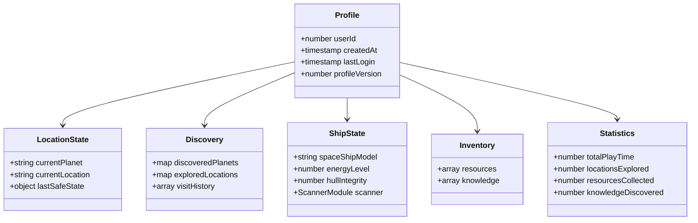
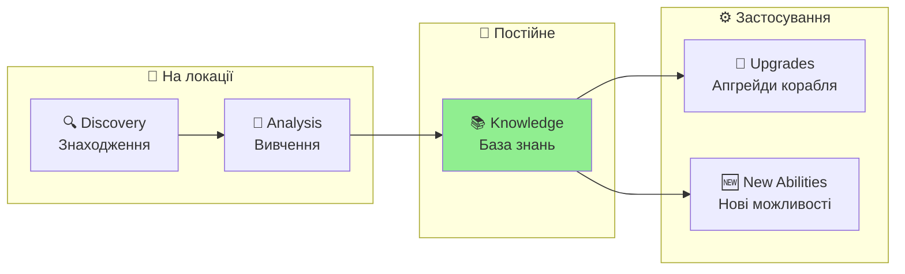

# Персонаж Гравця — Космічний Дослідник
**Project:** Call of Relics: Orbital Silence
**Document Type:** Game Design — Player Character & Profile System

---

## 1. ЗАГАЛЬНИЙ ОПИС

Гравець керує одним персонажем — землянином, освідченим науковцем-дослідником, учасником міжзоряної експедиції до джерела загадкових сигналів.

### Ключова фантазія

> *Ти — не герой.*
> *Ти — той, хто відповів на сигнал.*

### Роль у геймплеї

| Роль | Опис |
|------|------|
| Науковець-дослідник | Універсальний спеціаліст широкого профілю |
| Пілот корабля | Керує космічним кораблем «Самотній Колумб» |
| Дослідник планет | Сканує та досліджує планетні локації |
| Збирач знань | Накопичує knowledge (ніколи не втрачається) |
| Ресурсодобувач | Збирає ресурси (можуть бути втрачені) |

---

## 2. ПОХОДЖЕННЯ ТА ПЕРЕДІСТОРІЯ

### 2.1. Експедиція

- **Організатор:** Корпорація «Нащаддя Ілона»
- **Мета:** Дослідити джерело сигналів *The Call* («Поклик»)
- **Корабель:** Експериментальний автономний «Самотній Колумб»

### 2.2. Початкова ситуація

Після міжзоряного перельоту:
- Корабель витратив майже всю енергію
- Повернення на Землю неможливе
- Місія перетворилася на довготривалу автономну експедицію

### 2.3. Початкові знання

На старті гри персонаж володіє базовими знаннями:
- Виживання
- Астрономія
- Геологія
- Фізика
- Хімія
- Комп'ютерні науки

---

## 3. ПРОФІЛЬ ГРАВЦЯ (PLAYER PROFILE)

Профіль зберігається в DataStore і містить всю прогресію гравця.



### 3.1. Ідентифікація

| Поле | Тип | Опис |
|------|-----|------|
| userId | number | Roblox User ID |
| createdAt | timestamp | Час створення профілю |
| lastLogin | timestamp | Останній вхід |
| profileVersion | number | Версія схеми (поточна: 2) |

### 3.2. Поточний стан (Location State)

| Поле | Тип | Початкове значення | Опис |
|------|-----|-------------------|------|
| currentPlanet | string | "Planet_1" | ID поточної планети |
| currentLocation | string | "Orbit" | ID поточної локації |
| lastSafeState | object | {planetId, locationName, timestamp} | Остання безпечна точка |

**lastSafeState** оновлюється коли гравець на орбіті (safe zone).

### 3.3. Відкриття (Discovery Tracking)

| Поле | Тип | Опис |
|------|-----|------|
| discoveredPlanets | {[planetId]: timestamp} | Відкриті планети |
| exploredLocations | {[planetId]: {[locationId]: data}} | Досліджені локації |
| visitHistory | array | Історія відвідувань (макс. 100) |

**exploredLocations[planetId][locationId]:**
```lua
{
    discoveredAt = timestamp,  -- Коли відкрито
    visitCount = number,       -- Кількість відвідувань
}
```

### 3.4. Корабель (Ship State)

| Поле | Тип | Початкове значення | Опис |
|------|-----|-------------------|------|
| spaceShipModel | string | "SpaceShip" | Модель корабля |
| shipState.energyLevel | number | 100 | Рівень енергії корабля |
| shipState.hullIntegrity | number | 100 | Цілісність корпусу |

**Модулі корабля (shipState.modules):**

| Модуль | Поле | Початкове значення | Опис |
|--------|------|-------------------|------|
| scanner | batteryCharge | 500 | Заряд батареї сканера |
| scanner | scanCount | 0 | Кількість сканувань (зношення) |

---

## 4. ІНВЕНТАР (INVENTORY)

### 4.1. Ресурси (Resources)

| Властивість | Опис |
|-------------|------|
| Тип | Масив об'єктів |
| Початкове значення | [] (порожній) |
| При невдачі | **Можуть бути втрачені** |

**Структура ресурсу:**
```lua
{
    id = "resource_id",
    quantity = number,
    acquiredAt = timestamp
}
```

### 4.2. Знання (Knowledge)

| Властивість | Опис |
|-------------|------|
| Тип | Масив об'єктів |
| Початкове значення | [] (порожній) |
| При невдачі | **Ніколи не втрачаються** |

**Структура знання:**
```lua
{
    id = "knowledge_id",
    title = "Назва запису",
    discoveredAt = timestamp,
    planetId = "Planet_1",
    locationId = "Location_1"
}
```

> **GDD Вимога:** Знання зберігаються негайно і ніколи не втрачаються (навіть при смерті персонажа або виході з гри).

---

## 5. СТАТИСТИКА (STATISTICS)

| Поле | Тип | Початкове значення | Опис |
|------|-----|-------------------|------|
| totalPlayTime | number | 0 | Загальний час гри (секунди) |
| locationsExplored | number | 1 | Кількість досліджених локацій |
| resourcesCollected | number | 0 | Загальна кількість зібраних ресурсів |
| knowledgeDiscovered | number | 0 | Кількість відкритих записів знань |

---

## 6. ЗБЕРЕЖЕННЯ ПРОГРЕСУ

### 6.1. Автоматичне збереження

| Подія | Опис |
|-------|------|
| PlayerRemoving | При виході гравця з гри |
| PilotSeat sit | Коли гравець сідає в пілотське крісло (якщо профіль змінився) |
| Knowledge added | Негайно при отриманні нових знань |

### 6.2. Безпечний стан (Safe State)

При переході на орбіту оновлюється `lastSafeState`:
```lua
lastSafeState = {
    planetId = "Planet_1",
    locationName = "Orbit",
    timestamp = os.time()
}
```

При критичній невдачі гравець повертається до `lastSafeState`.

---

## 7. РОЗВИТОК ПЕРСОНАЖА

### 7.1. RPG-аспект

У процесі гри персонаж:
- Накопичує нові знання
- Розширює свою компетенцію
- Відкриває нові наукові та технічні можливості

### 7.2. Зв'язок з кораблем

Розвиток персонажа:
- Зберігається між ігровими сесіями
- Напряму пов'язаний із дослідженням локацій
- Впливає на розвиток корабля

### 7.3. Прогресія знань



| Етап | Опис |
|------|------|
| Discovery | Знаходження об'єкта/артефакту |
| Analysis | Вивчення та аналіз |
| Knowledge | Запис у базу знань (permanent) |
| Application | Використання знань для апгрейдів |

---

## 8. ГЛОБАЛЬНІ СТАНИ ГРАВЦЯ

### 8.1. Logged Off (Поза грою)

- Заставка гри
- Аватар Roblox гравця
- Можливість увійти у гру
- Ігрові системи неактивні

### 8.2. Logged In (У грі)

- Керування персонажем
- Активні всі ігрові системи
- Автоматичне збереження прогресу

### 8.3. Втрата з'єднання

При disconnect:
- Таймаут → перехід у Logged Off
- Прогрес зберігається
- При reconnect — відновлення з корабля

---

## 9. ТЕХНІЧНА РЕАЛІЗАЦІЯ

### 9.1. ProfileService

**Файл:** `ServerScriptService/Services/ProfileService.lua`

**API:**
- `LoadProfile(player)` — Завантаження/створення профілю
- `SaveProfile(player, data)` — Збереження в DataStore
- `GetProfile(player)` — Отримання кешованого профілю
- `UpdateProfile(player, updates)` — Оновлення полів
- `MarkLocationDiscovered(player, planetId, locationName)` — Відкриття локації
- `UpdateCurrentState(player, planetId, locationName)` — Оновлення позиції
- `AddResources(player, resourceId, quantity)` — Додавання ресурсів
- `RemoveResources(player, resourceId, quantity)` — Видалення ресурсів
- `AddKnowledge(player, knowledgeEntry)` — Додавання знань (immediate save)
- `GetScannerState(player)` — Стан сканера
- `UpdateScannerBattery(player, newCharge)` — Оновлення батареї
- `IncrementScannerWear(player)` — Збільшення зношення
- `RepairScanner(player)` — Ремонт сканера
- `RechargeScannerBattery(player, amount, maxCapacity)` — Підзарядка

### 9.2. DataStore

| Параметр | Значення |
|----------|----------|
| Store Name | "PlayerProfiles" |
| Key Format | "Player_{UserId}" |
| Max Retries | 3 |
| Retry Strategy | Exponential backoff |

### 9.3. Міграція профілів

При завантаженні старого профілю:
- Автоматична міграція до версії 2
- Збереження існуючих даних
- Заповнення відсутніх полів defaults

---

## 10. ЗВ'ЯЗОК З GDD

Цей документ деталізує **Розділ 5 GDD**:
- Персонаж гравця
- Походження і роль
- Початкові знання
- Розвиток персонажа

---

## 11. ПОВ'ЯЗАНІ ДОКУМЕНТИ

| Документ | Опис |
|----------|------|
| [GDD.md](GDD.md) | Головний Game Design Document |
| [SPACESHIP.md](SPACESHIP.md) | Космічний корабель |
| [Planets/README.md](Planets/README.md) | Планетарна система |
| [../TDD.md](../TDD.md) | Technical Design Document |

---

**Версія документа:** 1.1
**Дата:** 2026-01-21

**Changelog:**
- 1.1: Додано Mermaid діаграми (Profile schema, Knowledge progression)
- 1.0: Початкова версія документа
