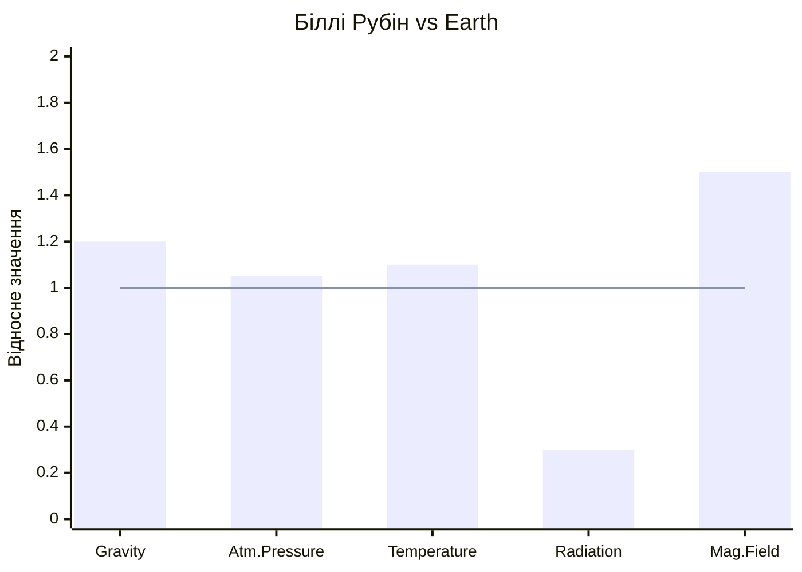

# LOCAL_GDD — Planet_1 (Біллі Рубін)
**Project:** Call of Relics: Orbital Silence
**Scope:** First Playable Planet

---

## Overview

Біллі Рубін — перша планета, яку досліджує гравець. Екзопланета в зоні життя з потенційно придатними умовами.

---

## Planet Data

| Property | Value |
|----------|-------|
| Planet ID | Planet_1 |
| Display Name | Біллі Рубін |
| Type | Habitable (Super-Earth) |
| Star System | Бінарна (K2V + K5V — помаранчеві карлики) |
| Orbital Position | Зона життя (habitable zone) |

---

## Planetary Characteristics

### Physical Parameters

| Parameter | Value | Notes |
|-----------|-------|-------|
| **Gravity** | 1.2g | Помітно важче за Землю; швидкість руху ×0.9, висота стрибка ×0.85 |
| **Atmosphere** | Breathable | Придатна для дихання без герметизації скафандра |
| **Atm. Composition** | N₂ 72%, O₂ 24%, Ar 3%, біоаерозолі ~0.8%, інші 0.2% | Підвищений O₂; біогенні пігменти забарвлюють небо |
| **Atm. Pressure** | Normal (1.05 atm) | Комфортна для людини |
| **Temperature** | +12°C .. +34°C | Теплий клімат, без екстремальних перепадів |
| **Radiation** | Low | K-тип зірок: менше UV ніж Сонце; магнітне поле компенсує решту |
| **Magnetic Field** | Strong | Потужне магнітне поле захищає від радіації зірок |
| **Water** | Liquid | Озера, річки; вода з невідомими мікроорганізмами |
| **Day/Night Cycle** | 20 хв (ігрового часу) | ~12 хв день / ~8 хв ніч |

### Weather System

| Parameter | Value | Notes |
|-----------|-------|-------|
| **Weather Type** | Calm–Variable | Переважно спокійна, інколи мінливий вітер |
| **Precipitation** | Rain (light) | Короткі теплі дощі; безпечні |
| **Wind** | Calm–Moderate | Слабкий бриз, рідко пориви |
| **Visibility** | Clear–Haze | Ясно вдень; легкий серпанок вранці |
| **Weather Events** | Thermal mist | Ранковий туман від водойм; зменшує видимість на 5 хв |

### Gameplay Impact

| Parameter | Value | Notes |
|-----------|-------|-------|
| **Suit Mode** | Normal | Стандартний режим, без герметизації |
| **O₂ Drain Rate** | ×0.5 (мінімальний) | Атмосфера придатна; скафандр у пасивному режимі |
| **Surface Time Limit** | Необмежено | Безпечна планета для навчання |
| **Movement Speed** | ×0.9 | Підвищена гравітація трохи сповільнює |
| **Jump Height** | ×0.85 | Стрибки нижчі через 1.2g |
| **Hazard Level** | Safe | Перша планета без загроз для навчання |

### Порівняння з Землею

> Лінія = Earth (1.0), стовпчики = Біллі Рубін

---

## Locations

| Location ID | Name | Status | Type | Arcade |
|-------------|------|--------|------|--------|
| Orbit | Orbital View | Implemented | Navigation Hub | — |
| Location_1 | Візитка | Implemented | Exploration | Open Exploration |
| Location_2 | Садочок | Stub | Exploration / Discovery | Puzzle / Archaeology |
| Location_3 | Маяк | Stub | Exploration | Platforming / Climbing |
| Location_4 | Кузня | Stub | Resource | Gathering / Crafting |
| Location_5 | Лабіринт | Stub | Underground | Maze / Stealth |
| Location_6 | Обсерваторія | Stub | Science | Puzzle / Hacking |
| Location_7 | Колиска | Stub | Biological | Survival / Defense |

---

## Discovery Order

1. Гравець прибуває на орбіту (GameStart)
2. Сканування поверхні відкриває локації
3. Landing на відкриті локації
4. Дослідження та збір ресурсів

---

## Planet-Specific Features

### Environment
- **Рожево-бордове небо** — результат трьох факторів (див. нижче)
- Подвійне помаранчеве сонце (K2V + K5V бінарна система)
- Екзотична флора з рубіновими та бордовими пігментами

### Sky Color: Пояснення рожево-бордового неба

Колір неба на Біллі Рубін визначається комбінацією трьох факторів:

| Фактор | Механізм | Внесок у колір |
|--------|----------|----------------|
| **1. Спектр зірок** | K-тип зірки (K2V + K5V) випромінюють переважно помаранчево-червоне світло (пік ~600-700 нм, на відміну від ~500 нм у Сонця) | Базовий тон: теплий помаранчево-рожевий |
| **2. Релеївське розсіювання** | Атмосфера розсіює коротші хвилі зіркового світла; для K-зірок «короткі хвилі» — це помаранчевий/рожевий, а не блакитний | Небо набуває рожевого відтінку замість блакитного |
| **3. Біогенні аерозолі** | Пишна рослинність виділяє в атмосферу органічні пігменти — білірубіноподібні сполуки (тетрапіроли), спори та терпени | Додає бордовий/вишневий відтінок, особливо на горизонті |

> **Назва планети «Біллі Рубін»** — пряме відсилання до білірубіну (bilirubin), жовто-помаранчевого тетрапірольного пігменту. Місцева флора синтезує аналогічні сполуки, які потрапляють в атмосферу як аерозоль і надають небу характерного рожево-бордового забарвлення.

**Зміна кольору неба протягом доби:**

| Час | Колір неба | Причина |
|-----|-----------|---------|
| Ранок (схід) | Темно-бордовий → рожевий | Довгий шлях світла через атмосферу; максимум аерозолів |
| День | Рожево-лавандовий | Мінімальний шлях світла; Релеївське розсіювання домінує |
| Вечір (захід) | Насичений бордово-пурпуровий | Довгий шлях + подвійний захід двох зірок |
| Ніч | Темно-вишневий серпанок | Аерозолі слабко флуоресціюють у залишковому світлі |

### Hazards
- Немає (перша планета для навчання)

### Resources
- TBD (визначається в Location GDD)

---

## Narrative Context

Біллі Рубін — перша зупинка експедиції. Планета обрана через:
- Стабільну орбіту в зоні життя
- **Аномальний електромагнітний сигнал** з поверхні
- Потенційні сліди цивілізації

### The Signal (Сигнал)

Під час наближення до системи, корабельні сенсори зафіксували повторюваний електромагнітний імпульс з поверхні Біллі Рубін. Аналіз показав:

- **Походження:** штучне (не природне явище)
- **Стан:** скремблований, нестабільний, неповний
- **Джерело:** локалізовано на поверхні (Візитка / Location_1)
- **Зміст:** не піддається декодуванню у поточному стані

Сигнал випромінюється будівлею на Візитці через систему електричних розрядів та вертикальну блискавку. Механізм пошкоджений — щось відсутнє на центральному педесталі.

**Наративна мета:** сигнал є центральною загадкою планети. Його стабілізація — ключ до просування сюжету та відкриття нових локацій/планет. Детальніше: [Surface/Location_1/README.md](Surface/Location_1/README.md#the-signal--core-narrative)

---

## Related Documents

- [Orbit/README.md](Orbit/README.md) — Orbital view
- [Surface/Location_1/README.md](Surface/Location_1/README.md) — Візитка (Open Exploration)
- [Surface/Location_2/README.md](Surface/Location_2/README.md) — Садочок (Puzzle / Archaeology)
- [Surface/Location_3/README.md](Surface/Location_3/README.md) — Маяк (Platforming / Climbing)
- [Surface/Location_4/README.md](Surface/Location_4/README.md) — Кузня (Gathering / Crafting)
- [Surface/Location_5/README.md](Surface/Location_5/README.md) — Лабіринт (Maze / Stealth)
- [Surface/Location_6/README.md](Surface/Location_6/README.md) — Обсерваторія (Puzzle / Hacking)
- [Surface/Location_7/README.md](Surface/Location_7/README.md) — Колиска (Survival / Defense)
