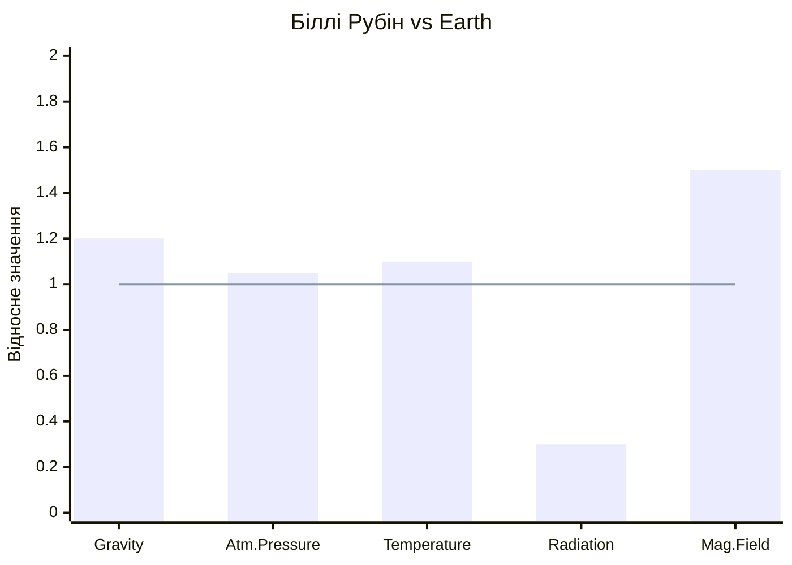

# LOCAL_GDD — Planet_1 (Біллі Рубін)
**Project:** Call of Relics: Orbital Silence
**Scope:** First Playable Planet

---

## Overview

Біллі Рубін — перша планета, яку досліджує гравець. Екзопланета в зоні життя з потенційно придатними умовами.

---

## Planet Data

| Property | Value |
|----------|-------|
| Planet ID | Planet_1 |
| Display Name | Біллі Рубін |
| Type | Habitable (Super-Earth) |
| Star System | Бінарна (подвійне сонце) |
| Orbital Position | Зона життя (habitable zone) |

---

## Planetary Characteristics

### Physical Parameters

| Parameter | Value | Notes |
|-----------|-------|-------|
| **Gravity** | 1.2g | Помітно важче за Землю; швидкість руху ×0.9, висота стрибка ×0.85 |
| **Atmosphere** | Breathable | Придатна для дихання без герметизації скафандра |
| **Atm. Composition** | N₂ 72%, O₂ 24%, Ar 3%, інші 1% | Підвищений O₂ — пишна рослинність |
| **Atm. Pressure** | Normal (1.05 atm) | Комфортна для людини |
| **Temperature** | +12°C .. +34°C | Теплий клімат, без екстремальних перепадів |
| **Radiation** | Low | Подвійна зірка компенсується магнітним полем |
| **Magnetic Field** | Strong | Потужне магнітне поле захищає від радіації зірок |
| **Water** | Liquid | Озера, річки; вода з невідомими мікроорганізмами |
| **Day/Night Cycle** | 20 хв (ігрового часу) | ~12 хв день / ~8 хв ніч |

### Weather System

| Parameter | Value | Notes |
|-----------|-------|-------|
| **Weather Type** | Calm–Variable | Переважно спокійна, інколи мінливий вітер |
| **Precipitation** | Rain (light) | Короткі теплі дощі; безпечні |
| **Wind** | Calm–Moderate | Слабкий бриз, рідко пориви |
| **Visibility** | Clear–Haze | Ясно вдень; легкий серпанок вранці |
| **Weather Events** | Thermal mist | Ранковий туман від водойм; зменшує видимість на 5 хв |

### Gameplay Impact

| Parameter | Value | Notes |
|-----------|-------|-------|
| **Suit Mode** | Normal | Стандартний режим, без герметизації |
| **O₂ Drain Rate** | ×0.5 (мінімальний) | Атмосфера придатна; скафандр у пасивному режимі |
| **Surface Time Limit** | Необмежено | Безпечна планета для навчання |
| **Movement Speed** | ×0.9 | Підвищена гравітація трохи сповільнює |
| **Jump Height** | ×0.85 | Стрибки нижчі через 1.2g |
| **Hazard Level** | Safe | Перша планета без загроз для навчання |

### Порівняння з Землею

> Лінія = Earth (1.0), стовпчики = Біллі Рубін

---

## Locations

| Location ID | Name | Status | Type |
|-------------|------|--------|------|
| Orbit | Orbital View | Implemented | Navigation Hub |
| Location_1 | Landing Site Alpha | Implemented | Exploration |
| Location_2 | Ancient Ruins | Implemented | Exploration |

---

## Discovery Order

1. Гравець прибуває на орбіту (GameStart)
2. Сканування поверхні відкриває локації
3. Landing на відкриті локації
4. Дослідження та збір ресурсів

---

## Planet-Specific Features

### Environment
- Синє небо з зеленуватим відтінком
- Подвійне сонце (бінарна система)
- Екзотична флора

### Hazards
- Немає (перша планета для навчання)

### Resources
- TBD (визначається в Location GDD)

---

## Narrative Context

Біллі Рубін — перша зупинка експедиції. Планета обрана через:
- Стабільну орбіту в зоні життя
- Сигнали невідомого походження
- Потенційні сліди цивілізації

---

## Related Documents

- [Orbit/README.md](Orbit/README.md) — Orbital view
- [Surface/Location_1/README.md](Surface/Location_1/README.md) — Landing Site Alpha
- [Surface/Location_2/README.md](Surface/Location_2/README.md) — Ancient Ruins
