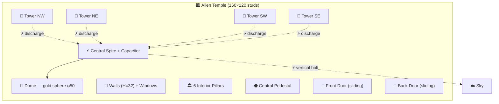
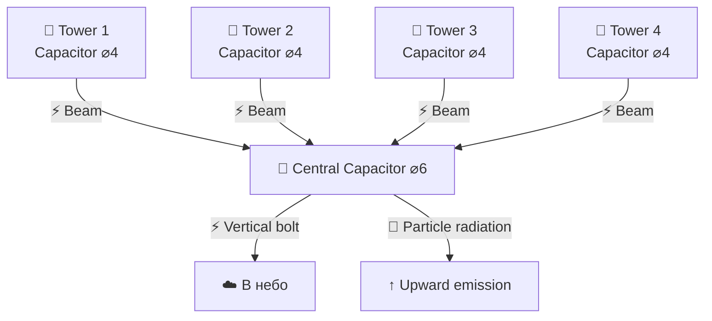
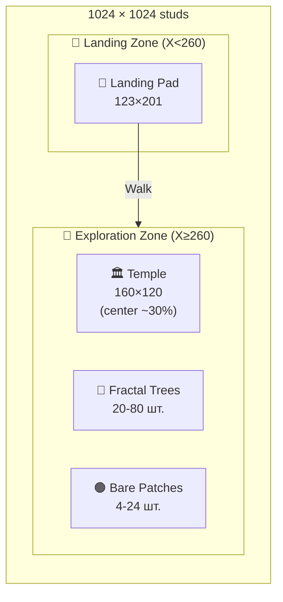

# LOCAL_GDD — Planet_1/Location_1 (Візитка)
**Project:** Call of Relics: Orbital Silence
**Scope:** First Landing Location
**Status:** WIP (середовище та цілісність локації не завершені)

---

## Overview

**Візитка** (Visiting Card) — перша локація для дослідження на Біллі Рубін. Безпечна зона для навчання базових механік. Назва «Візитка» — метафора: це перше, що бачить експедиція на чужій планеті, як візитна картка невідомої цивілізації.

Гравець приземляється на посадковий майданчик, виходить з корабля і бачить рожево-бордове небо під подвійним помаранчевим сонцем, екзотичний ліс з бірюзово-агатовим листям та загадкову будівлю з електромагнітною активністю на горизонті.

---

## Location Data

| Property | Value |
|----------|-------|
| Location ID | Location_1 |
| Display Name | Візитка |
| Parent Planet | Planet_1 (Біллі Рубін) |
| Type | Exploration |
| Context | TransitionConfig.Contexts.Surface |
| Difficulty | Tutorial / Safe |
| Zone Size | 1024 x 1024 studs |

---

## Environment

### Sky & Atmosphere

Небо Візитки визначається планетарними умовами Біллі Рубін (див. [Planet_1 README](../../README.md)):

| Час доби | Колір неба | Причина |
|----------|------------|---------|
| Ранок (схід) | Темно-бордовий → рожевий | Довгий шлях світла через атмосферу; максимум аерозолів |
| День | Рожево-лавандовий | Мінімальний шлях світла; Релеївське розсіювання домінує |
| Вечір (захід) | Насичений бордово-пурпуровий | Довгий шлях + подвійний захід двох зірок |
| Ніч | Темно-вишневий серпанок | Аерозолі слабко флуоресціюють у залишковому світлі |

- **Зірки:** подвійне помаранчеве сонце (K2V + K5V)
- **Атмосфера:** придатна для дихання (N₂ 72%, O₂ 24%, біоаерозолі ~0.8%)
- **Гравітація:** 1.2g — рух ×0.9, стрибки ×0.85
- **Температура:** +12..+34°C
- **Радіація:** низька (магнітне поле компенсує)

### Terrain

Процедурно генерований рельєф (SEED=42, FBM noise):

| Parameter | Value |
|-----------|-------|
| Тип | FBM шум (4 октави) |
| Висота рельєфу | 0.05–0.5 studs (текстура трави) |
| Крок сітки | 4 studs |
| Матеріал | Grass |
| Прогалини | 4–24 випадкових bare patches (R=8–25 studs) |
| Зона будівлі | Виключена з генерації (building + 20 stud clearance) |
| Фейдинг | 40 studs від лівого краю (плавний перехід) |

Зона генерації: X=[260..1024], Z=[0..1024]. Ліва частина (X<260) — Landing Zone без рельєфу.

### Flora

**Фрактальні дерева** — процедурно генеровані (20–80 шт.):

| Parameter | Value |
|-----------|-------|
| Тип стовбура | Циліндри (Shape=Cylinder) |
| Глибина гілкування | 2 рівні (trunk → branches → leaves) |
| Гілки на вузол | 2–3 |
| Кут гілок | 25°–50° |
| Листя | Сфери (Ball), Grass material |
| Колір листя | Бірюзово-агатова палітра (turquoise → agate gradient) |
| Розмір листя | 3–7 studs |
| Висота дерев | 6–16 studs (×0.5–1.5 random scale) |
| Мінімальна відстань | 12 studs між деревами |

Дерева не ростуть у зоні будівлі (margin 25 studs) та на входах (corridor 14 studs × 40 studs).

> **Науковий контекст:** бірюзово-агатовий колір листя зумовлений адаптацією місцевої флори до помаранчевого спектру K-зірок. Рослини поглинають червоне/помаранчеве світло і відбивають у бірюзовому/аквамариновому діапазоні.

---

## The Building — Alien Temple

### Architecture

Центральна споруда локації — загадковий «храм» невідомого походження.

### Dimensions & Structure

| Element | Size / Count | Details |
|---------|-------------|---------|
| **Footprint** | 160 × 120 studs | Floor: dark grey (55, 60, 70) |
| **Walls** | Height 32 studs, thickness 4 | SmoothPlastic, light grey (175, 175, 185) |
| **Windows** | 4 per side wall | 6×12 studs, Glass material (20, 160, 200), transparency 0.4 |
| **Doors** | 2 (front + back) | 8×12 studs, sliding split-panel, proximity trigger |
| **Neon trim** | Top edge of all walls | Gold neon (240, 200, 80) |
| **Interior pillars** | 6 (2 rows × 3 columns) | 3×32×3 studs, neon caps |
| **Central pedestal** | 6×4×6 studs | For future artifact placement |

### Dome

| Element | Details |
|---------|---------|
| **Drum** | Cylinder ⌀54, H=8, on top of walls |
| **Sphere** | Ball ⌀50 (Y=40), gold Glass (opaque) |
| **Interior symbols** | 12 glyphs (Elder Futhark runes + sacred geometry), animated fade in/out |
| **Main spire** | 1.5×12×1.5, neon gold, on top of dome |

### Corner Towers (×4)

| Element | Details |
|---------|---------|
| **Tower** | Cylinder R=5, H=36, offset 6 studs from corners |
| **Tower dome** | Ball ⌀14 (Y-stretch ×1.3), gold Glass (opaque) |
| **Tower spire** | 1×8×1, neon gold |
| **Capacitor sphere** | Ball ⌀4, cyan neon (80, 180, 255), on top of spire |

### Doors System

- 2 входи: front (X−) та back (X+)
- Split-panel sliding doors (кожна половинка ковзає в бік)
- Proximity trigger: відкриття на 15 studs, закриття на 20 studs
- Tween animation: 0.8s, Quad easing
- Door frames: neon gold strips

### Exterior Decals

8 настінних символів (BillboardGui) на зовнішніх стінах:
- Фінікійські літери (𐤀, 𐤁, 𐤂...)
- Сакральна геометрія (☬, ☸, ☥, ⏣...)
- Ієрогліфічні символи (𓁿, 𓂀, 𓃭...)
- Приглушений кам'яний вигляд (160, 150, 130), transparency 0.3

---

## Electromagnetic Phenomena

### Overview

Будівля є джерелом потужних електромагнітних явищ. Система розрядів створює візуальне враження живої енергетичної машини.

### 1. Tower Capacitor Glow

Кожна з 4 башт має на верхівці шпиля кулю-конденсатор (⌀4, cyan neon). Сфери постійно світяться, створюючи ефект заряджених електродів.

### 2. Discharge Beams (Tower → Central)

4 електричні розряди (Beam) з'єднують кулі-конденсатори башт з центральним конденсатором (⌀6) на головному шпилі:

| Parameter | Value |
|-----------|-------|
| Тип | Beam (FaceCamera) |
| Колір | Cyan (80, 180, 255) |
| Сегменти | 20 (для реалістичних дуг) |
| LightEmission | 1 (self-illuminated) |
| Анімація | Рандомізація CurveSize (−5..+5) кожні 0.05–0.15s |
| Інтенсивність | 3 режими: яскравий (30%), тьмяний (40%), вимкнено (30%) |

Ефект: блискавки хаотично змінюють форму дуги, пульсують від яскравих спалахів до тьмяних розрядів і тимчасово згасають.

### 3. Vertical Energy Emission (Central → Sky)

Центральний конденсатор випромінює частинки вгору (ParticleEmitter):

| Parameter | Value |
|-----------|-------|
| Rate | 12 particles/sec |
| Lifetime | 1.5–3.0 sec |
| Speed | 20–45 studs/sec |
| Spread | 12° cone |
| Колір | Cyan → white gradient |
| Size | 0.8 → 1.5 → 0.3 (lifecycle) |
| Transparency | 0.2 → 0.5 → 1.0 (fade out) |

### 4. Vertical Lightning Bolt (Central → Sky)

Періодична потужна блискавка від центрального конденсатора далеко в небо (~500 studs):

| Parameter | Value |
|-----------|-------|
| Тип | Beam (30 segments, FaceCamera) |
| Колір | Cyan (120, 200, 255) → White gradient |
| Width | 2–5 studs (base) → 0.3–1.0 (top) |
| Інтервал | 15–60 sec (random) |
| Тривалість | 0.3–0.8 sec |
| Flickering | CurveSize рандомізація кожні 0.05s під час спалаху |
| Flash | PointLight pulse (brightness 3–6, range 120, fade 0.5s) |
| Висота | ~500 studs від конденсатора |

Ефект: на випадкових інтервалах потужний вертикальний розряд б'є з центрального шпиля далеко в рожево-бордове небо, супроводжуючись яскравим спалахом. Розряд мерехтить і змінює форму протягом 0.3–0.8 секунд, після чого згасає.

> **Наративний контекст:** вертикальна блискавка — це електромагнітний сигнал, що випромінюється будівлею. Сигнал скремблований, нестабільний та неповний — щось у механізмі будівлі пошкоджено або деактивовано. Саме цей сигнал зафіксувала експедиція з орбіти (див. нижче).

> **TODO:** Додати звуковий ефект розряду

---

## The Signal — Core Narrative

### Що зафіксовано з орбіти

Під час сканування з орбіти Біллі Рубін, корабельні сенсори зафіксували **аномальний електромагнітний сигнал** з поверхні. Характеристики:

- **Тип:** повторюваний електромагнітний імпульс
- **Частота:** нерегулярна (15–60 секунд між імпульсами)
- **Стан:** скремблований, нестабільний, неповний
- **Потужність:** достатня для виявлення з орбіти
- **Джерело:** Візитка (Location_1)

Сигнал — одна з головних причин посадки на цю локацію. Він не схожий на природне явище: має ознаки штучного походження, але сильно деградований.

### Що бачить гравець на поверхні

Будівля випромінює сигнал через систему електричних розрядів:
1. 4 башти збирають енергію → передають через розряди до центрального конденсатора
2. Центральний конденсатор накопичує заряд → випромінює вертикальну блискавку в небо
3. Блискавка — це і є сигнал, але він **деформований і неповний**

Ознаки пошкодження:
- Розряди між баштами хаотичні (мерехтять, згасають)
- Вертикальна блискавка нерегулярна (рандомні інтервали замість рівномірних)
- Центральний педестал — **порожній** (щось відсутнє)
- Символи на куполі ледь видимі (поступово згасають і зникають)

### Квест: Стабілізація сигналу (TBD)

Гравець повинен **стабілізувати сигнал** — це відкриє повне повідомлення та просуне сюжет. Можливі кроки:

1. **Дослідити будівлю** — зрозуміти, як працює механізм
2. **Знайти відсутній компонент** — артефакт для педесталу (можливо на іншій локації)
3. **Встановити компонент** — активувати повний цикл передачі
4. **Декодувати сигнал** — прочитати повідомлення

> Стабілізований сигнал може містити: координати інших вузлів мережі (нові локації/планети), попередження, історію цивілізації, або запрошення.

### Building Lore — Hypothesis Variants

Точне призначення будівлі невідоме до стабілізації сигналу. Робочі гіпотези:

| Variant | Назва | Призначення | Педестал | Сигнал |
|---------|-------|-------------|---------|--------|
| **A** | Маяк (Beacon) | Навігаційний маяк для міжзоряних подорожей | Навігаційний кристал | Координати маршруту |
| **B** | Збирач (Harvester) | Збір атмосферної електрики та зоряної енергії | Енергетичне ядро | Статус-звіт станції |
| **C** | Святилище (Temple) | Ритуальна споруда з EM-значенням | Священний артефакт | Молитва / пророцтво |
| **D** | Антена (Comm Array) | Вузол міжзоряного зв'язку | Інтерфейс оператора | Повідомлення іншому вузлу |

---

## Landing Zone

### Landing Pad

| Property | Value |
|----------|-------|
| Size | ~123 × 201 studs |
| Position | (138, 2, 862) |
| Material | Metal, Dark stone grey |
| Frame | Neon green borders (4 sides) |
| Corner markers | 4 yellow neon cubes (3–4 studs) |
| Stripes | 3 white neon stripes |
| Lighting | PointLight + animated effects |

### Landing Zone Area

| Property | Value |
|----------|-------|
| Size | 256 × 368 studs |
| Position | X=[0..256], Z=[656..1024] |
| Material | Concrete, Bright blue |
| Purpose | Ship landing and operations |

### Modules

- **LandingPadEffectsModule** — візуальні ефекти посадкового майданчика
- **LandingLightsModule** — анімована система вогнів

---

## Gameplay Elements

### Primary Goal (EPIC 7)
- TBD — перше знайомство з механіками дослідження

### Discovery Triggers
- Дослідження будівлі (вхід через двері)
- Огляд електромагнітних явищ
- Вивчення символів (dome glyphs, wall decals)
- Дослідження центрального педесталу

### Resources
- TBD

### Knowledge Items
- TBD — перші записи про будівлю та її електромагнітну активність

---

## Player Actions

### Available
- Вийти з корабля (unseat)
- Дослідження території
- Вхід у будівлю (proximity doors)
- Огляд внутрішніх символів
- Повернення до корабля

### Restricted
- Сканування (тільки з орбіти)
- Взаємодія з педесталом (TBD)

---

## Zone Layout

---

## Transitions

### Incoming
- **Landing** — посадка з орбіти на Landing Pad

### Outgoing
- **Launch** — зліт на орбіту з Landing Pad

---

## Incomplete / TODO

| Item | Status | Notes |
|------|--------|-------|
| Sky / Lighting | WIP | Потрібно налаштувати рожево-бордове небо відповідно до Planet_1 GDD |
| Day/Night cycle | Not started | 20 хв (12 день / 8 ніч) |
| Terrain textures | WIP | Базова трава є, потрібні додаткові біоми |
| Building interior | Minimal | Порожній інтер'єр з пілярами та педесталом |
| Vertical lightning | Done (v0.4) | Beam + PointLight flash, 15-60s intervals, 0.3-0.8s duration |
| Sound design | Not started | Електричні розряди, ambient, двері |
| Flora diversity | Not started | Тільки фрактальні дерева, потрібні менші рослини |
| Weather effects | Not started | Легкий дощ, ранковий туман від водойм |
| Knowledge items | Not started | Інтерактивні елементи для вивчення |
| Pedestal interaction | Not started | Геймплейна взаємодія з педесталом |
| Location integrity | WIP | Цілісність середовища не завершена |

---

## Technical Implementation

| Script | Version | Purpose |
|--------|---------|---------|
| TerrainGenerator.server.luau | v0.4 | FBM terrain, bare patches, temple, fractal trees, electric discharges, vertical lightning |
| LandingPadEffectsModule.luau | — | Landing pad visual effects |
| LandingLightsModule.luau | — | Animated landing lights |
| Config.luau | v1.0 | Zone dimensions, settings, asset references |

---

## Related Documents

- [../../README.md](../../README.md) — Planet_1 overview (planetary characteristics, sky color)
- [../../Orbit/README.md](../../Orbit/README.md) — Orbital view
- [../Location_2/README.md](../Location_2/README.md) — Ancient Ruins
