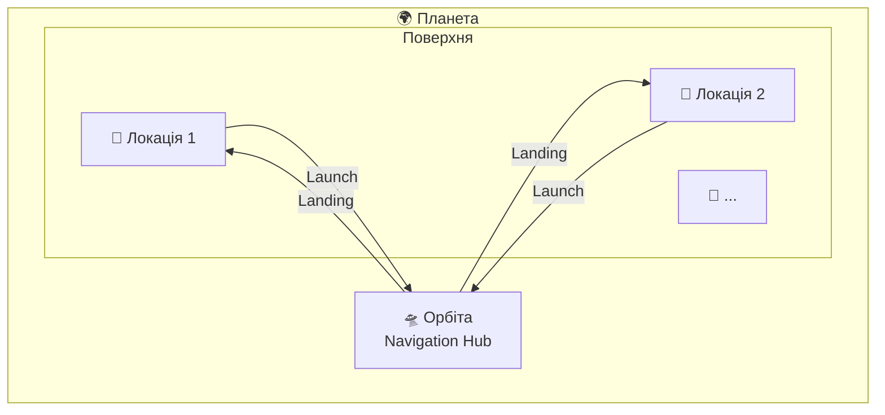
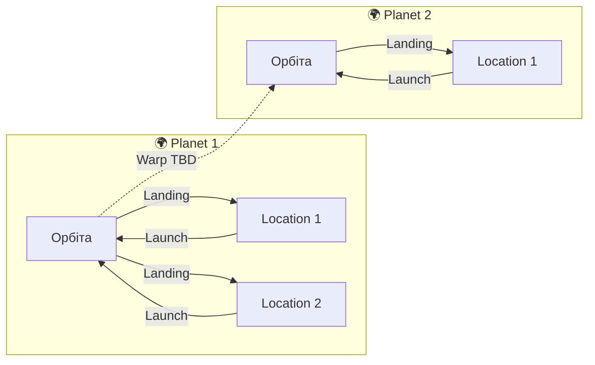
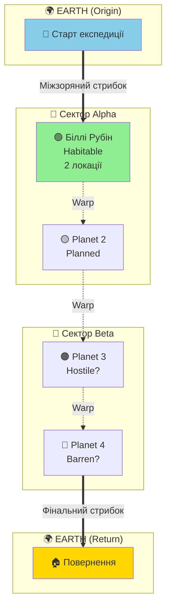

# LOCAL_GDD — Planets System
**Project:** Call of Relics: Orbital Silence
**Scope:** All Planets

---

## Overview

Планетарна система гри. Кожна планета — окремий ігровий контейнер з орбітою та локаціями на поверхні.

---

## Planet Registry

| Planet ID | Name | Status | Locations |
|-----------|------|--------|-----------|
| Planet_1 | Біллі Рубін | Implemented | 2 |
| Planet_Earth | Earth | Planned | 0 |

---

## Planet Structure

Кожна планета має таку ігрову структуру:



### Компоненти планети

| Компонент | Призначення |
|-----------|-------------|
| **Орбіта** | Точка прибуття, сканування, навігація |
| **Локації поверхні** | Ігрові зони для дослідження |
| **Конфігурація** | Параметри планети (атмосфера, гравітація, тип) |

---

## Discovery System

- Планети відкриваються через сканування з попередньої локації
- Нові планети з'являються в ProfileService як `discoveredPlanets`
- Локації на планеті відкриваються через сканування з орбіти

---

## Navigation Rules



1. **Orbit → Surface**: Landing через TransitionService
2. **Surface → Orbit**: Launch через TransitionService
3. **Planet → Planet**: TBD (warp/jump system)

---

## Planet Types (Planned)

| Type | Characteristics | Example |
|------|----------------|---------|
| Habitable | Breathable atmosphere, low hazards | Біллі Рубін |
| Hostile | Environmental hazards, time limits | TBD |
| Barren | No atmosphere, suit required | TBD |
| Gas Giant | Orbit only, no surface landing | TBD |

---

## Концептуальна карта подорожі (Journey Map)



### Вимоги енергії для перельотів

```mermaid
xychart-beta
    title "Енергія для міжпланетних перельотів"
    x-axis [P1→P2, P2→P3, P3→P4, P4→Earth]
    y-axis "Енергія" 0 --> 1000
    bar [100, 200, 350, 800]
    line [100, 200, 350, 800]
```

---

## Related Documents

- [Planet_1/README.md](Planet_1/README.md) — Біллі Рубін
- [Planet_Earth/README.md](Planet_Earth/README.md) — Earth (origin)
