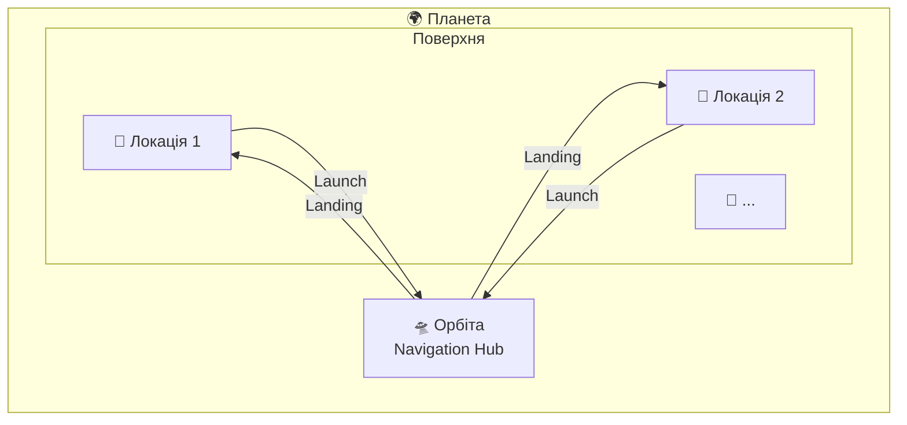
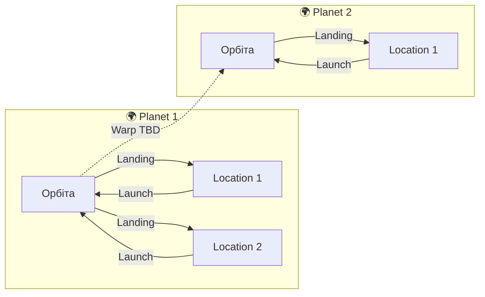
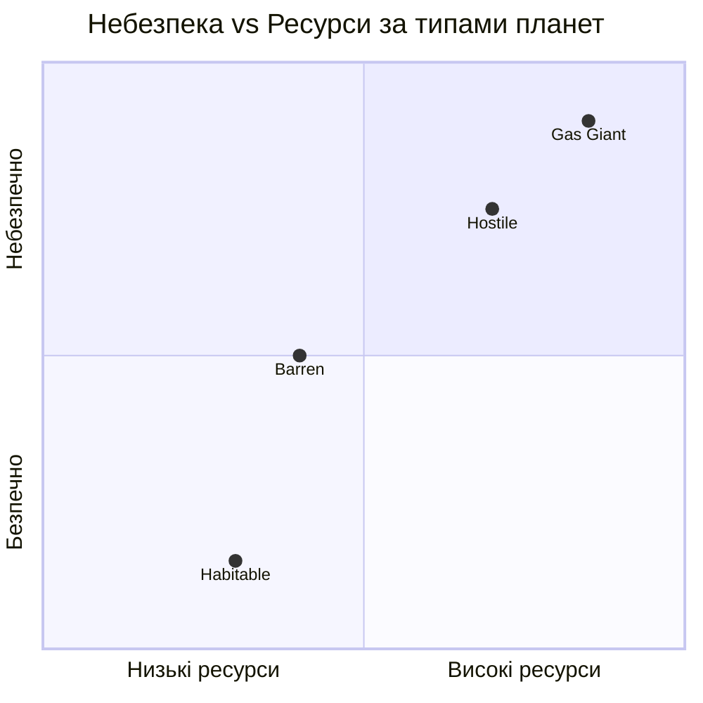
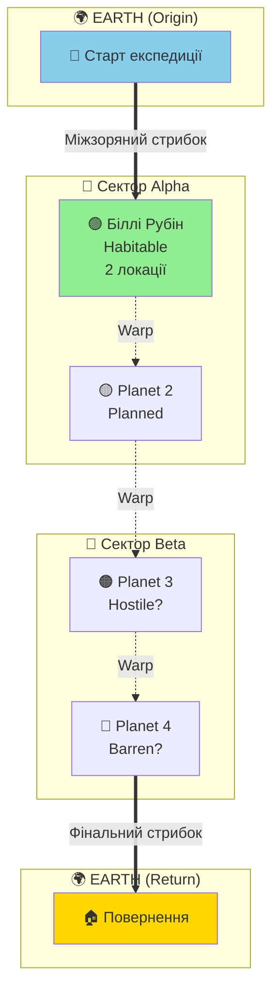

# LOCAL_GDD — Planets System
**Project:** Call of Relics: Orbital Silence
**Scope:** All Planets

---

## Overview

Планетарна система гри. Кожна планета — окремий ігровий контейнер з орбітою та локаціями на поверхні.

---

## Planet Registry

| Planet ID | Name | Type | Gravity | Atmosphere | Hazard | Status | Locations |
|-----------|------|------|---------|------------|--------|--------|-----------|
| Planet_1 | Біллі Рубін | Habitable | 1.2g | Breathable | Safe | Implemented | 7 |
| Planet_Earth | Earth | Home World | 1.0g | Breathable | Safe | Planned | 0 |

---

## Planet Structure

Кожна планета має таку ігрову структуру:



### Компоненти планети

| Компонент | Призначення |
|-----------|-------------|
| **Орбіта** | Точка прибуття, сканування, навігація |
| **Локації поверхні** | Ігрові зони для дослідження |
| **Конфігурація** | Параметри планети (атмосфера, гравітація, тип) |

---

## Discovery System

- Планети відкриваються через сканування з попередньої локації
- Нові планети з'являються в ProfileService як `discoveredPlanets`
- Локації на планеті відкриваються через сканування з орбіти

---

## Navigation Rules



1. **Orbit → Surface**: Landing через TransitionService
2. **Surface → Orbit**: Launch через TransitionService
3. **Planet → Planet**: TBD (warp/jump system)

---

## Planet Types

| Type | Characteristics | Example |
|------|----------------|---------|
| Habitable | Breathable atmosphere, low hazards | Біллі Рубін |
| Hostile | Environmental hazards, time limits | TBD |
| Barren | No atmosphere, suit required | TBD |
| Gas Giant | Orbit only, no surface landing | TBD |

---

## Planetary Characteristics Model

Кожна планета описується набором фізичних та геймплейних характеристик. Цей розділ визначає модель, яку повинна мати кожна планета.

### Physical Parameters

| Parameter | Description | Units / Values |
|-----------|-------------|----------------|
| **Gravity** | Поверхнева гравітація | Множник g (Earth = 1.0g) |
| **Atmosphere** | Тип атмосфери | Breathable / Marginal / Toxic / None |
| **Atm. Composition** | Склад атмосфери | Опис основних газів |
| **Atm. Pressure** | Тиск атмосфери | Low / Normal / High / Extreme / None |
| **Temperature** | Діапазон температур | min..max °C |
| **Radiation** | Рівень радіації | None / Low / Moderate / High / Lethal |
| **Magnetic Field** | Магнітне поле | None / Weak / Moderate / Strong |
| **Water** | Наявність води | None / Ice / Liquid / Vapor |
| **Day/Night Cycle** | Тривалість доби | хвилини (ігрового часу) |

### Weather System

| Parameter | Description | Values |
|-----------|-------------|--------|
| **Weather Type** | Тип погоди | Calm / Variable / Stormy / Extreme |
| **Precipitation** | Опади | None / Rain / Acid Rain / Dust / Ice |
| **Wind** | Вітер | Calm / Moderate / Strong / Hurricane |
| **Visibility** | Видимість | Clear / Haze / Fog / Dust Storm |
| **Weather Events** | Спеціальні події | Список можливих погодних подій |

### Gameplay Impact

| Parameter | Description | Values |
|-----------|-------------|--------|
| **Suit Mode Required** | Режим скафандра | Normal / Sealed / Chemical / Radiation / Extreme |
| **O₂ Drain Rate** | Витрата кисню | Множник (1.0x = Normal) |
| **Surface Time Limit** | Обмеження часу | Необмежено / хвилини |
| **Movement Speed** | Швидкість руху | Модифікатор від гравітації |
| **Jump Height** | Висота стрибка | Модифікатор від гравітації |
| **Hazard Level** | Загальна небезпека | Safe / Low / Moderate / High / Extreme |

### Characteristics by Planet Type



| Type | Gravity | Atmosphere | Radiation | Weather | Suit Mode | Hazard |
|------|---------|------------|-----------|---------|-----------|--------|
| **Habitable** | 0.8–1.3g | Breathable | None–Low | Calm–Variable | Normal | Safe–Low |
| **Hostile** | 0.5–2.0g | Toxic / Marginal | Moderate–High | Stormy–Extreme | Chemical / Radiation | High |
| **Barren** | 0.2–1.5g | None | Low–Moderate | Dust storms | Sealed | Moderate |
| **Gas Giant** | 2.5g+ | Crushing | Variable | Hurricane | — (orbit only) | Extreme |

---

## Концептуальна карта подорожі (Journey Map)



### Вимоги енергії для перельотів

```mermaid
xychart-beta
    title "Енергія для міжпланетних перельотів"
    x-axis [P1→P2, P2→P3, P3→P4, P4→Earth]
    y-axis "Енергія" 0 --> 1000
    bar [100, 200, 350, 800]
    line [100, 200, 350, 800]
```

---

## Related Documents

- [Planet_1/README.md](Planet_1/README.md) — Біллі Рубін
- [Planet_Earth/README.md](Planet_Earth/README.md) — Earth (origin)
- [PLAYER.md](../PLAYER.md) — Розділ 11: Скафандр дослідника (взаємодія з планетарними умовами)
- [PLANET_LOCATIONS.md](../PLANET_LOCATIONS.md) — Система планетних локацій
