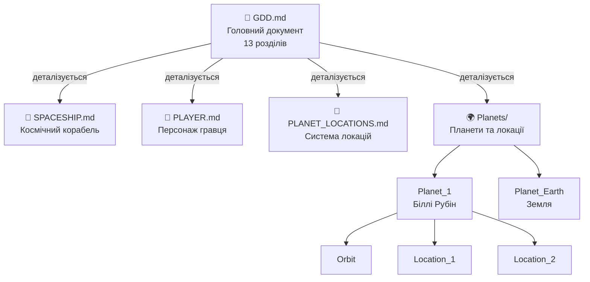

# Game Design Documentation
**Project:** Call of Relics: Orbital Silence

---

## Про цей розділ

Папка `Docs/GameDesign/` містить усю документацію з ігрового дизайну проєкту **Call of Relics: Orbital Silence**.

Документи цього розділу описують:
- Концепцію та механіки гри
- Ігровий світ і його структуру
- Планети, локації та їх характеристики
- Системи гри (корабель, сканування, прогресія)

---

## Структура документації

```
Docs/GameDesign/
├── README.md              ← Цей файл (навігація)
├── GDD.md                 ← Головний Game Design Document (13 розділів)
├── PLAYER.md              ← Персонаж гравця, глобальні стани, профіль
├── SPACESHIP.md           ← Космічний корабель, модулі, сканування
├── PLANET_LOCATIONS.md    ← Система планетних локацій (NEW)
└── Planets/               ← Планети та локації
    ├── README.md          ← Огляд планетарної системи
    ├── Planet_1/          ← Біллі Рубін (перша планета)
    │   ├── README.md      ← Опис планети
    │   ├── Orbit/
    │   │   └── README.md  ← Орбітальний вигляд
    │   └── Surface/
    │       ├── Location_1/
    │       │   └── README.md  ← Landing Site Alpha
    │       └── Location_2/
    │           └── README.md  ← Ancient Ruins
    └── Planet_Earth/      ← Земля (фінал гри)
        └── README.md      ← Опис планети
```

---

## Головні документи

### GDD.md — Game Design Document

**Головний документ ігрового дизайну.** Містить повний опис концепції гри. Після реструктуризації v0.14.0 — **13 розділів**.

**Зміст:**
| Розділ | Тема | Деталі |
|--------|------|--------|
| 1 | Загальна концепція | — |
| 2 | Персонаж гравця | → PLAYER.md |
| 3 | Огляд ігрового світу | — |
| 4 | Наративна зав'язка | — |
| 5 | Космічний корабель | → SPACESHIP.md |
| 6 | Міжпланетні перельоти | — |
| 7 | Планетні локації | → PLANET_LOCATIONS.md |
| 8 | Збереження прогресу | — |
| 9 | Початок гри | — |
| 10 | Перша планета (Біллі Рубін) | — |
| 11 | Теми та атмосфера | — |
| 12 | Принципи дизайну | — |
| 13 | Ідеї подальшого розвитку | — |

**Посилання:** [GDD.md](GDD.md)

---

### SPACESHIP.md — Космічний Корабель

**Детальний опис космічного корабля «Самотній Колумб».** Версія 1.8 — 11 секцій.

**Зміст:**
- Загальний опис та характеристики
- Компоненти корабля та модулі
- Робочі місця (5 функціональних сидінь)
- Системи корабля (сканери, двигуни, енергетика)
- Ramp System (посадочний трап)
- Орбітальний ігровий стан
- Системи сканування (Activity diagram)

**Робочі місця:**
| Сидіння | Функція |
|---------|---------|
| PilotSeat | Навігація, посадка, зліт |
| Seat Engines | Керування двигунами |
| Seat Planet Surface Scanner | Сканування поверхні планети |
| Seat Planet Locator | Пошук нових планет |
| Seat Personal Computer | Інвентар, база знань |

**Посилання:** [SPACESHIP.md](SPACESHIP.md)

---

### PLAYER.md — Персонаж Гравця

**Детальний опис персонажа гравця та системи профілю.** Версія 1.4 — 11 секцій.

**Зміст:**
- Роль та походження гравця
- Глобальні стани гравця (Logged Off / Logged In)
- Структура профілю (Profile Schema)
- Система збереження прогресу
- Інвентар (ресурси та знання)
- Розвиток персонажа
- Взаємодія гравця з системами (UseCase diagram)

**Ключові характеристики профілю:**
| Секція | Опис |
|--------|------|
| Identity | userId, createdAt, lastLogin |
| Location State | currentPlanet, currentLocation, lastSafeState |
| Discovery | discoveredPlanets, exploredLocations |
| Ship State | energyLevel, hullIntegrity, modules (scanner) |
| Inventory | resources (втрачаються), knowledge (ніколи) |
| Statistics | playTime, locationsExplored, resourcesCollected |

**Посилання:** [PLAYER.md](PLAYER.md)

---

### PLANET_LOCATIONS.md — Система Планетних Локацій

**Детальний опис системи локацій.** Версія 1.0 — новий документ з v0.14.0.

**Зміст:**
- Структура локації (Landing Zone, Exploration Area, Objectives)
- Класифікація 12 типів локацій
- Стани локацій (Unknown → Discovered → Visited → Explored)
- Критерії дослідження
- Невдалі стани та наслідки (Успіх / Втеча / Смерть)

**Mermaid діаграми:**
- flowchart, stateDiagram, pie, quadrantChart, xychart-beta, gantt

**Посилання:** [PLANET_LOCATIONS.md](PLANET_LOCATIONS.md)

---

## Планети та локації

### Planets/README.md — Планетарна система

**Огляд усієї планетарної системи гри.**

**Зміст:**
- Реєстр планет
- Структура папок планети
- Система відкриття (discovery)
- Правила навігації
- Типи планет

**Посилання:** [Planets/README.md](Planets/README.md)

---

### Planet_1 — Біллі Рубін

**Перша планета експедиції.** Навчальна планета з мінімальними загрозами.

| Властивість | Значення |
|-------------|----------|
| ID | Planet_1 |
| Назва | Біллі Рубін |
| Тип | Habitable (Super-Earth) |
| Атмосфера | Придатна для дихання |
| Гравітація | 1.2g |

**Локації:**
| ID | Назва | Тип |
|----|-------|-----|
| Orbit | Орбітальний вигляд | Navigation Hub |
| Location_1 | Landing Site Alpha | Exploration |
| Location_2 | Ancient Ruins | Exploration |

**Документи:**
- [Planet_1/README.md](Planets/Planet_1/README.md) — Опис планети
- [Planet_1/Orbit/README.md](Planets/Planet_1/Orbit/README.md) — Орбіта
- [Planet_1/Surface/Location_1/README.md](Planets/Planet_1/Surface/Location_1/README.md) — Локація 1
- [Planet_1/Surface/Location_2/README.md](Planets/Planet_1/Surface/Location_2/README.md) — Локація 2

---

### Planet_Earth — Земля

**Планета походження гравця.** Фінальна мета гри — повернення на Землю.

| Властивість | Значення |
|-------------|----------|
| ID | Planet_Earth |
| Статус | Planned |
| Роль | Фінал гри |

**Посилання:** [Planet_Earth/README.md](Planets/Planet_Earth/README.md)

---

## Зв'язок з іншими документами

### Ієрархія Game Design документації



> Технічна реалізація описана в документах `Docs/TechDesign/`

---

## Принципи документації

### Naming Convention

- **GDD.md** — головний Game Design Document
- **README.md** — опис папки/розділу
- **SPACESHIP.md**, **COMBAT.md** — документи по системах (CAPS)
- **Planet_Id/README.md** — опис конкретної планети

### Мова документації

- Основна мова: **українська**
- Технічні терміни: **англійська** (де доречно)
- Назви файлів/коду: **англійська**

### Формат

- Markdown (.md)
- Таблиці для структурованих даних
- Code blocks для технічних деталей

---

## Швидкі посилання

| Що шукаєте? | Де знайти? |
|-------------|------------|
| Концепція гри | [GDD.md](GDD.md) |
| Персонаж гравця | [PLAYER.md](PLAYER.md) |
| Глобальні стани гравця | [PLAYER.md#2-глобальні-стани-гравця](PLAYER.md) |
| Профіль гравця | [PLAYER.md#4-профіль-гравця-player-profile](PLAYER.md) |
| Космічний корабель | [SPACESHIP.md](SPACESHIP.md) |
| Робочі місця корабля | [SPACESHIP.md#3-робочі-місця-seats](SPACESHIP.md) |
| Системи сканування | [SPACESHIP.md#9-системи-сканування](SPACESHIP.md) |
| Система локацій | [PLANET_LOCATIONS.md](PLANET_LOCATIONS.md) |
| Типи локацій | [PLANET_LOCATIONS.md#3-класифікація-планетних-локацій](PLANET_LOCATIONS.md) |
| Стани локацій | [PLANET_LOCATIONS.md#4-прогресія-локацій](PLANET_LOCATIONS.md) |
| Планети | [Planets/README.md](Planets/README.md) |
| Перша планета | [Planet_1/README.md](Planets/Planet_1/README.md) |
| Локації планети | [Planet_1/Surface/](Planets/Planet_1/Surface/) |
| Технічна реалізація | Docs/TechDesign/TDD.md |

---

**Версія:** 1.4
**Дата:** 2026-01-21

**Changelog:**
- 1.4: Додано PLANET_LOCATIONS.md; оновлено GDD структуру (13 розділів); оновлено посилання
- 1.3: Видалено технічні посилання (TDD, KB, etc.) — фокус на Game Design
- 1.2: Додано Mermaid діаграми до всіх документів GameDesign
- 1.1: Додано PLAYER.md (персонаж гравця та профіль)
- 1.0: Початкова версія
