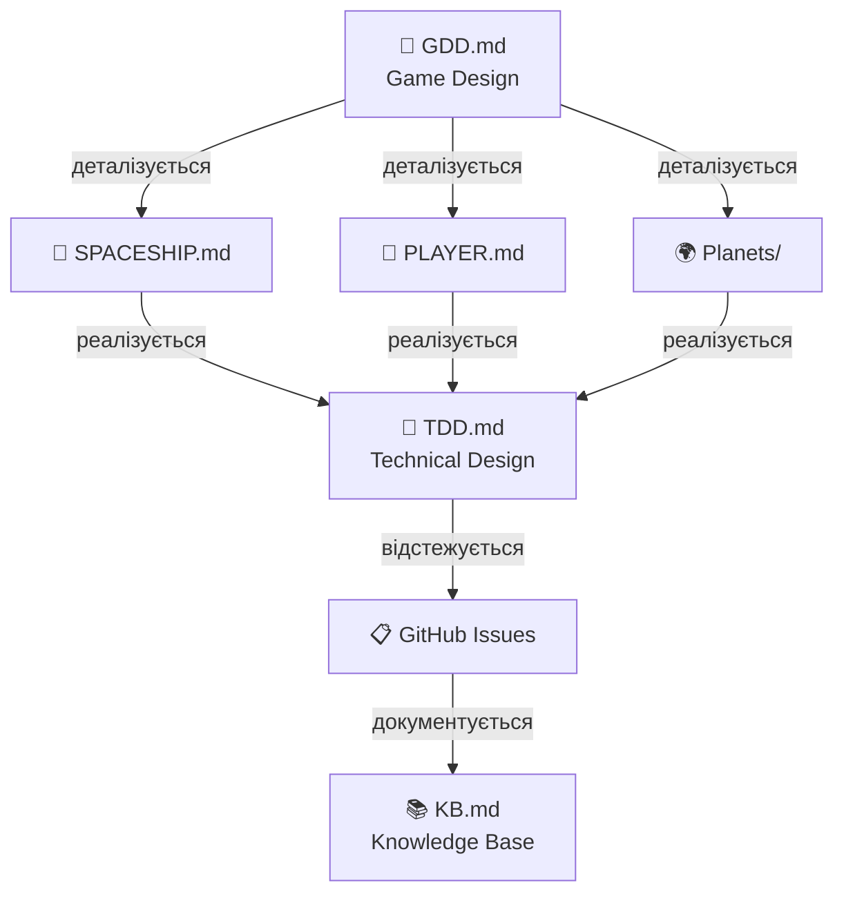

# Game Design Documentation
**Project:** Call of Relics: Orbital Silence

---

## Про цей розділ

Папка `Docs/GameDesign/` містить усю документацію з ігрового дизайну проєкту **Call of Relics: Orbital Silence**.

Документи цього розділу описують:
- Концепцію та механіки гри
- Ігровий світ і його структуру
- Планети, локації та їх характеристики
- Системи гри (корабель, сканування, прогресія)

---

## Структура документації

```
Docs/GameDesign/
├── README.md              ← Цей файл (навігація)
├── GDD.md                 ← Головний Game Design Document
├── PLAYER.md              ← Персонаж гравця та профіль
├── SPACESHIP.md           ← Космічний корабель
└── Planets/               ← Планети та локації
    ├── README.md          ← Огляд планетарної системи
    ├── Planet_1/          ← Біллі Рубін (перша планета)
    │   ├── README.md      ← Опис планети
    │   ├── Orbit/
    │   │   └── README.md  ← Орбітальний вигляд
    │   └── Surface/
    │       ├── Location_1/
    │       │   └── README.md  ← Landing Site Alpha
    │       └── Location_2/
    │           └── README.md  ← Ancient Ruins
    └── Planet_Earth/      ← Земля (фінал гри)
        └── README.md      ← Опис планети
```

---

## Головні документи

### GDD.md — Game Design Document

**Головний документ ігрового дизайну.** Містить повний опис концепції гри.

**Зміст:**
| Розділ | Тема |
|--------|------|
| 1 | Загальна концепція |
| 2 | Глобальні стани гравця |
| 3 | Огляд ігрового світу |
| 4 | Наративна зав'язка |
| 5 | Персонаж гравця |
| 6-7 | Космічний корабель та модулі |
| 8 | Орбітальний ігровий стан |
| 9 | Системи сканування |
| 10 | Міжпланетні перельоти |
| 11-14 | Планети та локації |
| 15 | Невдалі стани (failure) |
| 16 | Збереження прогресу |
| 17 | Початок гри |
| 18 | Перша планета (Біллі Рубін) |
| 19-20 | Теми, атмосфера, принципи |
| 21 | Ідеї подальшого розвитку |

**Посилання:** [GDD.md](GDD.md)

---

### SPACESHIP.md — Космічний Корабель

**Детальний опис космічного корабля «Самотній Колумб».**

**Зміст:**
- Загальний опис та характеристики
- Компоненти корабля
- Робочі місця (5 функціональних сидінь)
- Системи корабля (сканери, двигуни, енергетика)
- Життєвий цикл корабля
- Апгрейди та технічна реалізація

**Робочі місця:**
| Сидіння | Функція |
|---------|---------|
| PilotSeat | Навігація, посадка, зліт |
| Seat Engines | Керування двигунами |
| Seat Planet Surface Scanner | Сканування поверхні планети |
| Seat Planet Locator | Пошук нових планет |
| Seat Personal Computer | Інвентар, база знань |

**Посилання:** [SPACESHIP.md](SPACESHIP.md)

---

### PLAYER.md — Персонаж Гравця

**Детальний опис персонажа гравця та системи профілю.**

**Зміст:**
- Походження та передісторія
- Роль у геймплеї
- Структура профілю (Profile Schema)
- Система збереження прогресу
- Інвентар (ресурси та знання)
- Статистика гравця

**Ключові характеристики профілю:**
| Секція | Опис |
|--------|------|
| Identity | userId, createdAt, lastLogin |
| Location State | currentPlanet, currentLocation, lastSafeState |
| Discovery | discoveredPlanets, exploredLocations |
| Ship State | energyLevel, hullIntegrity, modules (scanner) |
| Inventory | resources (втрачаються), knowledge (ніколи) |
| Statistics | playTime, locationsExplored, resourcesCollected |

**Посилання:** [PLAYER.md](PLAYER.md)

---

## Планети та локації

### Planets/README.md — Планетарна система

**Огляд усієї планетарної системи гри.**

**Зміст:**
- Реєстр планет
- Структура папок планети
- Система відкриття (discovery)
- Правила навігації
- Типи планет

**Посилання:** [Planets/README.md](Planets/README.md)

---

### Planet_1 — Біллі Рубін

**Перша планета експедиції.** Навчальна планета з мінімальними загрозами.

| Властивість | Значення |
|-------------|----------|
| ID | Planet_1 |
| Назва | Біллі Рубін |
| Тип | Habitable (Super-Earth) |
| Атмосфера | Придатна для дихання |
| Гравітація | 1.2g |

**Локації:**
| ID | Назва | Тип |
|----|-------|-----|
| Orbit | Орбітальний вигляд | Navigation Hub |
| Location_1 | Landing Site Alpha | Exploration |
| Location_2 | Ancient Ruins | Exploration |

**Документи:**
- [Planet_1/README.md](Planets/Planet_1/README.md) — Опис планети
- [Planet_1/Orbit/README.md](Planets/Planet_1/Orbit/README.md) — Орбіта
- [Planet_1/Surface/Location_1/README.md](Planets/Planet_1/Surface/Location_1/README.md) — Локація 1
- [Planet_1/Surface/Location_2/README.md](Planets/Planet_1/Surface/Location_2/README.md) — Локація 2

---

### Planet_Earth — Земля

**Планета походження гравця.** Фінальна мета гри — повернення на Землю.

| Властивість | Значення |
|-------------|----------|
| ID | Planet_Earth |
| Статус | Planned |
| Роль | Фінал гри |

**Посилання:** [Planet_Earth/README.md](Planets/Planet_Earth/README.md)

---

## Зв'язок з іншими документами

### Docs/ (кореневий рівень)

| Документ | Призначення |
|----------|-------------|
| [TDD.md](../TDD.md) | Technical Design Document |
| [KB.md](../KB.md) | Knowledge Base (технічні рішення) |
| [Backlog.md](../Backlog.md) | Product Backlog |
| [FOLDER_STRUCTURE.md](../FOLDER_STRUCTURE.md) | Структура проєкту |
| [README_GUI_DEV.md](../README_GUI_DEV.md) | Документація UI |

### Ієрархія документації



```
GDD.md (Game Design)
    ↓ деталізується в
SPACESHIP.md (корабель)
Planets/README.md (планети)
    ↓ реалізується в
TDD.md (Technical Design)
    ↓ відстежується в
Backlog.md (Tasks)
    ↓ документується в
KB.md (Knowledge Base)
```

---

## Принципи документації

### Naming Convention

- **GDD.md** — головний Game Design Document
- **README.md** — опис папки/розділу
- **SPACESHIP.md**, **COMBAT.md** — документи по системах (CAPS)
- **Planet_Id/README.md** — опис конкретної планети

### Мова документації

- Основна мова: **українська**
- Технічні терміни: **англійська** (де доречно)
- Назви файлів/коду: **англійська**

### Формат

- Markdown (.md)
- Таблиці для структурованих даних
- Code blocks для технічних деталей

---

## Швидкі посилання

| Що шукаєте? | Де знайти? |
|-------------|------------|
| Концепція гри | [GDD.md](GDD.md) |
| Персонаж гравця | [PLAYER.md](PLAYER.md) |
| Профіль гравця | [PLAYER.md#3-профіль-гравця-player-profile](PLAYER.md) |
| Космічний корабель | [SPACESHIP.md](SPACESHIP.md) |
| Робочі місця корабля | [SPACESHIP.md#3-робочі-місця-seats](SPACESHIP.md) |
| Сканер поверхні | [SPACESHIP.md#сканер-поверхні-планети-seat-planet-surface-scanner](SPACESHIP.md) |
| Планети | [Planets/README.md](Planets/README.md) |
| Перша планета | [Planet_1/README.md](Planets/Planet_1/README.md) |
| Локації планети | [Planet_1/Surface/](Planets/Planet_1/Surface/) |
| Типи локацій | [GDD.md#13-класифікація-планетних-локацій](GDD.md) |
| Прогресія | [GDD.md#14-прогресія-локацій](GDD.md) |
| Технічна реалізація | [../TDD.md](../TDD.md) |

---

**Версія:** 1.2
**Дата:** 2026-01-21

**Changelog:**
- 1.2: Додано Mermaid діаграми до всіх документів GameDesign
- 1.1: Додано PLAYER.md (персонаж гравця та профіль)
- 1.0: Початкова версія
