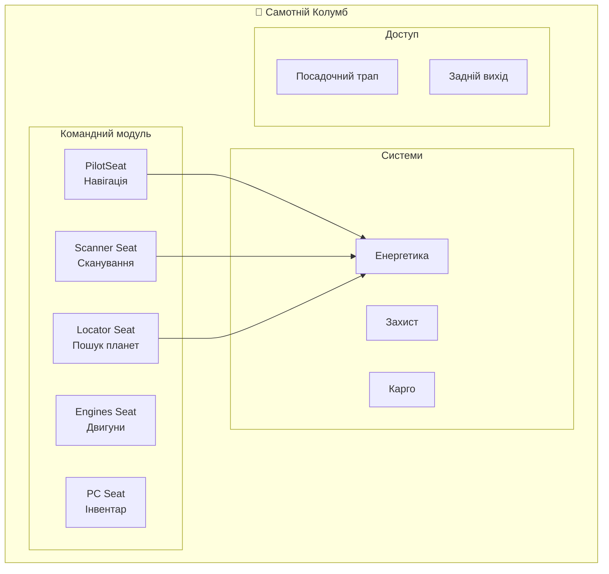
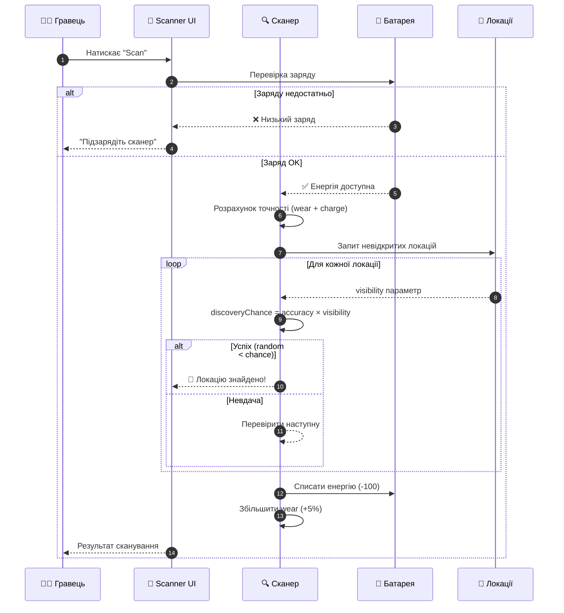
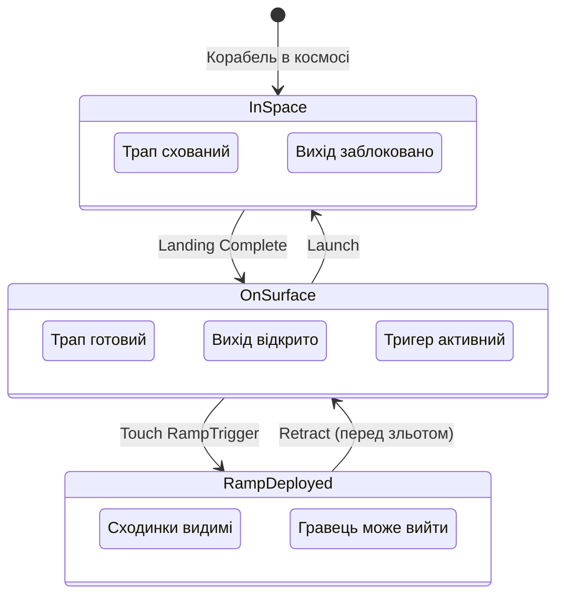
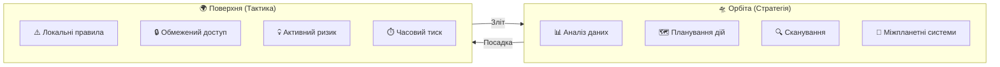

# Космічний Корабель — «Самотній Колумб»
**Project:** Call of Relics: Orbital Silence
**Document Type:** Game Design — SpaceShip System

---

## 1. ЗАГАЛЬНИЙ ОПИС

Космічний корабель **«Самотній Колумб»** (Ones Columbus) є центральним елементом геймплею. Це не просто транспорт — це мобільна база, точка збереження прогресу та наративний центр гри.

### Статус корабля
- **Тип:** Експериментальний, автономний
- **Екіпаж:** Один член (гравець)
- **Розташування:** Орбіта планети або поверхня локації

### Роль у геймплеї
| Роль | Опис |
|------|------|
| Мобільна база | Постійне місце перебування гравця |
| Точка спавну | Гравець з'являється на кораблі після входу в гру |
| Збереження прогресу | Автоматичне збереження при переходах |
| Наративний центр | Командний центр для прийняття рішень |

---

## 2. ХАРАКТЕРИСТИКИ КОРАБЛЯ

### 2.1. Швидкість (Speed)

| Параметр | Значення | Опис |
|----------|----------|------|
| maxSpeed | 100 studs/sec | Максимальна швидкість |
| acceleration | 20 studs/sec² | Прискорення |
| deceleration | 30 studs/sec² | Гальмування |
| maneuverability | 0.8 | Маневреність (0.0 - 1.0) |
| boostMultiplier | 1.5x | Множник швидкості при прискоренні |
| boostDuration | 3.0 sec | Тривалість прискорення |

### 2.2. Енергетика (Energy)

| Параметр | Значення | Опис |
|----------|----------|------|
| maxEnergy | 1000 | Максимальний запас енергії |
| regenRate | 5/sec | Швидкість регенерації |
| regenDelay | 2.0 sec | Затримка перед регенерацією |

**Споживання енергії:**

| Дія | Витрата | Примітка |
|-----|---------|----------|
| Idle | 0/sec | В режимі очікування |
| Moving | 2/sec | При русі |
| Boost | 10/sec | При прискоренні |
| Scan | 50 | За одне сканування |
| Landing | 100 | Посадка на локацію |
| Launch | 150 | Зліт на орбіту |
| Interplanetary | 500 | Міжпланетний переліт |

### 2.3. Захист (Defense)

| Параметр | Значення | Опис |
|----------|----------|------|
| maxShield | 100 | Максимальний щит |
| maxHull | 200 | Максимальна міцність корпусу |
| shieldRegenRate | 2/sec | Регенерація щита |
| shieldRegenDelay | 5.0 sec | Затримка регенерації щита |

### 2.4. Обмеження на початку гри

На старті гри корабель має значні обмеження:
- Недостатньо енергії для повернення на Землю
- Доступні лише локальні орбітальні маневри
- Посадки та зльоти в межах однієї планети
- Обмежені можливості модулів

---

## 3. РОБОЧІ МІСЦЯ (SEATS)

Корабель обладнаний **5 функціональними робочими місцями**, кожне з яких надає доступ до певних систем.

### 3.1. Таблиця робочих місць

| Сидіння | Назва (UK) | UI Module | Функціонал |
|---------|------------|-----------|------------|
| PilotSeat | Пілотське крісло | PilotUI | Навігація, посадка, зліт |
| Seat Engines | Керування двигунами | EnginesUI | Контроль двигунів |
| Seat Planet Surface Scanner | Сканер поверхні | PlanetSurfaceScannerUI | Сканування планети |
| Seat Planet Locator | Планетний локатор | PlanetLocatorUI | Пошук нових планет |
| Seat Personal Computer | Персональний комп'ютер | PersonalComputerUI | Інвентар, знання |

### 3.2. Детальний опис робочих місць

---

#### ПІЛОТСЬКЕ КРІСЛО (PilotSeat)

**Тип сидіння:** VehicleSeat

**Призначення:**
Головне місце керування кораблем. Звідси гравець контролює переміщення та приймає ключові рішення.

**Можливості:**
- Перегляд списку відкритих локацій
- Ініціювання посадки на локацію
- Ініціювання зльоту на орбіту
- (Майбутнє) Навігація між планетами
- (Майбутнє) Керування зброєю

**Контекстна поведінка:**
| Контекст | Доступні дії |
|----------|--------------|
| Орбіта | Вибір локації для посадки |
| Поверхня | Кнопка "Зліт на орбіту" |

**Функціональні флаги:**
- `canControl = true`
- `canNavigate = true`

---

#### СКАНЕР ПОВЕРХНІ ПЛАНЕТИ (Seat Planet Surface Scanner)

**Тип сидіння:** Seat

**Призначення:**
Виявлення невідкритих локацій на поверхні поточної планети.

**Можливості:**
- Запуск сканування поверхні
- Прогрес сканування (візуальний)
- Відкриття нових локацій
- Перегляд списку виявлених локацій

**Обмеження:**
- Працює **тільки на орбіті**
- Не працює на поверхні локації
- Cooldown між скануваннями (10 сек)

**Часові параметри:**

| Параметр | Значення | Опис |
|----------|----------|------|
| scanDuration | 5.0 sec | Тривалість сканування |
| scanCooldown | 10.0 sec | Перерва між скануваннями |

**Батарея сканера (власне джерело живлення):**

| Параметр | Значення | Опис |
|----------|----------|------|
| maxCapacity | 500 | Максимальна ємність батареї |
| rechargeRate | 2/sec | Швидкість підзарядки (від корабля) |
| rechargeDelay | 3.0 sec | Затримка перед підзарядкою |

**Споживання енергії:**

| Параметр | Значення | Опис |
|----------|----------|------|
| powerConsumption | 100 | Витрата енергії за одне сканування |

> Сканер має **власну батарею**, яка заряджається від енергосистеми корабля. Кожне сканування споживає енергію з батареї сканера, а не напряму з корабля.

**Система зношення (Wear):**

| Параметр | Значення | Опис |
|----------|----------|------|
| baseAccuracy | 100% | Точність нового сканера |
| wearPerScan | -5% | Зменшення точності за кожне сканування |
| minAccuracy | 0% | Мінімальна точність (повне зношення) |
| repairCost | 200 | Вартість ремонту (відновлення точності) |
| guaranteedFirstScan | true | Перший скан завжди успішний |

**Видимість локації (Location Visibility):**

Кожна локація має параметр `visibility` (0-100%), який визначає наскільки легко її виявити:

| Visibility | Опис | Приклад |
|------------|------|---------|
| 100% | Завжди видима | Стартові локації |
| 70% | Легко виявити | Типові локації |
| 50% | Середня складність | Приховані локації |
| 30% | Важко виявити | Секретні локації |
| 10% | Дуже прихована | Легендарні локації |

---

### Таблиця ймовірності виявлення

| Стан сканера | Заряд | Visibility | Формула | Шанс |
|--------------|-------|------------|---------|------|
| Новий (100%) | Повний | 100% | 1.0 × 1.0 × 1.0 | **100%** |
| Новий (100%) | Повний | 70% | 1.0 × 1.0 × 0.7 | **70%** |
| 10 сканів (50%) | Повний | 100% | 0.5 × 1.0 × 1.0 | **50%** |
| 10 сканів (50%) | Повний | 70% | 0.5 × 1.0 × 0.7 | **35%** |
| Новий (100%) | 50/100 | 100% | 1.0 × 0.5 × 1.0 | **50%** |
| 10 сканів (50%) | 80/100 | 50% | 0.5 × 0.8 × 0.5 | **20%** |
| 15 сканів (25%) | Повний | 30% | 0.25 × 1.0 × 0.3 | **7.5%** |
| 20 сканів (0%) | Будь-який | Будь-яка | 0.0 × ... | **0%** |

---

### Приклад зношення

| Кількість сканувань | Точність | Стан |
|---------------------|----------|------|
| 0 (новий) | 100% | Ідеальний |
| 5 | 75% | Добрий |
| 10 | 50% | Середній |
| 15 | 25% | Поганий |
| 20 | 0% | Зношений (потребує ремонту) |

**Максимум сканувань до повного зношення:** 20 (100% / 5% = 20)

---

### Механіка сканування

**Перший скан:**
- Завжди успішний (`guaranteedFirstScan = true`)
- Ігнорує зношення та видимість

**Наступні скани:**
- Перебирає невідкриті локації у випадковому порядку
- Для кожної перевіряє шанс виявлення за формулою
- Відкриває першу успішно виявлену локацію
- Якщо жодна не виявлена: "Нічого не знайдено"

**Результат сканування:**
- При успіху: відкриття однієї невідкритої локації
- При невдачі: "Нічого не знайдено" (зношення все одно збільшується)
- Локація отримує статус `isDiscovered = true`
- Локація стає доступною для посадки

---

### Ремонт та підзарядка

**Ремонт сканера:**
- Скидає лічильник сканувань (`scanCount = 0`)
- Відновлює точність до 100%
- Коштує енергії або ресурсів (TBD)

**Підзарядка батареї:**
- Автоматична підзарядка від корабля (2/sec)
- Або ручна підзарядка через інтерфейс

**Функціональні флаги:**
- `canScan = true`

---

#### КЕРУВАННЯ ДВИГУНАМИ (Seat Engines)

**Тип сидіння:** Seat

**Призначення:**
Моніторинг та керування двигунами корабля.

**Можливості (заплановано):**
- Перегляд стану двигунів
- Моніторинг рівня палива/енергії
- Розподіл потужності
- Налаштування режимів двигунів

**Вплив на геймплей:**
- Стан двигунів впливає на швидкість
- Стан двигунів впливає на маневреність
- Енергія обмежує міжпланетні перельоти

**Функціональні флаги:**
- `canControlEngines = true`

---

#### ПЛАНЕТНИЙ ЛОКАТОР (Seat Planet Locator)

**Тип сидіння:** Seat

**Призначення:**
Виявлення нових планет у космосі.

**Можливості (заплановано):**
- Перегляд відомих планет
- Сканування космосу на нові планети
- Встановлення навігаційної цілі
- Оцінка відстані до планет

**Обмеження:**
- Працює **тільки на орбіті**
- Потребує енергію для сканування

**Результат сканування:**
- Виявлення нової планети
- Планета зберігається в `discoveredPlanets` профілю

**Функціональні флаги:**
- `canLocatePlanets = true`

---

#### ПЕРСОНАЛЬНИЙ КОМП'ЮТЕР (Seat Personal Computer)

**Тип сидіння:** Seat

**Призначення:**
Доступ до особистих даних гравця — інвентарю та бази знань.

**Можливості (заплановано):**
- Перегляд інвентарю (ресурси)
- Перегляд бази знань
- Управління зібраними ресурсами
- Перегляд відкритих записів

**Особливості:**
- Доступний на орбіті та на поверхні
- Не вимагає особливих умов

**Функціональні флаги:**
- `canAccessInventory = true`
- `canAccessKnowledge = true`

---

## 4. СИСТЕМА ТРАПУ (RAMP SYSTEM)

### 4.1. Загальний опис

Посадочний трап — система для безпечного виходу/входу екіпажу на поверхню планети. Трап працює тільки коли корабель приземлився.

### 4.2. Компоненти

| Компонент | Тип | Опис |
|-----------|-----|------|
| ShipRamp | Model | Модель трапу з 10 металевих сходинок |
| RampTrigger | Part | Тригер-зона для активації трапу |
| RearShipExit | Part | Задній вихід (ShipParts/RearShipExit) |

### 4.3. Стани системи

| Контекст | ShipRamp | RearShipExit | RampTrigger |
|----------|----------|--------------|-------------|
| **В космосі/польоті** | Схований | Блокує вихід | Неактивний |
| **Після приземлення** | Готовий до deploy | Прохідний | Активний (підсвітка) |
| **Трап розгорнутий** | Видимий | Прохідний | Активний |

### 4.4. Властивості компонентів

**RearShipExit (задній вихід):**

| Стан | CanCollide | Transparency | Опис |
|------|------------|--------------|------|
| Blocked | true | 0.25 | Блокує вихід в космосі |
| Open | false | 0.8 | Дозволяє вихід на поверхні |

**RampTrigger:**

| Стан | Transparency | Highlight | Опис |
|------|--------------|-----------|------|
| Inactive | 1.0 | Off | Невидимий в космосі |
| Active | 0.7 | Green glow | Активний після приземлення |

**ShipRamp Steps (Step1-Step10):**

| Стан | Transparency | CanCollide | Опис |
|------|--------------|------------|------|
| Hidden | 1.0 | false | Схований |
| Visible | 0.0 | true | Видимий, можна ходити |

### 4.5. Анімація трапу

**Deploy (розгортання):**
1. Step1 → Step10 з'являються послідовно
2. Fade in: 0.3 sec на сходинку
3. Затримка: 0.1 sec між сходинками
4. Загальний час: ~1.5 sec

**Retract (згортання):**
1. Step10 → Step1 зникають послідовно
2. Fade out: 0.3 sec на сходинку
3. Затримка: 0.1 sec між сходинками
4. Загальний час: ~1.5 sec

### 4.6. Логіка роботи

**При старті гри / spawn корабля:**
- Трап схований
- RearShipExit блокує вихід
- RampTrigger неактивний

**Після приземлення (Landing complete):**
1. `SetShipLanded(player, true)` викликається
2. RearShipExit стає прохідним
3. RampTrigger активується (зелена підсвітка)
4. Touch detection включається

**Коли гравець торкається RampTrigger:**
1. `DeployRamp(player)` викликається
2. Анімація розгортання трапу
3. Гравець може вийти на поверхню

**Перед зльотом (Launch):**
1. Якщо трап розгорнутий → `RetractRamp(player)`
2. Чекаємо 1.5 sec на анімацію згортання
3. `SetShipLanded(player, false)` викликається
4. RearShipExit блокує вихід
5. RampTrigger деактивується
6. Корабель злітає

---

## 5. СИСТЕМИ КОРАБЛЯ

### 5.1. Сканери

| Система | Робоче місце | Результат |
|---------|--------------|-----------|
| Surface Scanner | Seat Planet Surface Scanner | Відкриття локацій на планеті |
| Planet Locator | Seat Planet Locator | Відкриття нових планет |

### 4.2. Двигуни (Engines)

| Тип | Призначення |
|-----|-------------|
| Orbital | Маневри на орбіті, посадка/зліт |
| Interplanetary | Перельоти між планетами |
| Interstellar | Повернення на Землю (фінал гри) |

### 4.3. Енергетика

- Сонячні батареї
- Акумулятори
- (Майбутнє) Інші джерела

---

## 5. ЖИТТЄВИЙ ЦИКЛ КОРАБЛЯ

### 5.1. Ініціалізація

1. При старті гри корабель клонується з `ServerStorage/Actors/SpaceShip`
2. Корабель розміщується на орбіті планети
3. Гравець спавниться в PilotSeat
4. `ModelStreamingMode = Persistent` запобігає стримінгу

### 5.2. Переходи

### 5.3. Збереження

Стан корабля зберігається в профілі гравця:
- `spaceShipModel` — модель корабля (для апгрейдів)
- (Майбутнє) Рівень модулів
- (Майбутнє) Запас енергії

---

## 6. АПГРЕЙДИ КОРАБЛЯ

### 6.1. Моделі корабля

| Модель | Статус | Опис |
|--------|--------|------|
| SpaceShip | Implemented | Базова модель |
| SpaceShip_Advanced | TBD | Покращена модель |
| SpaceShip_Elite | TBD | Елітна модель |

### 6.2. Система апгрейдів (заплановано)

- Профіль гравця зберігає `spaceShipModel`
- При старті гри завантажується відповідна модель
- Fallback до `SpaceShip` якщо модель не знайдена

---

## 7. НАЛАШТУВАННЯ КАМЕРИ

Кожне робоче місце має власні налаштування камери:

| Сидіння | FOV | Min Zoom | Max Zoom |
|---------|-----|----------|----------|
| PilotSeat | 70 | 5 | 50 |
| Seat Engines | 70 | 5 | 30 |
| Seat Planet Surface Scanner | 70 | 5 | 50 |
| Seat Planet Locator | 70 | 5 | 50 |
| Seat Personal Computer | 70 | 5 | 30 |

---

## 8. ОРБІТАЛЬНИЙ ІГРОВИЙ СТАН

Орбіта планети є окремим ігровим станом, який принципово відрізняється від перебування на поверхні локації.

### 8.1. Перебування на орбіті планети

Коли космічний корабель перебуває на орбіті планети:
- Гравець знаходиться всередині корабля
- Активні деякі корабельні системи
- Доступні сканери і локатори
- Можливе управління маршрутами і перельотами

Орбіта є:
- Безпечною зоною
- Місцем відновлення
- Точкою між експедиціями

### 8.2. Відмінності між орбітою та поверхнею

| Орбіта | Поверхня |
|--------|----------|
| Стратегічний режим | Тактичний режим |
| Аналіз даних | Активна дія |
| Доступ до всіх систем | Обмежений доступ |
| Безпека | Ризик |

### 8.3. Візуальний контекст орбіти

Перебування на орбіті візуально відображає:
- Поточну планету
- Її розмір, колір і структуру
- Зоряне небо конкретного регіону

Орбіта підкреслює:
- Самотність гравця
- Масштаб простору
- Дистанцію між локаціями

---

## 9. СИСТЕМИ СКАНУВАННЯ

Сканери є ключовими інструментами прогресу гри. Без сканування неможливе подальше дослідження.

### 9.1. Activity Diagram: Процес сканування

### 9.2. Невизначеність як елемент дизайну

Сканери навмисно не дають повної картини:
- Гравець не знає наперед тип локації
- Гравець не знає точний рівень ризику
- Рішення приймаються на основі обмежених даних

Це підтримує:
- Атмосферу дослідження
- Відчуття невідомого
- Відповідальність вибору

---

## 10. ЗВ'ЯЗОК З GDD

Цей документ деталізує **Розділи 6, 7, 8, 9 GDD**:
- Розділ 6: Космічний Корабель
- Розділ 7: Модулі Космічного Корабля
- Розділ 8: Орбітальний ігровий стан
- Розділ 9: Системи сканування

---

## 11. МАЙБУТНІЙ РОЗВИТОК

### Запланований функціонал

- [ ] Повноцінна система двигунів
- [ ] Міжпланетні перельоти
- [ ] Система апгрейдів модулів
- [ ] Керування зброєю (PilotSeat)
- [ ] Візуальні пошкодження корабля
- [ ] Альтернативні моделі кораблів

---

**Версія документа:** 1.8
**Дата:** 2026-01-21

**Changelog:**
- 1.8: Додано секції 8-9 (Орбітальний стан, Системи сканування) з GDD; Activity diagram для сканування; перенумеровано розділи
- 1.7: Додано Sequence діаграму для процесу сканування
- 1.6: Видалено технічну реалізацію (перенесено до TDD) — фокус на Game Design
- 1.5: Додано Mermaid діаграми (структура корабля, система трапу, життєвий цикл)
- 1.4: Додано секцію Ramp System (посадочний трап, RampTrigger, RearShipExit)
- 1.3: Додано формулу ймовірності виявлення локації (visibility, chargeRatio, wearAccuracy)
- 1.2: Нова модель сканера: власна батарея, система зношення (wear), ремонт
- 1.1: Додано характеристики швидкості, енергетики, захисту; деталізовано сканер (точність, енергоспоживання)
- 1.0: Початкова версія документа

> **Примітка:** Технічна реалізація (API, структура файлів, код) описана в `Docs/TechDesign/TDD.md`
