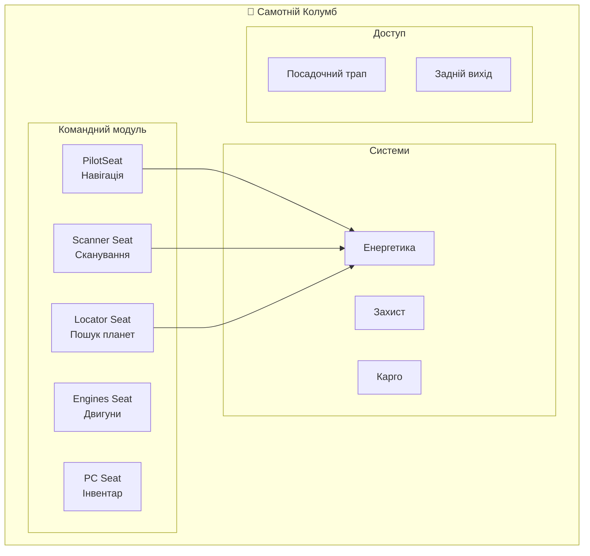
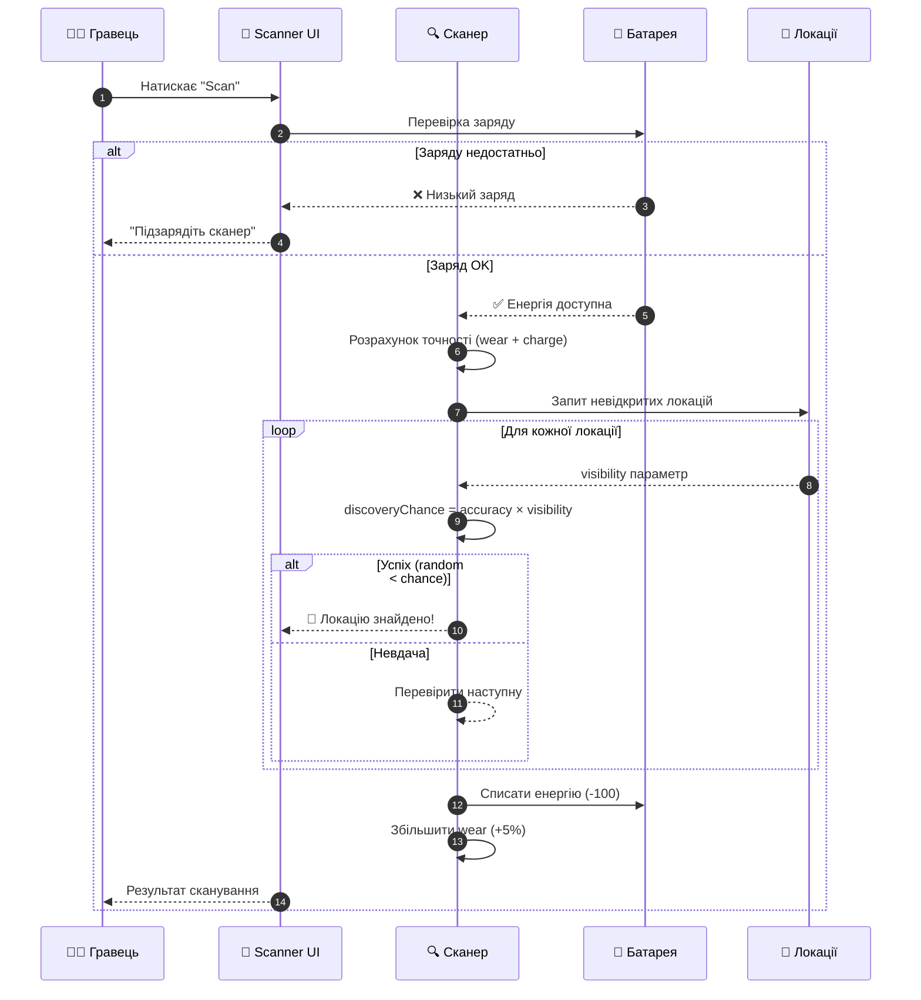
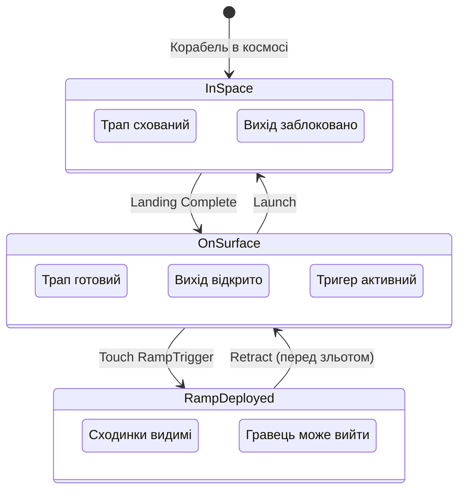
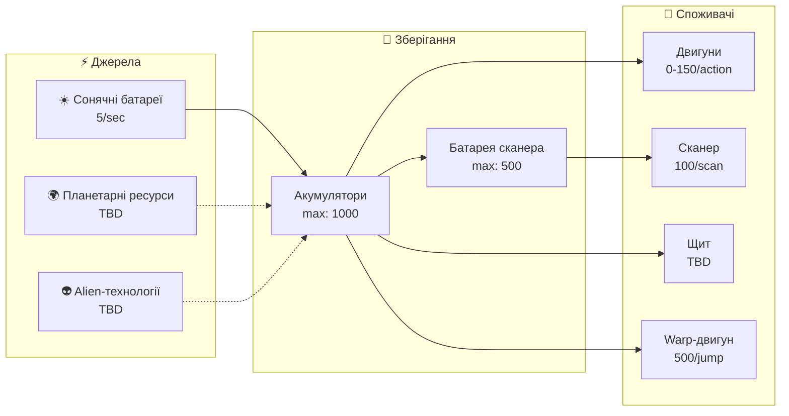
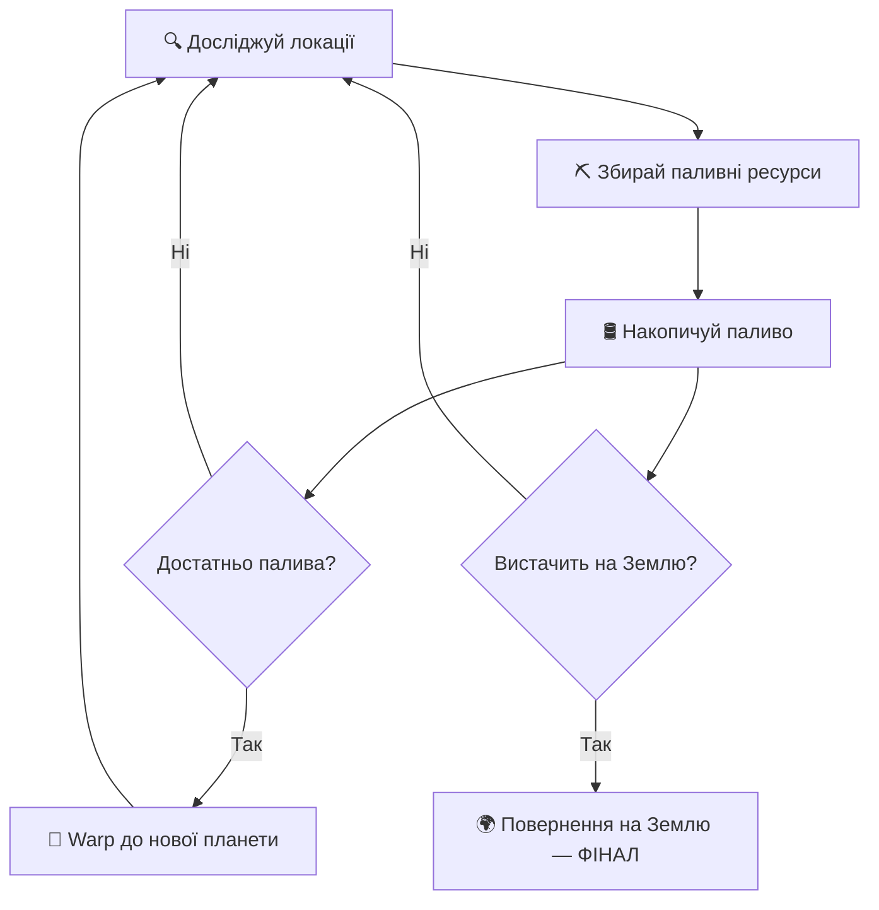
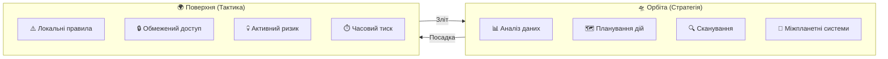
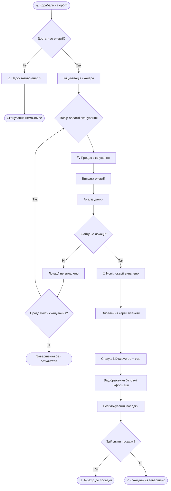
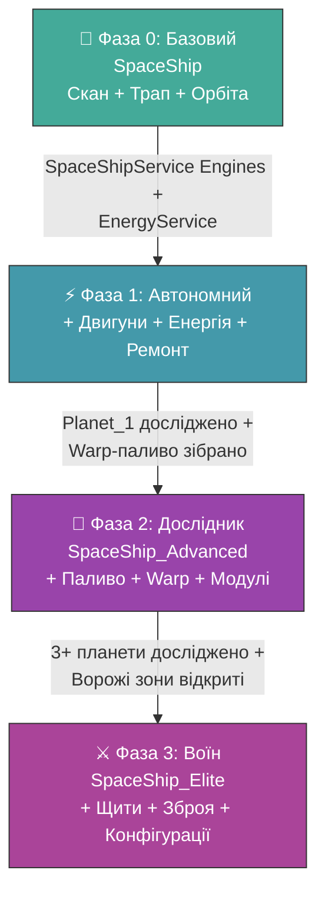

# Космічний Корабель — «Самотній Колумб»
**Project:** Call of Relics: Orbital Silence
**Document Type:** Game Design — SpaceShip System

---

## 1. ЗАГАЛЬНИЙ ОПИС

Космічний корабель **«Самотній Колумб»** (Ones Columbus) є центральним елементом геймплею. Це не просто транспорт — це мобільна база, точка збереження прогресу та наративний центр гри.

### Статус корабля
- **Тип:** Експериментальний, автономний
- **Екіпаж:** Один член (гравець)
- **Розташування:** Орбіта планети або поверхня локації

### Роль у геймплеї
| Роль | Опис |
|------|------|
| Мобільна база | Постійне місце перебування гравця |
| Точка спавну | Гравець з'являється на кораблі після входу в гру |
| Збереження прогресу | Автоматичне збереження при переходах |
| Наративний центр | Командний центр для прийняття рішень |



---

## 2. ХАРАКТЕРИСТИКИ КОРАБЛЯ

### 2.1. Швидкість (Speed)

| Параметр | Значення | Опис |
|----------|----------|------|
| maxSpeed | 100 studs/sec | Максимальна швидкість |
| acceleration | 20 studs/sec² | Прискорення |
| deceleration | 30 studs/sec² | Гальмування |
| maneuverability | 0.8 | Маневреність (0.0 - 1.0) |
| boostMultiplier | 1.5x | Множник швидкості при прискоренні |
| boostDuration | 3.0 sec | Тривалість прискорення |

### 2.2. Енергетика (Energy)

| Параметр | Значення | Опис |
|----------|----------|------|
| maxEnergy | 1000 | Максимальний запас енергії |
| regenRate | 5/sec | Швидкість регенерації |
| regenDelay | 2.0 sec | Затримка перед регенерацією |

**Споживання енергії:**

| Дія | Витрата | Примітка |
|-----|---------|----------|
| Idle | 0/sec | В режимі очікування |
| Moving | 2/sec | При русі |
| Boost | 10/sec | При прискоренні |
| Scan | 50 | За одне сканування |
| Landing | 100 | Посадка на локацію |
| Launch | 150 | Зліт на орбіту |
| Interplanetary | 500 | Міжпланетний переліт |

### 2.3. Захист (Defense)

| Параметр | Значення | Опис |
|----------|----------|------|
| maxShield | 100 | Максимальний щит |
| maxHull | 200 | Максимальна міцність корпусу |
| shieldRegenRate | 2/sec | Регенерація щита |
| shieldRegenDelay | 5.0 sec | Затримка регенерації щита |

### 2.4. Обмеження на початку гри

На старті гри корабель має значні обмеження:
- Недостатньо енергії для повернення на Землю
- Доступні лише локальні орбітальні маневри
- Посадки та зльоти в межах однієї планети
- Обмежені можливості модулів

---

## 3. РОБОЧІ МІСЦЯ (SEATS)

Корабель обладнаний **5 функціональними робочими місцями**, кожне з яких надає доступ до певних систем.

### 3.1. Таблиця робочих місць

| Сидіння | Назва (UK) | UI Module | Функціонал |
|---------|------------|-----------|------------|
| PilotSeat | Пілотське крісло | PilotUI | Навігація, посадка, зліт |
| Seat Engines | Керування двигунами | EnginesUI | Контроль двигунів |
| Seat Planet Surface Scanner | Сканер поверхні | PlanetSurfaceScannerUI | Сканування планети |
| Seat Planet Locator | Планетний локатор | PlanetLocatorUI | Пошук нових планет |
| Seat Personal Computer | Персональний комп'ютер | PersonalComputerUI | Інвентар, знання |

### 3.2. Детальний опис робочих місць

---

#### ПІЛОТСЬКЕ КРІСЛО (PilotSeat)

**Тип сидіння:** VehicleSeat

**Призначення:**
Головне місце керування кораблем. Звідси гравець контролює переміщення та приймає ключові рішення.

**Можливості:**
- Перегляд списку відкритих локацій
- Ініціювання посадки на локацію
- Ініціювання зльоту на орбіту
- (Майбутнє) Навігація між планетами
- (Майбутнє) Керування зброєю

**Контекстна поведінка:**
| Контекст | Доступні дії |
|----------|--------------|
| Орбіта | Вибір локації для посадки |
| Поверхня | Кнопка "Зліт на орбіту" |

**Функціональні флаги:**
- `canControl = true`
- `canNavigate = true`

---

#### СКАНЕР ПОВЕРХНІ ПЛАНЕТИ (Seat Planet Surface Scanner)

**Тип сидіння:** Seat

**Призначення:**
Виявлення невідкритих локацій на поверхні поточної планети.

**Можливості:**
- Запуск сканування поверхні
- Прогрес сканування (візуальний)
- Відкриття нових локацій
- Перегляд списку виявлених локацій

**Обмеження:**
- Працює **тільки на орбіті**
- Не працює на поверхні локації
- Cooldown між скануваннями (10 сек)

**Часові параметри:**

| Параметр | Значення | Опис |
|----------|----------|------|
| scanDuration | 5.0 sec | Тривалість сканування |
| scanCooldown | 10.0 sec | Перерва між скануваннями |

**Батарея сканера (власне джерело живлення):**

| Параметр | Значення | Опис |
|----------|----------|------|
| maxCapacity | 500 | Максимальна ємність батареї |
| rechargeRate | 2/sec | Швидкість підзарядки (від корабля) |
| rechargeDelay | 3.0 sec | Затримка перед підзарядкою |

**Споживання енергії:**

| Параметр | Значення | Опис |
|----------|----------|------|
| powerConsumption | 100 | Витрата енергії за одне сканування |

> Сканер має **власну батарею**, яка заряджається від енергосистеми корабля. Кожне сканування споживає енергію з батареї сканера, а не напряму з корабля.

**Система зношення (Wear):**

| Параметр | Значення | Опис |
|----------|----------|------|
| baseAccuracy | 100% | Точність нового сканера |
| wearPerScan | -5% | Зменшення точності за кожне сканування |
| minAccuracy | 0% | Мінімальна точність (повне зношення) |
| repairCost | 200 | Вартість ремонту (відновлення точності) |
| guaranteedFirstScan | true | Перший скан завжди успішний |

**Видимість локації (Location Visibility):**

Кожна локація має параметр `visibility` (0-100%), який визначає наскільки легко її виявити:

| Visibility | Опис | Приклад |
|------------|------|---------|
| 100% | Завжди видима | Стартові локації |
| 70% | Легко виявити | Типові локації |
| 50% | Середня складність | Приховані локації |
| 30% | Важко виявити | Секретні локації |
| 10% | Дуже прихована | Легендарні локації |

---

### Таблиця ймовірності виявлення

| Стан сканера | Заряд | Visibility | Формула | Шанс |
|--------------|-------|------------|---------|------|
| Новий (100%) | Повний | 100% | 1.0 × 1.0 × 1.0 | **100%** |
| Новий (100%) | Повний | 70% | 1.0 × 1.0 × 0.7 | **70%** |
| 10 сканів (50%) | Повний | 100% | 0.5 × 1.0 × 1.0 | **50%** |
| 10 сканів (50%) | Повний | 70% | 0.5 × 1.0 × 0.7 | **35%** |
| Новий (100%) | 50/100 | 100% | 1.0 × 0.5 × 1.0 | **50%** |
| 10 сканів (50%) | 80/100 | 50% | 0.5 × 0.8 × 0.5 | **20%** |
| 15 сканів (25%) | Повний | 30% | 0.25 × 1.0 × 0.3 | **7.5%** |
| 20 сканів (0%) | Будь-який | Будь-яка | 0.0 × ... | **0%** |

---

### Приклад зношення

| Кількість сканувань | Точність | Стан |
|---------------------|----------|------|
| 0 (новий) | 100% | Ідеальний |
| 5 | 75% | Добрий |
| 10 | 50% | Середній |
| 15 | 25% | Поганий |
| 20 | 0% | Зношений (потребує ремонту) |

**Максимум сканувань до повного зношення:** 20 (100% / 5% = 20)

---

### Механіка сканування



**Перший скан:**
- Завжди успішний (`guaranteedFirstScan = true`)
- Ігнорує зношення та видимість

**Наступні скани:**
- Перебирає невідкриті локації у випадковому порядку
- Для кожної перевіряє шанс виявлення за формулою
- Відкриває першу успішно виявлену локацію
- Якщо жодна не виявлена: "Нічого не знайдено"

**Результат сканування:**
- При успіху: відкриття однієї невідкритої локації
- При невдачі: "Нічого не знайдено" (зношення все одно збільшується)
- Локація отримує статус `isDiscovered = true`
- Локація стає доступною для посадки

---

### Ремонт та підзарядка

**Ремонт сканера:**
- Скидає лічильник сканувань (`scanCount = 0`)
- Відновлює точність до 100%
- Коштує енергії або ресурсів (TBD)

**Підзарядка батареї:**
- Автоматична підзарядка від корабля (2/sec)
- Або ручна підзарядка через інтерфейс

**Функціональні флаги:**
- `canScan = true`

---

#### КЕРУВАННЯ ДВИГУНАМИ (Seat Engines)

**Тип сидіння:** Seat

**Призначення:**
Моніторинг та керування двигунами корабля.

**Можливості (заплановано):**
- Перегляд стану двигунів
- Моніторинг рівня палива/енергії
- Розподіл потужності
- Налаштування режимів двигунів

**Вплив на геймплей:**
- Стан двигунів впливає на швидкість
- Стан двигунів впливає на маневреність
- Енергія обмежує міжпланетні перельоти

**Функціональні флаги:**
- `canControlEngines = true`

---

#### ПЛАНЕТНИЙ ЛОКАТОР (Seat Planet Locator)

**Тип сидіння:** Seat

**Призначення:**
Виявлення нових планет у космосі.

**Можливості (заплановано):**
- Перегляд відомих планет
- Сканування космосу на нові планети
- Встановлення навігаційної цілі
- Оцінка відстані до планет

**Обмеження:**
- Працює **тільки на орбіті**
- Потребує енергію для сканування

**Результат сканування:**
- Виявлення нової планети
- Планета зберігається в `discoveredPlanets` профілю

**Функціональні флаги:**
- `canLocatePlanets = true`

---

#### ПЕРСОНАЛЬНИЙ КОМП'ЮТЕР (Seat Personal Computer)

**Тип сидіння:** Seat

**Призначення:**
Доступ до особистих даних гравця — інвентарю та бази знань.

**Можливості (заплановано):**
- Перегляд інвентарю (ресурси)
- Перегляд бази знань
- Управління зібраними ресурсами
- Перегляд відкритих записів

**Особливості:**
- Доступний на орбіті та на поверхні
- Не вимагає особливих умов

**Функціональні флаги:**
- `canAccessInventory = true`
- `canAccessKnowledge = true`

---

## 4. СИСТЕМА ТРАПУ (RAMP SYSTEM)

### 4.1. Загальний опис

Посадочний трап — система для безпечного виходу/входу екіпажу на поверхню планети. Трап працює тільки коли корабель приземлився.



### 4.2. Компоненти

| Компонент | Тип | Опис |
|-----------|-----|------|
| ShipRamp | Model | Модель трапу з 11 металевих сходинок |
| RampTrigger | Part | Тригер-зона для активації трапу |
| RearShipExit | Part | Задній вихід (ShipParts/RearShipExit) |

### 4.3. Стани системи

| Контекст | ShipRamp | RearShipExit | RampTrigger |
|----------|----------|--------------|-------------|
| **В космосі/польоті** | Схований | Блокує вихід | Неактивний |
| **Після приземлення** | Готовий до deploy | Прохідний | Активний (підсвітка) |
| **Трап розгорнутий** | Видимий | Прохідний | Активний |

### 4.4. Властивості компонентів

**RearShipExit (задній вихід):**

| Стан | CanCollide | Transparency | Опис |
|------|------------|--------------|------|
| Blocked | true | 0.25 | Блокує вихід в космосі |
| Open | false | 0.8 | Дозволяє вихід на поверхні |

**RampTrigger:**

| Стан | Transparency | Highlight | Опис |
|------|--------------|-----------|------|
| Inactive | 1.0 | Off | Невидимий в космосі |
| Active | 0.7 | Green glow | Активний після приземлення |

**ShipRamp Steps (Step1-Step11):**

| Стан | Transparency | CanCollide | Опис |
|------|--------------|------------|------|
| Hidden | 1.0 | false | Схований |
| Visible | 0.0 | true | Видимий, можна ходити |

### 4.5. Анімація трапу

**Deploy (розгортання):**
1. Step1 → Step11 з'являються послідовно
2. Fade in: 0.3 sec на сходинку
3. Затримка: 0.1 sec між сходинками
4. Загальний час: ~1.5 sec

**Retract (згортання):**
1. Step11 → Step1 зникають послідовно
2. Fade out: 0.3 sec на сходинку
3. Затримка: 0.1 sec між сходинками
4. Загальний час: ~1.5 sec

### 4.6. Логіка роботи

**При старті гри / spawn корабля:**
- Трап схований
- RearShipExit блокує вихід
- RampTrigger неактивний

**Після приземлення (Landing complete):**
1. `SetShipLanded(player, true)` викликається
2. RearShipExit стає прохідним
3. RampTrigger активується (зелена підсвітка)
4. Touch detection включається

**Коли гравець торкається RampTrigger:**
1. `DeployRamp(player)` викликається
2. Анімація розгортання трапу
3. Гравець може вийти на поверхню

**Перед зльотом (Launch):**
1. Якщо трап розгорнутий → `RetractRamp(player)`
2. Чекаємо 1.5 sec на анімацію згортання
3. `SetShipLanded(player, false)` викликається
4. RearShipExit блокує вихід
5. RampTrigger деактивується
6. Корабель злітає


---

## 5. СИСТЕМИ КОРАБЛЯ

### 5.1. Сканери

| Система | Робоче місце | Результат |
|---------|--------------|-----------|
| Surface Scanner | Seat Planet Surface Scanner | Відкриття локацій на планеті |
| Planet Locator | Seat Planet Locator | Відкриття нових планет |

### 5.2. Двигуни (Engines)

| Тип | Призначення | Статус |
|-----|-------------|--------|
| Orbital | Маневри на орбіті, посадка/зліт | Візуально реалізовано (Fire effects) |
| Interplanetary | Перельоти між планетами | Заплановано |
| Interstellar | Повернення на Землю (фінал гри) | Заплановано |

Двигуни мають візуальні ефекти (Fire на BottomEngineLeft/Right), що автоматично вмикаються при зльоті та вимикаються при посадці.

### 5.3. Освітлення корабля

| Компонент | Тип | Колір | Призначення |
|-----------|-----|-------|-------------|
| RearCeilingLightCenter | Neon | Bright Red | Головне освітлення |
| RearCeilingLightLeftFront/Rear | Neon | Lily White/Cyan | Бічне освітлення |
| SideLightStripRightFront/Rear | Neon | Lily White/Cyan | Бічне освітлення |
| RearIndicatorLight | Neon | Cyan (brightness=10) | Індикатор стану |
| CargoLighter | Neon | Bright Red | Карго-зона |

### 5.4. Пілотські монітори

Два монітори (PilotMonitorLeft/Right) встановлені в кокпіті — чорні пластикові панелі 1×5×8 studs. Служать як інтерфейсні екрани для PilotUI.

---

## 6. ЕНЕРГЕТИЧНА МОДЕЛЬ

### 6.1. Концепція енергетики

Енергія — універсальний ресурс корабля, від якого залежить робота всіх систем. На початку гри запас енергії обмежений, що визначає радіус дій гравця.

### 6.2. Джерела енергії

| Джерело | Опис | Потужність | Статус |
|---------|------|------------|--------|
| **Сонячні батареї** | Автоматична регенерація на орбіті | regenRate: 5/sec | Базове джерело |
| **Акумулятори** | Запас накопиченої енергії | maxEnergy: 1000 | Реалізовано в профілі |
| **Планетарні ресурси** | Збір енергоносіїв на поверхні | Змінна | Заплановано |
| **Alien-технології** | Знайдені технології зниклих рас | Унікальна | Заплановано (пізня гра) |

> **Поточний стан:** Регенерація від сонячних батарей є єдиним джерелом. Починається через regenDelay (2 сек) після припинення споживання.

### 6.3. Споживання енергії — повна модель

| Система | Дія | Витрата | Коли | Примітка |
|---------|-----|---------|------|----------|
| **Двигуни** | Idle (стоянка) | 0/sec | Орбіта, поверхня | Не споживає |
| | Moving (рух) | 2/sec | Орбітальні маневри | Постійна витрата |
| | Boost (прискорення) | 10/sec | Тимчасове прискорення | Макс 3 sec |
| | Landing (посадка) | 100 | При посадці на локацію | Одноразово |
| | Launch (зліт) | 150 | При зльоті на орбіту | Одноразово |
| | Interplanetary (warp) | 500 | Перехід між планетами | Одноразово |
| **Сканер поверхні** | Scan | 50 (корабель) + 100 (батарея) | На орбіті, кожне сканування | З батареї сканера |
| **Батарея сканера** | Recharge | -2/sec від корабля | Автоматично | Підзарядка від корабля |
| **Планетний локатор** | Planet Scan | ~100 (TBD) | На орбіті | Заплановано |
| **Щит** | Shield Regen | ~2/sec (TBD) | При пошкодженні щита | Заплановано |

### 6.4. Енергетичний баланс



### 6.5. Обмеження енергії як ігрова механіка

| Ситуація | Наслідок | Рішення гравця |
|----------|----------|----------------|
| Низький заряд на орбіті | Не можна посадити корабель | Чекати регенерацію або шукати ресурси |
| Сканер розряджений | Не можна сканувати нові локації | Чекати підзарядку батареї (від корабля) |
| Недостатньо для warp | Не можна залишити планету | Зібрати енергоресурси на поверхні |
| Повне виснаження | Корабель в аварійному режимі | Аварійне джерело (мінімальна регенерація) |

> **Принцип:** Повне виснаження енергії ніколи не робить гру нерозв'язною. Мінімальна регенерація завжди забезпечує можливість відновлення.

---

## 7. ПАЛИВНА МОДЕЛЬ

### 7.1. Концепція палива

Паливо — окремий від енергії ресурс, що витрачається виключно на переміщення корабля між планетами (warp-перельоти). Енергія живить системи, паливо — рухає корабель через космос.

### 7.2. Розмежування: Енергія vs Паливо

| Характеристика | Енергія | Паливо |
|----------------|---------|--------|
| **Призначення** | Живлення систем корабля | Міжпланетне переміщення |
| **Регенерація** | Автоматична (сонячні батареї) | Ні — лише поповнення |
| **Джерело поповнення** | Сонце, ресурси, alien-tech | Видобуток на планетах, рідкісні знахідки |
| **Витрати** | Сканування, посадка/зліт, щит | Тільки warp-перельоти |
| **Дефіцит** | Обмежує дії, але не блокує гру | Блокує міжпланетну подорож |
| **Відновлення** | Швидке (5/sec) | Повільне (тільки збір) |

### 7.3. Джерела палива

| Джерело | Опис | Кількість | Де знайти |
|---------|------|-----------|-----------|
| **Мінеральні поклади** | Видобуток паливних мінералів | 10-50 одиниць | Resource-локації |
| **Alien-контейнери** | Залишки палива зниклих рас | 20-100 одиниць | Exploration, Anomaly-локації |
| **Переробка ресурсів** | Конверсія зібраних ресурсів | Змінна | На кораблі (Engines Seat) |
| **Унікальні артефакти** | Технології ефективного палива | Зменшує витрати | Trial, Story-локації |

### 7.4. Витрати палива

| Дія | Витрата | Контекст |
|-----|---------|----------|
| Warp до сусідньої планети | 100 | Стандартний перельот |
| Warp до далекої планети | 200-500 | Залежить від відстані |
| Повернення на Землю | 1000+ | Фінальний warp (потребує повного запасу) |

### 7.5. Паливо як стратегічний ресурс



> **Принцип:** Паливо — це головний обмежувач прогресії між планетами. Гравець повинен ретельно досліджувати кожну планету перед тим, як летіти далі.

---

## 8. ЖИТТЄВИЙ ЦИКЛ КОРАБЛЯ

### 8.1. Ініціалізація

1. При старті гри корабель клонується з `ServerStorage/Actors/SpaceShip`
2. Корабель розміщується на орбіті планети
3. Гравець спавниться в PilotSeat
4. `ModelStreamingMode = Persistent` запобігає стримінгу

### 8.2. Переходи


### 8.3. Збереження

Стан корабля зберігається в профілі гравця:
- `spaceShipModel` — модель корабля (для апгрейдів)
- (Майбутнє) Рівень модулів
- (Майбутнє) Запас енергії

---

## 9. АПГРЕЙДИ КОРАБЛЯ

### 9.1. Моделі корабля

| Модель | Статус | Опис |
|--------|--------|------|
| SpaceShip | Implemented | Базова модель |
| SpaceShip_Advanced | TBD | Покращена модель |
| SpaceShip_Elite | TBD | Елітна модель |

### 9.2. Система апгрейдів (заплановано)

- Профіль гравця зберігає `spaceShipModel`
- При старті гри завантажується відповідна модель
- Fallback до `SpaceShip` якщо модель не знайдена

---

## 10. НАЛАШТУВАННЯ КАМЕРИ

Кожне робоче місце має власні налаштування камери:

| Сидіння | FOV | Min Zoom | Max Zoom |
|---------|-----|----------|----------|
| PilotSeat | 70 | 5 | 50 |
| Seat Engines | 70 | 5 | 30 |
| Seat Planet Surface Scanner | 70 | 5 | 50 |
| Seat Planet Locator | 70 | 5 | 50 |
| Seat Personal Computer | 70 | 5 | 30 |

---

## 11. ОРБІТАЛЬНИЙ ІГРОВИЙ СТАН

Орбіта планети є окремим ігровим станом, який принципово відрізняється від перебування на поверхні локації.

### 11.1. Перебування на орбіті планети

Коли космічний корабель перебуває на орбіті планети:
- Гравець знаходиться всередині корабля
- Активні деякі корабельні системи
- Доступні сканери і локатори
- Можливе управління маршрутами і перельотами

Орбіта є:
- Безпечною зоною
- Місцем відновлення
- Точкою між експедиціями

### 11.2. Відмінності між орбітою та поверхнею



| Орбіта | Поверхня |
|--------|----------|
| Стратегічний режим | Тактичний режим |
| Аналіз даних | Активна дія |
| Доступ до всіх систем | Обмежений доступ |
| Безпека | Ризик |

### 11.3. Візуальний контекст орбіти

Перебування на орбіті візуально відображає:
- Поточну планету
- Її розмір, колір і структуру
- Зоряне небо конкретного регіону

Орбіта підкреслює:
- Самотність гравця
- Масштаб простору
- Дистанцію між локаціями

---

## 12. СИСТЕМИ СКАНУВАННЯ

Сканери є ключовими інструментами прогресу гри. Без сканування неможливе подальше дослідження.

### 12.1. Activity Diagram: Процес сканування



### 12.2. Невизначеність як елемент дизайну

Сканери навмисно не дають повної картини:
- Гравець не знає наперед тип локації
- Гравець не знає точний рівень ризику
- Рішення приймаються на основі обмежених даних

Це підтримує:
- Атмосферу дослідження
- Відчуття невідомого
- Відповідальність вибору

---

## 13. ЗВ'ЯЗОК З GDD

Цей документ деталізує **Розділ 5 GDD** — «Космічний Корабель (Space Ship)» та частково **Розділ 6** — «Міжпланетні перельоти».

| Тема | GDD | Цей документ |
|------|-----|--------------|
| Загальний опис корабля | Розділ 5 | Розділи 1-2: Характеристики, параметри |
| Робочі місця | Розділ 5 | Розділ 3: 5 функціональних сидінь |
| Системи трапу | Розділ 5 | Розділ 4: Ramp System |
| Системи корабля | Розділ 5 | Розділ 5: Сканери, двигуни, освітлення |
| Енергетична модель | — | Розділ 6: Джерела, споживання, баланс |
| Паливна модель | Розділ 6 | Розділ 7: Паливо як стратегічний ресурс |
| Орбітальний стан | Розділ 5 | Розділ 11: Орбіта vs поверхня |
| Сканування | Розділ 5 | Розділ 12: Activity diagram, невизначеність |

---

## 14. ROADMAP ЕВОЛЮЦІЇ КОРАБЛЯ

Корабель «Самотній Колумб» розвивається разом з гравцем. Еволюція поділена на **4 фази**, кожна з яких відповідає етапу прогресу гравця та доступності ресурсів.

### 14.1. Огляд фаз

```mermaid
gantt
    title Roadmap еволюції корабля
    dateFormat X
    axisFormat %s

    section Фаза 0 — Базовий
    Базова модель SpaceShip         :done, p0a, 0, 1
    Сканер (батарея + знос)         :done, p0b, 0, 1
    Система трапу (11 кроків)       :done, p0c, 0, 1
    5 робочих місць + CRT           :done, p0d, 0, 1
    Орбіта ↔ Поверхня              :done, p0e, 0, 1

    section Фаза 1 — Автономний
    Повноцінні двигуни              :active, p1a, 1, 2
    Енергетична система             :active, p1b, 1, 2
    Ремонт корпусу                  :p1c, 1, 2
    Покращений сканер               :p1d, 1, 2

    section Фаза 2 — Дослідник
    Паливна система                 :p2a, 2, 3
    Warp-перельоти між планетами    :p2b, 2, 3
    SpaceShip_Advanced              :p2c, 2, 3
    Модулі апгрейдів                :p2d, 2, 3

    section Фаза 3 — Воїн
    Щити та зброя                   :p3a, 3, 4
    SpaceShip_Elite                 :p3b, 3, 4
    Візуальні пошкодження           :p3c, 3, 4
    Альтернативні конфігурації      :p3d, 3, 4
```



### 14.2. Фаза 0 — Базовий корабель (реалізовано)

Стартовий стан корабля. Гравець отримує мінімально функціональний корабель.

| Система | Статус | Деталі |
|---------|--------|--------|
| Модель SpaceShip | ✅ Done | Базова модель з 9 сидіннями |
| Сканер поверхні | ✅ Done | Батарея 500, знос -5%/скан, формула discovery |
| Система трапу | ✅ Done | 11-крокова анімація, RampTrigger, RearShipExit |
| 5 робочих місць | ✅ Done | PilotSeat, Engines, Scanner, Locator, PC — кожне з CRT-терміналом |
| Освітлення | ✅ Done | 7 компонентів (зовнішні + внутрішні + кабіна) |
| Орбіта ↔ Поверхня | ✅ Done | Посадка через PilotUI, зліт через LaunchPad |

**Обмеження Фази 0:**
- Двигуни — лише візуальні ефекти (SpaceShipService)
- Енергія не витрачається реально
- Немає системи пошкоджень
- Немає міжпланетних перельотів

### 14.3. Фаза 1 — Автономний корабель

Корабель стає повноцінною автономною системою з реальним управлінням ресурсами.

| Система | Що додається | Вплив на геймплей |
|---------|-------------|-------------------|
| **Двигуни** | Реальне споживання енергії при посадці/зльоті; візуальний зворотній зв'язок через монітори | Гравець планує витрати енергії |
| **Енергетика** | Сонячні панелі (орбіта), акумулятори, регенерація | Потреба обирати: сканувати чи економити? |
| **Ремонт корпусу** | hullIntegrity деградує при посадках; ремонт на орбіті | Ризик аварійної посадки при низькому hull |
| **Сканер v2** | Збільшена батарея, менший знос, нові типи сканів | Ефективніше дослідження |

**Нові можливості гравця:**
- Монітор стану енергії в реальному часі (Seat Engines)
- Вибір: витратити енергію на скан або зберегти для зльоту
- Ремонт корпусу як активність на орбіті (потребує часу)

**Умова переходу до Фази 1:** реалізація двигунів в SpaceShipService та EnergyService.

### 14.4. Фаза 2 — Дослідницький корабель

Корабель отримує здатність подорожувати між планетами. Відкривається стратегічний вимір гри.

| Система | Що додається | Вплив на геймплей |
|---------|-------------|-------------------|
| **Паливо** | Збір палива на планетах, warp-витрати | Стратегічне планування маршрутів |
| **Warp-двигун** | Перельоти Planet_1 → Planet_2 → ... | Прогресія через нові планети |
| **SpaceShip_Advanced** | Нова модель: +20% енергії, +1 модуль, покращений корпус | Відчутне покращення можливостей |
| **Модулі апгрейдів** | Slot-система: гравець обирає які модулі встановити | Кастомізація під стиль гри |

**Система модулів (slots):**

```
┌─────────────────────────────────────┐
│  SpaceShip_Advanced — 4 слоти       │
├──────────┬──────────┬───────────────┤
│ Slot 1   │ Slot 2   │ Slot 3       │
│ Scanner+ │ Engine+  │ [вибір]      │
│ (fixed)  │ (fixed)  │              │
├──────────┴──────────┴───────────────┤
│ Slot 4: Utility (вибір гравця)      │
│ • Cargo Bay — більше ресурсів       │
│ • Lab Module — аналіз знахідок      │
│ • Beacon — автоматичний SOS         │
└─────────────────────────────────────┘
```

**Ключовий принцип:** слоти обмежені — гравець не може мати все одночасно.

**Умова переходу до Фази 2:** гравець дослідив усі локації Planet_1, зібрав достатньо ресурсів для warp-палива.

### 14.5. Фаза 3 — Бойовий корабель

Корабель стає повністю оснащеним для небезпечних планет з ворожим середовищем.

| Система | Що додається | Вплив на геймплей |
|---------|-------------|-------------------|
| **Щити** | Енергетичний щит з power drain | Захист від орбітальних загроз |
| **Зброя** | Керування через PilotSeat | Оборона від ворожих об'єктів |
| **SpaceShip_Elite** | Нова модель: +50% енергії, 6 слотів, посилений корпус | Максимальні можливості |
| **Візуальні пошкодження** | Тріщини, іскри, dim освітлення при низькому hull | Наративне занурення |
| **Конфігурації** | 3 пресети: Explorer / Fighter / Balanced | Різні стилі проходження |

**Конфігурації корабля:**

| Конфігурація | Фокус | Бонуси | Обмеження |
|-------------|-------|--------|-----------|
| Explorer | Дослідження | +30% скан, +20% паливо | -50% щити, немає зброї |
| Fighter | Бій | +30% щити, зброя | -30% скан, -20% паливо |
| Balanced | Універсальний | Без бонусів/штрафів | Немає спеціалізації |

### 14.6. Діаграма еволюції



### 14.7. Еволюція характеристик

| Параметр | Фаза 0 | Фаза 1 | Фаза 2 | Фаза 3 |
|----------|--------|--------|--------|--------|
| Макс. енергія | 1000 | 1000 | 1200 | 1500 |
| Регенерація | — | 5/сек | 8/сек | 12/сек |
| Макс. паливо | — | — | 100 | 150 |
| Батарея сканера | 500 | 700 | 900 | 1200 |
| Знос сканера | -5%/скан | -4%/скан | -3%/скан | -2%/скан |
| Цілісність корпусу | 100% | 100% | 100% | 100% |
| Модулі (slots) | 0 | 0 | 4 | 6 |
| Щити | — | — | — | Так |
| Зброя | — | — | — | Так |

---

**Версія документа:** 1.9
**Дата:** 2026-02-06

**Changelog:**
- 1.9: Додано розділи 6-7 (Енергетична та Паливна модель); розділ 14 (Roadmap еволюції корабля з 4 фазами); оновлено розділ 5 (освітлення, монітори); виправлено кількість кроків трапу (10→11); виправлено зв'язок з GDD (розділ 5, а не 6-9); перенумеровано розділи
- 1.8: Додано секції 8-9 (Орбітальний стан, Системи сканування) з GDD; Activity diagram для сканування; перенумеровано розділи
- 1.7: Додано Sequence діаграму для процесу сканування
- 1.6: Видалено технічну реалізацію (перенесено до TDD) — фокус на Game Design
- 1.5: Додано Mermaid діаграми (структура корабля, система трапу, життєвий цикл)
- 1.4: Додано секцію Ramp System (посадочний трап, RampTrigger, RearShipExit)
- 1.3: Додано формулу ймовірності виявлення локації (visibility, chargeRatio, wearAccuracy)
- 1.2: Нова модель сканера: власна батарея, система зношення (wear), ремонт
- 1.1: Додано характеристики швидкості, енергетики, захисту; деталізовано сканер (точність, енергоспоживання)
- 1.0: Початкова версія документа

> **Примітка:** Технічна реалізація (API, структура файлів, код) описана в `Docs/TechDesign/TDD.md`
