# Architecture Documentation
**Project:** Call of Relics: Orbital Silence
**Version:** 1.1
**Date:** 2026-02-08

---

## Table of Contents

1. [Architecture Overview](#1-architecture-overview)
2. [Components Diagram](#2-components-diagram)
   - [Server Side](#21-server-side)
   - [UI (Client)](#22-ui-client)
   - [Replicated Storage](#23-replicated-storage)
3. [ServerStorage](#3-serverstorage)
   - [Planets Structure](#31-planets-structure)
4. [Game Boot Sequence](#4-game-boot-sequence)
5. [Loading Level Sequence](#5-loading-level-sequence)
6. [Unloading Level Sequence](#6-unloading-level-sequence)
7. [Game Statuses and State Machine](#7-game-statuses-and-state-machine)
8. [Events](#8-events)
9. [Player Profile](#9-player-profile)

---

## 1. Architecture Overview

Call of Relics використовує **сервіс-орієнтовану архітектуру** з чітким розділенням відповідальностей між сервером і клієнтом.

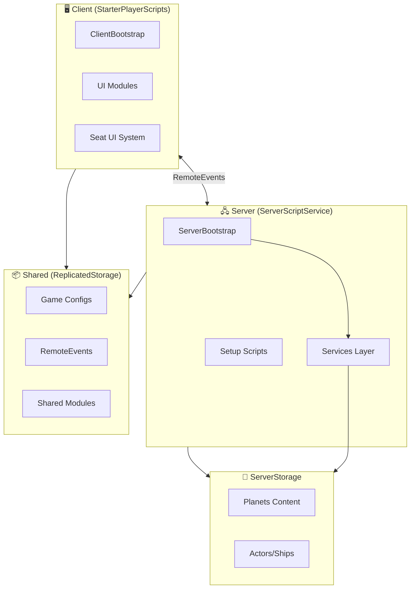

### Ключові принципи

| Принцип | Опис |
|---------|------|
| **Service-Oriented** | Кожна фіча інкапсульована в окремому сервісі |
| **State Machine** | Глобальний стан гри (LoggedOff → Initializing → InGame) |
| **Profile Persistence** | Весь прогрес зберігається в DataStore |
| **Context Hierarchy** | Ієрархія Planet/Orbit/Location з Init/Fini очисткою |
| **Configuration-Driven** | Централізовані конфіги (GameConfig, SpaceShipConfig, TransitionConfig) |

---

## 2. Components Diagram

### 2.1 Server Side

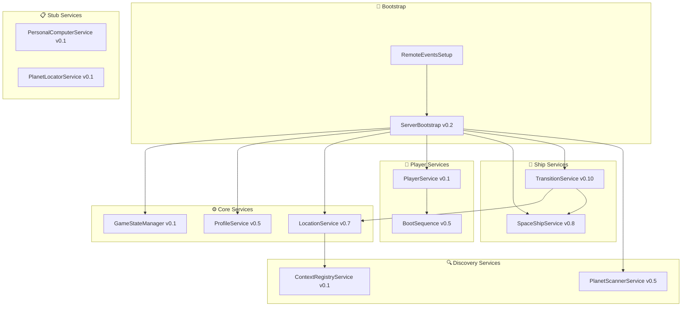

#### Services Reference

| Service | Version | Відповідальність |
|---------|---------|------------------|
| **GameStateManager** | 0.1 | Глобальні стани гри, валідація переходів |
| **ProfileService** | 0.5 | Профілі гравців, DataStore, міграція v1→v2 |
| **LocationService** | 0.7 | Завантаження/вивантаження локацій, LevelController Init/Fini |
| **PlayerService** | 0.1 | Життєвий цикл гравця (LogOn/LogOff) |
| **SpaceShipService** | 0.8 | Спавн корабля, сидіння, рампа, ефекти |
| **TransitionService** | 0.10 | Послідовності Landing/Launch |
| **PlanetScannerService** | 0.5 | Сканування поверхні, відкриття локацій |
| **ContextRegistryService** | 0.1 | Реєстр скопійованого контенту для очистки |

---

### 2.2 UI (Client)

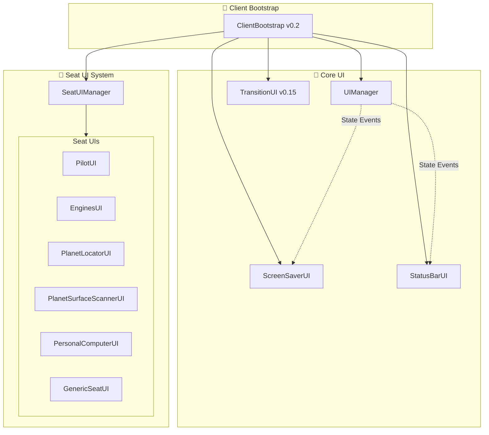

#### UI Modules Reference

| UI Module | Призначення |
|-----------|-------------|
| **UIManager** | Координація UI на основі станів |
| **ScreenSaverUI** | Екран завантаження, splash screen |
| **StatusBarUI** | HUD статус інформація |
| **TransitionUI** | Анімації Landing/Launch, переходи екранів |
| **SeatUIManager** | Управління активацією Seat UI |
| **PilotUI** | UI пілотського крісла, управління кораблем |
| **PlanetSurfaceScannerUI** | UI сканера, прогрес, результати |

---

### 2.3 Replicated Storage

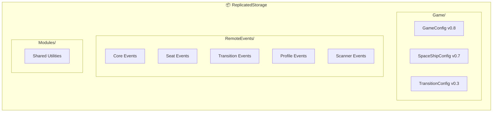

#### Configuration Modules

| Config | Version | Призначення |
|--------|---------|-------------|
| **GameConfig** | 0.8 | Ідентичність гри, версія, тайминги boot |
| **SpaceShipConfig** | 0.7 | Структура корабля, сидіння, статистика |
| **TransitionConfig** | 0.3 | Тайминги анімацій, параметри камери |

---

## 3. ServerStorage

### 3.1 Planets Structure

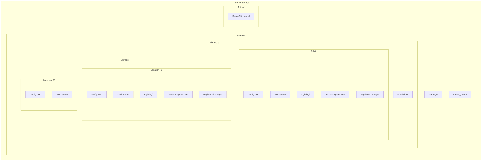

#### Planets Hierarchy

```
ServerStorage/
├── Planets/
│   ├── Planet_1/                    ← "Біллі Рубін"
│   │   ├── Config.luau              ← Planet metadata
│   │   ├── Orbit/
│   │   │   ├── Config.luau          ← Orbital settings, arrival animation
│   │   │   ├── Workspace/           ← Planet model, skybox
│   │   │   ├── Lighting/            ← Space lighting
│   │   │   ├── ServerScriptService/ ← Cloned as folder, LevelController entry point
│   │   │   └── ReplicatedStorage/   ← Orbital modules
│   │   └── Surface/
│   │       ├── Location_1/
│   │       │   ├── Config.luau      ← Location metadata, landing pad
│   │       │   ├── Workspace/       ← Baseplate, zones, landing pad
│   │       │   ├── Lighting/        ← Surface lighting
│   │       │   ├── ServerScriptService/ ← Cloned as folder, LevelController entry point
│   │       │   └── ReplicatedStorage/
│   │       └── Location_2/
│   ├── Planet_2/
│   └── Planet_Earth/
└── Actors/
    └── SpaceShip/                   ← Ship template for cloning
```

---

## 4. Game Boot Sequence

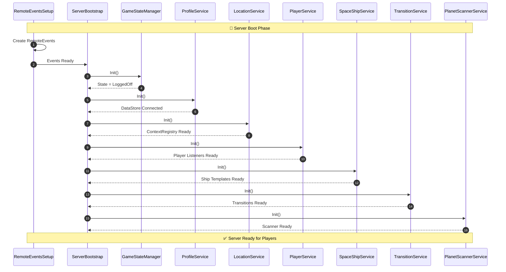

### Player Join Sequence

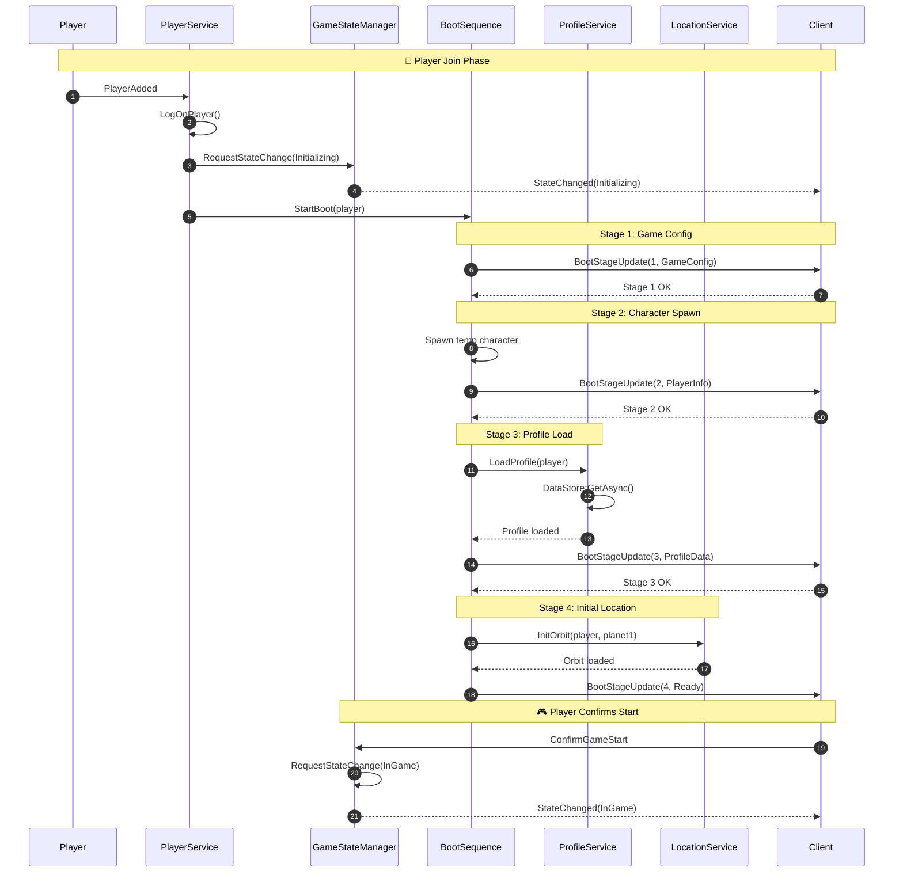

---

## 5. Loading Level Sequence

### Landing Sequence (Orbit → Surface)

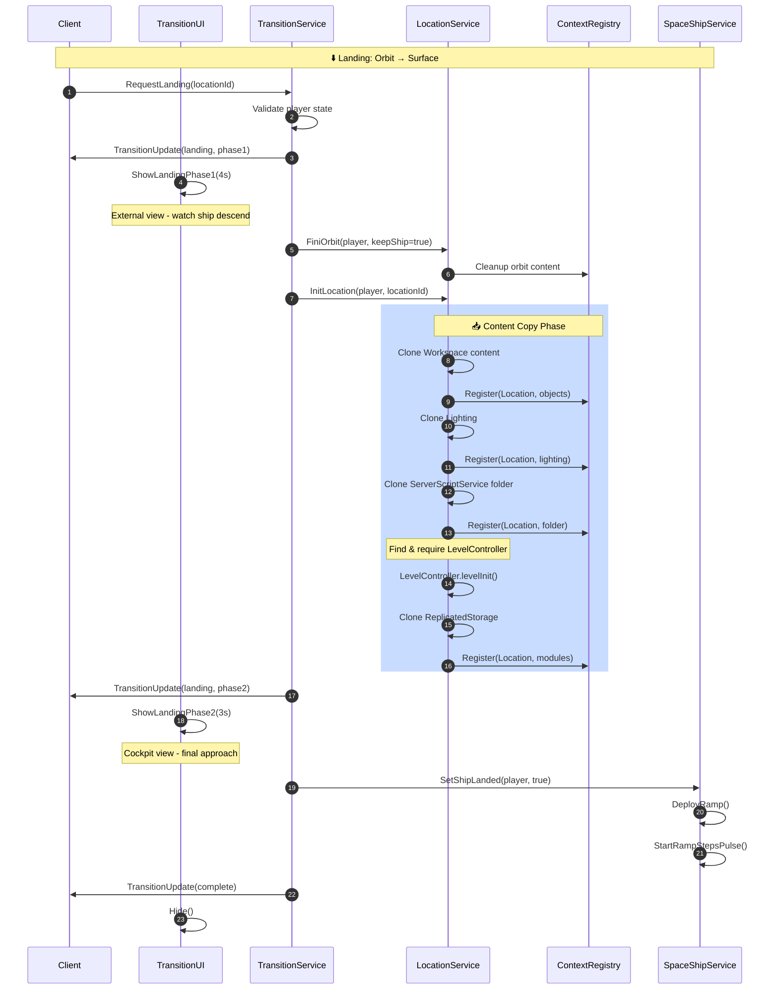

### Content Copy Diagram

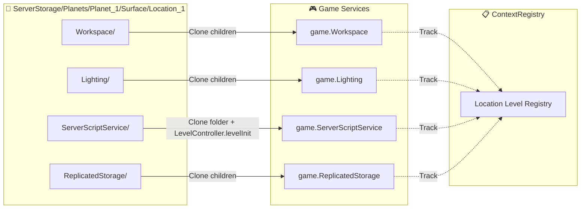

---

## 6. Unloading Level Sequence

### Launch Sequence (Surface → Orbit)

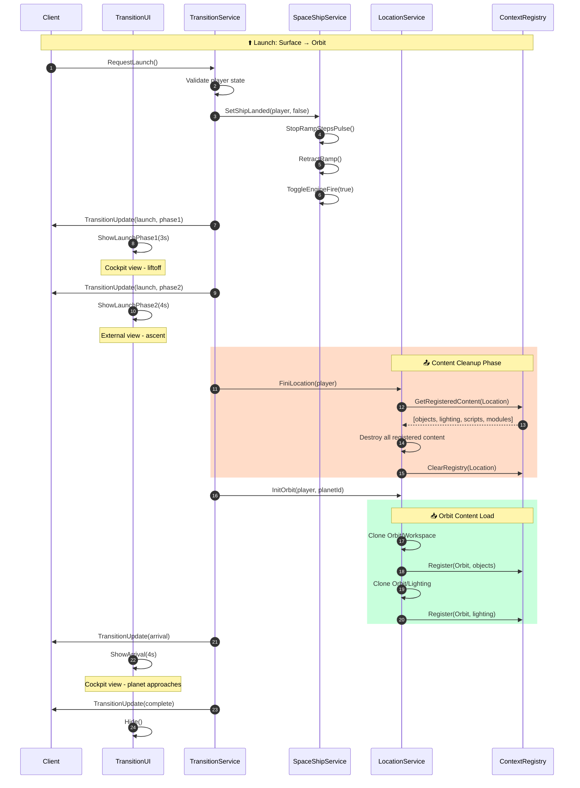

### Cleanup Flow

```mermaid
flowchart TB
    subgraph Fini["🧹 FiniLocation Process"]
        F1[Get registered content from ContextRegistry]
        F1b[LevelController.levelFini — stop loops, cleanup]
        F2[Destroy Workspace objects]
        F3[Destroy Lighting objects]
        F4[Destroy ServerScriptService folder]
        F5[Destroy ReplicatedStorage modules]
        F6[Clear registry for Location level]
    end

    F1 --> F1b --> F2 --> F3 --> F4 --> F5 --> F6

    subgraph Hierarchy["📊 Cleanup Hierarchy"]
        L[Location Level]
        O[Orbit Level]
        P[Planet Level]
    end

    L -->|First| O -->|Then| P

    Note1[Location Fini cleans Location content only]
    Note2[Orbit Fini cleans Orbit content]
    Note3[Planet Fini cleans Planet-level scripts]
```

---

## 7. Game Statuses and State Machine

### Global Game States

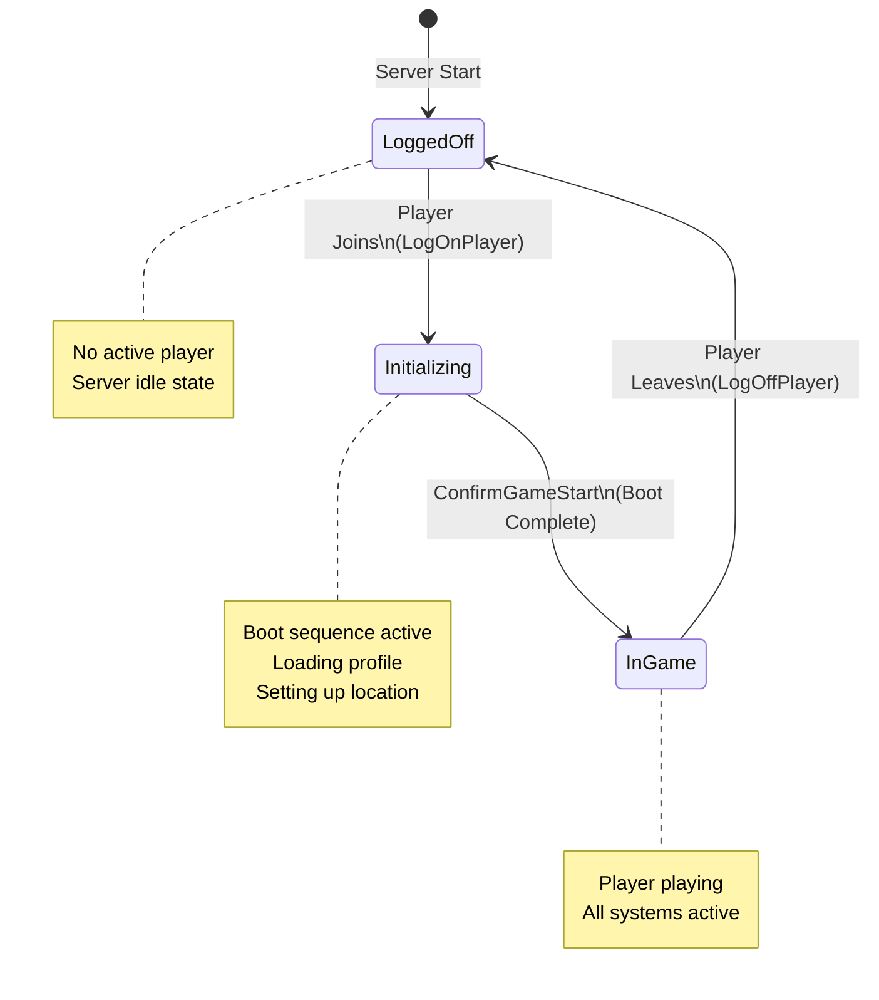

### Transition States

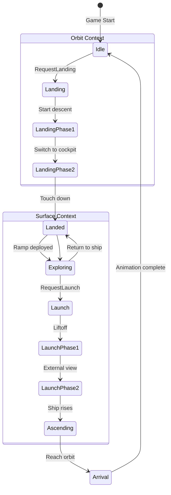

### State Transitions Table

| From State | To State | Trigger | Validation |
|------------|----------|---------|------------|
| LoggedOff | Initializing | Player.PlayerAdded | Single player only |
| Initializing | InGame | ConfirmGameStart | Boot complete |
| InGame | LoggedOff | Player.PlayerRemoving | Save profile |
| Idle | Landing | RequestLanding | Player in PilotSeat |
| Landed | Launch | RequestLaunch | Player in PilotSeat |
| Launch | Arrival | Animation complete | - |
| Arrival | Idle | Animation complete | - |

---

## 8. Events

### Events Architecture

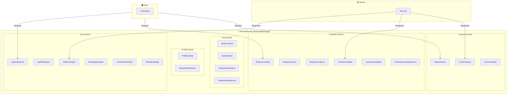

### Events Flow Diagram

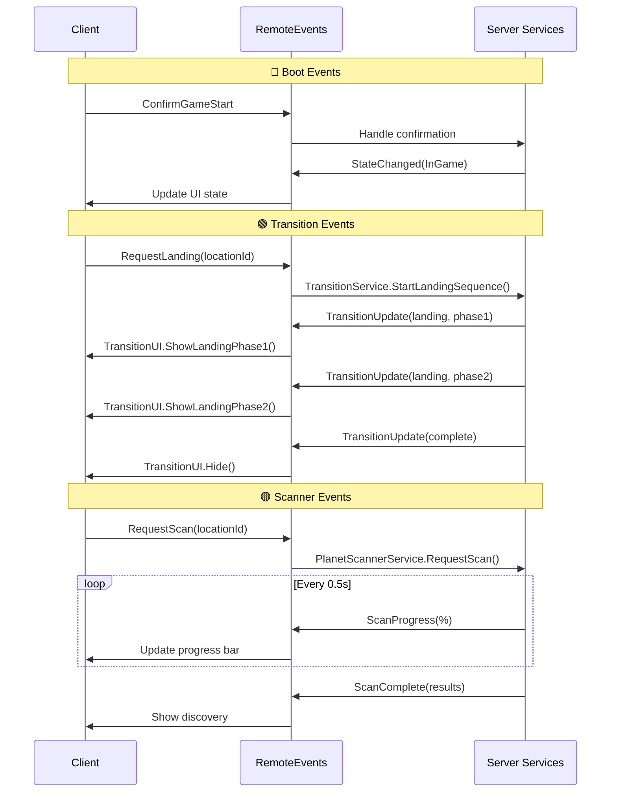

### Events Reference Table

| Event | Direction | Payload | Purpose |
|-------|-----------|---------|---------|
| **LogOnRequest** | C→S | - | Player wants to log on |
| **StateChanged** | S→C | state, data | Global state changed |
| **BootStageUpdate** | S→C | stage, data | Boot progress update |
| **ConfirmGameStart** | C→S | - | Player ready to play |
| **RequestLanding** | C→S | locationId | Start landing sequence |
| **RequestLaunch** | C→S | - | Start launch sequence |
| **TransitionUpdate** | S→C | state, data | Transition progress |
| **RequestScan** | C→S | locationId | Start surface scan |
| **ScanProgress** | S→C | progress% | Scan progress update |
| **ScanComplete** | S→C | results | Scan finished |
| **ProfileUpdate** | S→C | profileData | Profile data changed |

---

## 9. Player Profile

### Profile Schema (v2)

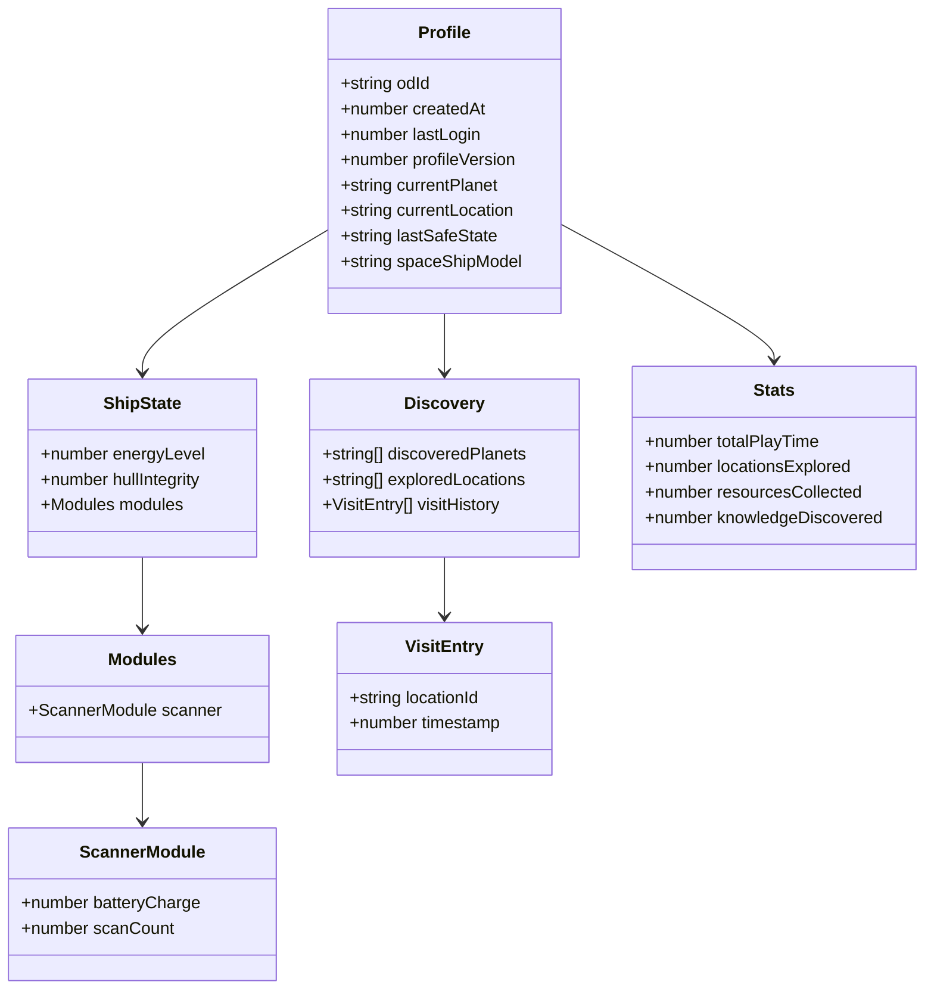

### Profile Component Diagram

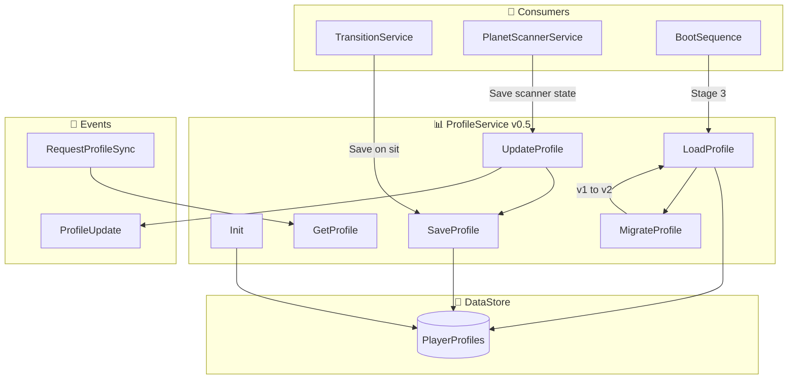

### Profile Persistence Flow

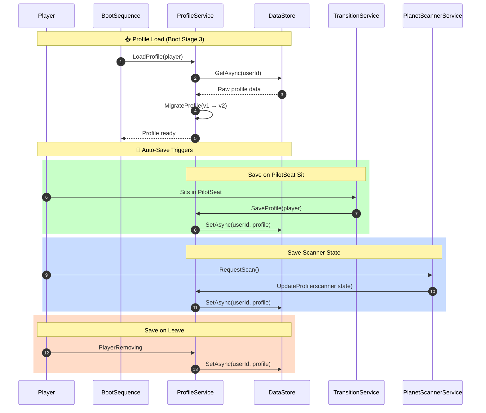

### Profile Data Example

```lua
Profile = {
    odId = "123456789",
    createdAt = 1705776000,
    lastLogin = 1737475200,
    profileVersion = 2,

    currentPlanet = "planet1",
    currentLocation = "orbit",
    lastSafeState = "orbit",

    discoveredPlanets = {"planet1"},
    exploredLocations = {"planet1_surface_location1"},
    visitHistory = {
        {locationId = "planet1_surface_location1", timestamp = 1737474000}
    },

    spaceShipModel = "default",

    shipState = {
        energyLevel = 100,
        hullIntegrity = 100,
        modules = {
            scanner = {
                batteryCharge = 500,  -- Max 500
                scanCount = 0         -- Wear counter
            }
        }
    },

    resources = {},
    knowledge = {},

    stats = {
        totalPlayTime = 3600,
        locationsExplored = 1,
        resourcesCollected = 0,
        knowledgeDiscovered = 0
    }
}
```

---

## Appendix: File Structure Reference

```
CallOfRelics/
├── ServerScriptService/
│   ├── Setup/
│   │   └── RemoteEventsSetup.server.lua
│   ├── Core/
│   │   ├── ServerBootstrap.server.lua
│   │   ├── GameStateManager.lua
│   │   └── BootSequence.lua
│   └── Services/
│       ├── ProfileService.lua
│       ├── LocationService.lua
│       ├── PlayerService.lua
│       ├── SpaceShipService.lua
│       ├── TransitionService.lua
│       ├── PlanetScannerService.lua
│       └── ContextRegistryService.lua
│
├── StarterPlayer/
│   └── StarterPlayerScripts/
│       ├── Core/
│       │   └── ClientBootstrap.client.lua
│       └── UI/
│           ├── UIManager.lua
│           ├── ScreenSaverUI.lua
│           ├── StatusBarUI.lua
│           ├── TransitionUI.lua
│           ├── SeatUIManager.lua
│           └── SeatUI/
│               ├── PilotUI.lua
│               ├── EnginesUI.lua
│               ├── PlanetLocatorUI.lua
│               ├── PlanetSurfaceScannerUI.lua
│               └── PersonalComputerUI.lua
│
├── ReplicatedStorage/
│   ├── Game/
│   │   ├── GameConfig.lua
│   │   ├── SpaceShipConfig.lua
│   │   └── TransitionConfig.lua
│   └── RemoteEvents/
│       └── [Created by RemoteEventsSetup]
│
└── ServerStorage/
    ├── Planets/
    │   ├── Planet_1/
    │   │   ├── Config.luau
    │   │   ├── Orbit/
    │   │   └── Surface/
    │   ├── Planet_2/
    │   └── Planet_Earth/
    └── Actors/
        └── SpaceShip/
```

---

**Версія:** 1.0
**Автор:** Claude Code
**Дата:** 2026-01-21
