# Структура Проєкту — Call of Relics: Orbital Silence

**Версія:** 1.3
**Дата:** 2026-01-21
**Статус:** Рекомендовано

---

## Огляд

Цей документ описує рекомендовану структуру папок для проєкту,
яка узгоджена з TDD (розділ 13.3) та вимогами Roblox Studio Script Sync.

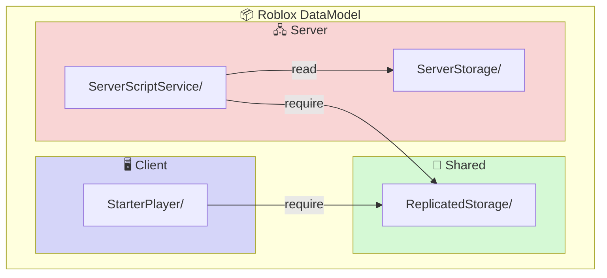

---

## Критична Вимога: Script Sync

**ВАЖЛИВО:** Roblox Studio Script Sync працює **виключно всередині існуючих контейнерів** у DataModel.

Це означає:
1. Спочатку створити структуру папок **в Roblox Studio**
2. Налаштувати Script Sync
3. Тільки після цього синхронізація працюватиме

---

## Структура ServerScriptService

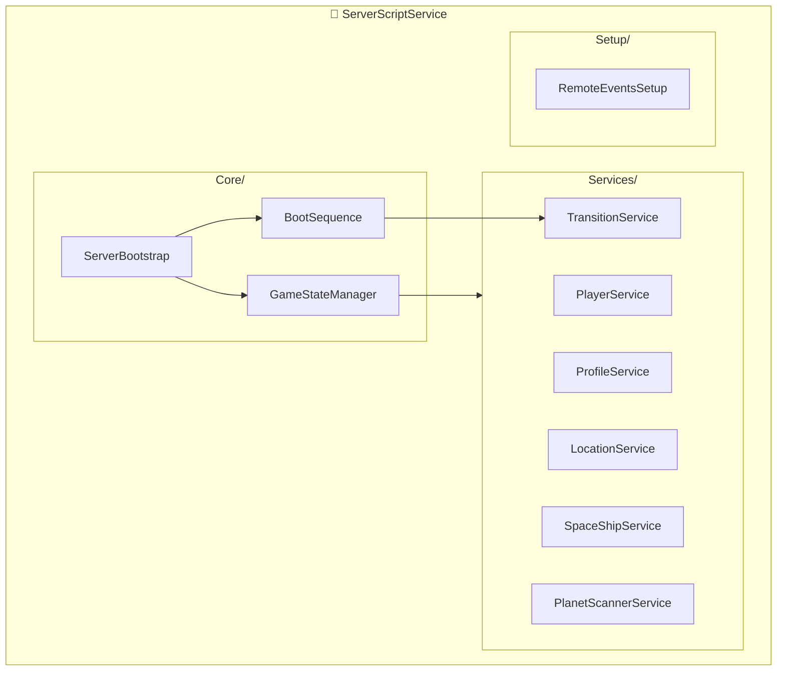

### Поточна структура (v0.9)

```
ServerScriptService/
├── Core/
│   ├── GameStateManager.lua      -- Координатор станів (v0.2)
│   ├── BootSequence.lua          -- 4-stage boot sequence (v0.4)
│   └── ServerBootstrap.server.lua -- Точка входу (v0.3)
│
├── Services/
│   ├── PlayerService.lua         -- Життєвий цикл гравця (v0.2)
│   ├── ProfileService.lua        -- DataStore профілі (v0.2)
│   ├── LocationService.lua       -- Завантаження локацій, LevelController (v0.7)
│   ├── ContextRegistryService.lua -- Реєстрація контенту (v0.1)
│   ├── TransitionService.lua     -- Переходи Orbit↔Surface (v0.7)
│   ├── SpaceShipService.lua      -- SpaceShip + Seat management (v0.4) ← NEW
│   ├── PlanetScannerService.lua  -- Сканування планет (v0.1) ← NEW
│   ├── EnginesService.lua        -- Двигуни корабля (v0.1) ← NEW
│   ├── PlanetLocatorService.lua  -- Пошук планет (v0.1) ← NEW
│   └── PersonalComputerService.lua -- Інвентар/Knowledge (v0.1) ← NEW
│
├── Systems/
│   └── (підготовлено для майбутніх систем)
│
└── Setup/
    └── RemoteEventsSetup.server.lua -- RemoteEvents (v0.5)
```

### Видалено у v0.9

- `SeatService.lua` — merged into SpaceShipService

---

## Інші Контейнери DataModel

### ReplicatedStorage

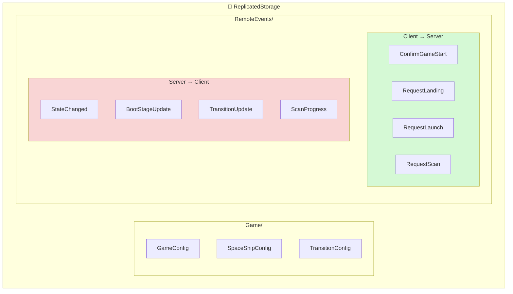

```
ReplicatedStorage/
├── Game/                         -- Конфігурація гри
│   ├── GameConfig.lua            -- Основна конфігурація (v0.3)
│   ├── SpaceShipConfig.lua       -- SpaceShip + Seats config (v0.1) ← NEW (renamed from SeatConfig)
│   └── TransitionConfig.lua      -- Конфігурація переходів (v0.2)
│
├── Modules/                      -- Загальні модулі
│   └── (майбутнє)
│
└── RemoteEvents/                 -- Створюється автоматично Setup скриптом
    ├── StateChanged              -- Зміна стану гри
    ├── BootStageUpdate           -- Прогрес boot sequence
    ├── ConfirmGameStart          -- Підтвердження старту гри
    ├── RetryBootStage            -- Повтор стадії boot
    ├── SeatOccupied              -- Сів у сидіння
    ├── SeatVacated               -- Встав з сидіння
    ├── SeatActionRequest         -- Запит дії сидіння
    ├── SeatActionResponse        -- Відповідь дії сидіння
    ├── RequestLanding            -- Запит посадки
    ├── RequestLaunch             -- Запит зльоту (renamed from RequestLiftoff)
    ├── TransitionUpdate          -- Стан переходу
    ├── TransitionLandingCamera   -- Дані камери посадки
    ├── AvailableLocationsResponse -- Список локацій
    ├── RequestScan               -- Запит сканування ← NEW
    ├── ScanProgress              -- Прогрес сканування ← NEW
    └── ScanComplete              -- Результат сканування ← NEW
```

### StarterPlayer/StarterPlayerScripts

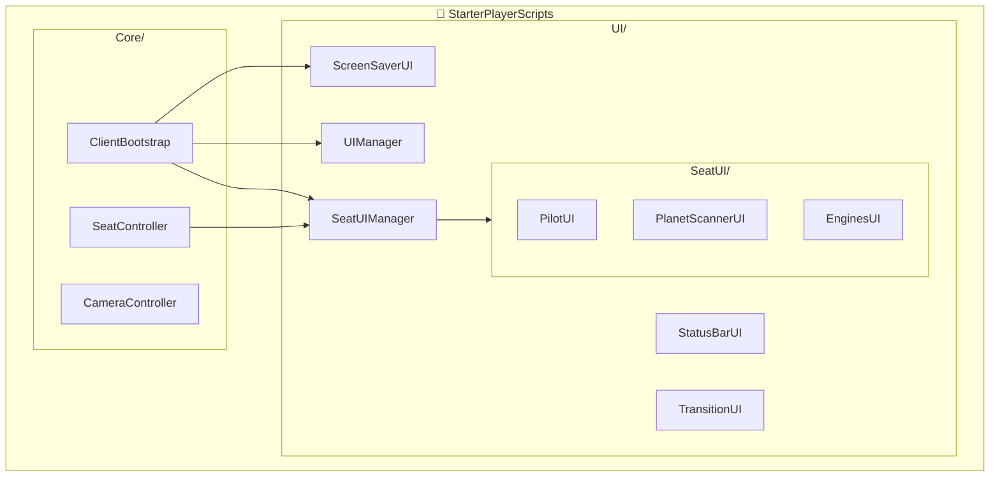

```
StarterPlayer/StarterPlayerScripts/
├── Core/
│   ├── ClientBootstrap.client.lua -- Клієнтська ініціалізація (v0.3)
│   ├── SeatController.lua        -- Детекція сидінь (v0.2) ← UPDATED
│   └── CameraController.client.lua -- Керування камерою (v0.2)
│
├── UI/
│   ├── ScreenSaverUI.lua         -- Boot sequence UI (v0.5)
│   ├── StatusBarUI.lua           -- In-game status bar (v0.4)
│   ├── UIManager.lua             -- Координатор UI (v0.2)
│   ├── SeatUIManager.lua         -- Менеджер UI сидінь (v0.2) ← UPDATED
│   ├── TransitionUI.lua          -- UI переходів (v0.9)
│   └── SeatUI/                   -- Модулі UI для кожного сидіння
│       ├── PilotUI.lua           -- Пілотське крісло (v0.7)
│       ├── GenericSeatUI.lua     -- Базовий UI для сидінь (v0.2) ← UPDATED
│       ├── PlanetSurfaceScannerUI.lua -- Сканер поверхні (v0.1) ← NEW
│       ├── EnginesUI.lua         -- UI двигунів (v0.1) ← NEW
│       ├── PlanetLocatorUI.lua   -- UI локатора планет (v0.1) ← NEW
│       └── PersonalComputerUI.lua -- UI персонального комп'ютера (v0.1) ← NEW
│
└── Systems/                      -- Майбутні клієнтські системи
    └── (порожня)
```

### ServerStorage

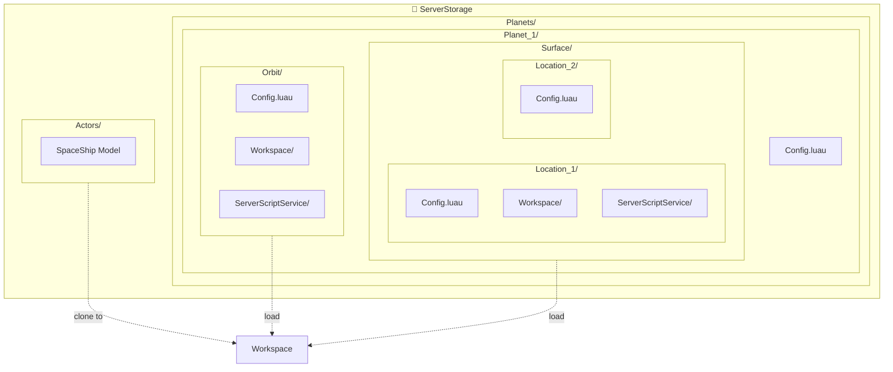

```
ServerStorage/
├── Actors/                       -- SpaceShip моделі ← NEW
│   ├── SpaceShip                 -- Default SpaceShip model
│   ├── SpaceShip_Advanced        -- Upgraded model (TBD)
│   └── SpaceShip_Elite           -- Upgraded model (TBD)
│
└── Planets/                      -- Контент планет (v0.9)
    └── Planet_1/                 -- Планета Біллі Рубін
        ├── Config.luau           -- Конфігурація планети
        ├── Orbit/                -- Орбітальна локація
        │   ├── Config.luau       -- Конфіг орбіти (з animationData)
        │   ├── Workspace/        -- 3D об'єкти
        │   │   ├── Lighting/     -- Sky, Atmosphere, Effects
        │   │   └── Planet/       -- Модель планети (Surface, CloudLayers)
        │   └── ServerScriptService/ -- Скрипти рівня (клонуються як папка)
        │       └── LevelController.luau -- Точка входу рівня (levelInit/levelFini)
        │
        └── Surface/              -- Поверхневі локації
            ├── Location_1/       -- "Зелена долина"
            │   ├── Config.luau   -- Конфіг локації
            │   ├── Workspace/    -- 3D об'єкти
            │   │   ├── Lighting/ -- Sky конфігурація
            │   │   └── Baseplate/ -- Поверхня з зонами
            │   │       ├── ExplorationZone   -- 80% території
            │   │       ├── LandingZone       -- 20% території
            │   │       ├── SpaceShipLandingPad -- Посадковий майданчик
            │   │       │   ├── LandingLights/    -- Сигнальні вогні
            │   │       │   └── LandingPadFrame/  -- Рамка та декор
            │   │       └── ZoneWalls/        -- Стіни з мітками
            │   └── ServerScriptService/ -- Скрипти рівня (клонуються як папка)
            │       ├── LevelController.luau -- Точка входу (levelInit/levelFini)
            │       ├── TerrainGenerator.luau -- Процедурна генерація
            │       ├── LandingLightsModule.luau -- Вогні посадки
            │       └── LandingPadEffectsModule.luau -- Ефекти рамки
            │
            └── Location_2/       -- "Гірський хребет"
                ├── Config.luau
                └── Workspace/
```

---

## SpaceShip Seats (SpaceShipConfig)

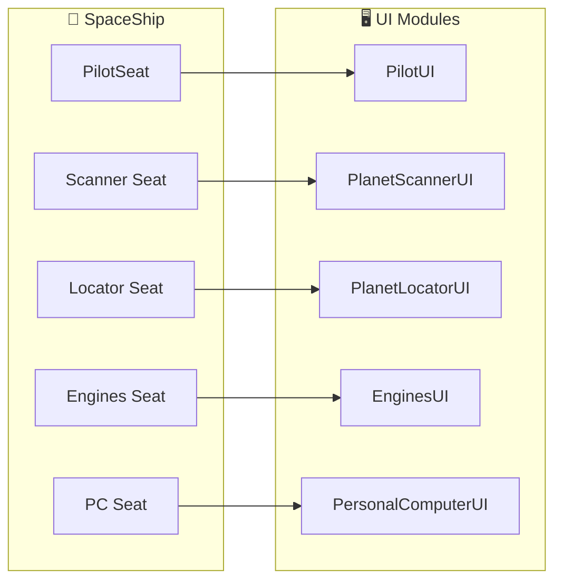

| Seat | UI Module | Functionality |
|------|-----------|---------------|
| PilotSeat | PilotUI | Navigation, Weapons control |
| Seat Engines | EnginesUI | Engine control |
| Seat Planet Surface Scanner | PlanetSurfaceScannerUI | Planet scanning |
| Seat Planet Locator | PlanetLocatorUI | Planet discovery |
| Seat Personal Computer | PersonalComputerUI | Inventory, Knowledge |

---

## Протоколи Взаємодії (Client-Server)

### Events Flow Overview

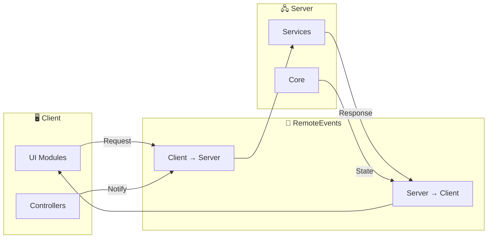

### Boot Sequence Protocol

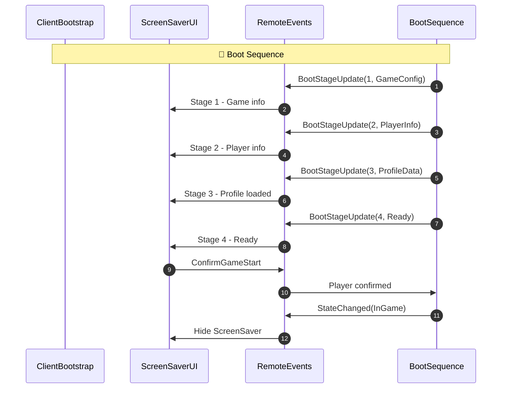

### Landing Sequence Protocol

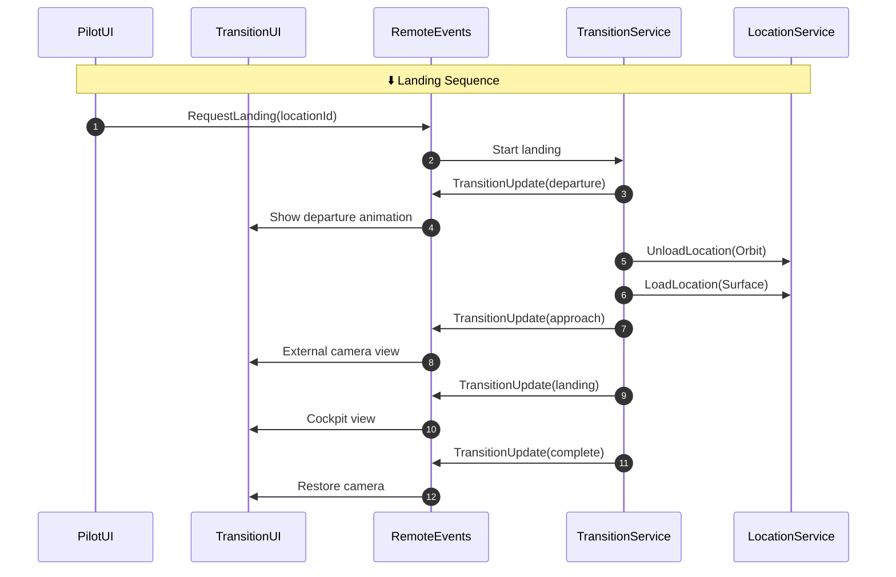

### Launch Sequence Protocol

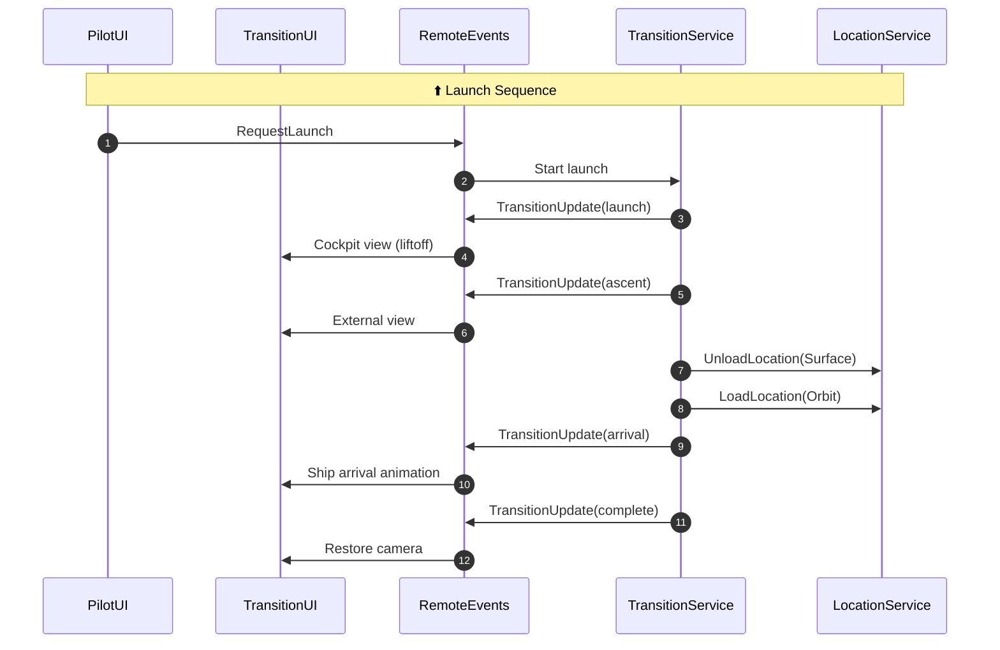

### Scan Sequence Protocol

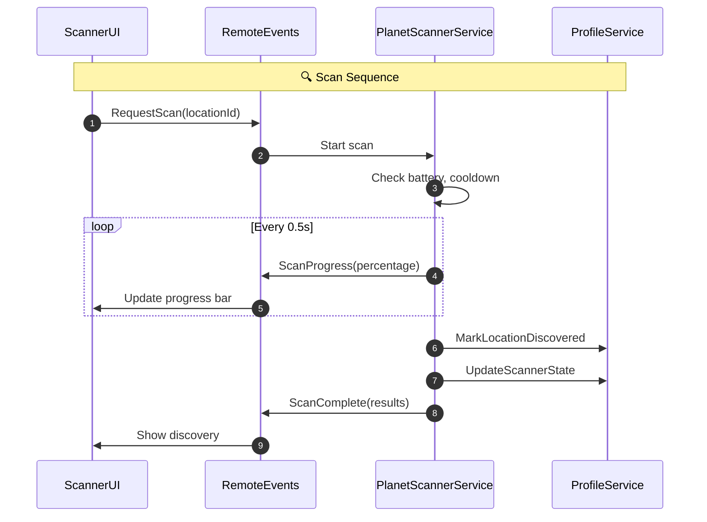

### Event Handlers Summary

| Module | Listens To | Sends |
|--------|------------|-------|
| **ScreenSaverUI** | BootStageUpdate | ConfirmGameStart, RetryBootStage |
| **UIManager** | StateChanged | — |
| **SeatUIManager** | — | SeatOccupied, SeatVacated |
| **TransitionUI** | TransitionUpdate | — |
| **PilotUI** | AvailableLocationsResponse | RequestLanding, RequestLaunch |
| **ScannerUI** | ScanProgress, ScanComplete | RequestScan |

---

## Інструкції: Налаштування в Roblox Studio

### Крок 1: Створення базової структури

#### ServerScriptService:
1. Відкрити проєкт у Roblox Studio
2. У Explorer знайти **ServerScriptService**
3. Створити папки:
   - Правий клік на ServerScriptService → Insert Object → Folder
   - Назвати: `Core`
   - Повторити для: `Services`, `Systems`, `Setup`

#### StarterPlayerScripts:
1. У Explorer знайти **StarterPlayer → StarterPlayerScripts**
2. Створити папки:
   - Правий клік на StarterPlayerScripts → Insert Object → Folder
   - Назвати: `Core`
   - Повторити для: `UI`, `Systems`

#### ReplicatedStorage:
1. У Explorer знайти **ReplicatedStorage**
2. Створити папки:
   - Правий клік на ReplicatedStorage → Insert Object → Folder
   - Назвати: `Game`
   - Повторити для: `Modules`
3. **RemoteEvents** папка створюється автоматично скриптом RemoteEventsSetup

### Крок 2: Переміщення існуючих скриптів

**ServerScriptService/Core:**
- `GameStateManager.lua`
- `BootSequence.lua`
- `ServerBootstrap.server.lua`

**ServerScriptService/Services:**
- `PlayerService.lua`
- `ProfileService.lua`
- `LocationService.lua`
- `ContextRegistryService.lua`
- `TransitionService.lua`
- `SpaceShipService.lua`
- `PlanetScannerService.lua`
- `EnginesService.lua`
- `PlanetLocatorService.lua`
- `PersonalComputerService.lua`

**ServerScriptService/Setup:**
- `RemoteEventsSetup.server.lua`

**StarterPlayerScripts/Core:**
- `ClientBootstrap.client.lua`
- `SeatController.lua`
- `CameraController.client.lua`

**StarterPlayerScripts/UI:**
- `ScreenSaverUI.lua`
- `StatusBarUI.lua`
- `UIManager.lua`
- `SeatUIManager.lua`
- `TransitionUI.lua`

**StarterPlayerScripts/UI/SeatUI:**
- `PilotUI.lua`
- `GenericSeatUI.lua`
- `PlanetSurfaceScannerUI.lua`
- `EnginesUI.lua`
- `PlanetLocatorUI.lua`
- `PersonalComputerUI.lua`

**ReplicatedStorage/Game:**
- `GameConfig.lua`
- `SpaceShipConfig.lua`
- `TransitionConfig.lua`

**Systems папки:**
- Залишити порожніми (для майбутніх систем)

### Крок 3: Налаштування Script Sync

1. У Roblox Studio: **View → Script Sync**
2. Вибрати папку проєкту: `d:\Code\Roblox\CallOfRelics`
3. Увімкнути синхронізацію
4. Перевірити, що зміни синхронізуються в обидва боки

### Крок 4: Перевірка

**Тест 1: Studio → Файлова система**
1. Створити тестовий скрипт у Studio
2. Перевірити, що він з'явився у файловій системі

**Тест 2: Файлова система → Studio**
1. Змінити коментар у `GameStateManager.lua` через VSCode
2. Перевірити, що зміна відобразилася у Studio

---

## Принципи Організації (з TDD)

### Core/ — Архітектурне ядро

**Призначення:**
- Координація глобальних станів
- Bootstrap гри
- Стабільне ядро, що рідко змінюється

**Правила:**
- Не залежить від контенту
- Змінюється лише при архітектурних змінах
- Містить єдиний координатор станів (TDD 2.5)

**Файли:**
- `GameStateManager.lua` — координатор станів
- `BootSequence.lua` — 4-stage boot sequence
- `ServerBootstrap.server.lua` — точка входу

---

### Services/ — Довготривалі сервіси

**Призначення:**
- Координація між системами
- Управління ресурсами
- Надання контрактів

**Правила (TDD 3.2):**
- "Має довготривале існування"
- "Ініціалізується під час boot"
- "Є єдиним для сесії гравця"
- Надає чітко визначений контракт

**Поточні файли:**
- `PlayerService.lua` — керування гравцями
- `ProfileService.lua` — збереження/відновлення профілів
- `LocationService.lua` — завантаження локацій
- `ContextRegistryService.lua` — реєстрація контенту
- `TransitionService.lua` — переходи між локаціями
- `SpaceShipService.lua` — SpaceShip + seat management
- `PlanetScannerService.lua` — сканування планет
- `EnginesService.lua` — керування двигунами
- `PlanetLocatorService.lua` — пошук планет
- `PersonalComputerService.lua` — інвентар та knowledge

---

### Systems/ — Функціональні системи

**Призначення:**
- Реалізація ігрових механік
- Реакція на зміни станів
- Ізольована функціональність

**Правила (TDD 3.1):**
- "Відповідає за одну функціональну область"
- "Реагує на зміни станів"
- "Не ініціює переходи станів напряму"
- Працює в межах дозволеного контексту

**Майбутні файли:**
- `CombatSystem.lua` — бойова система
- `ResourceSystem.lua` — керування ресурсами

---

### Setup/ — Ініціалізація інфраструктури

**Призначення:**
- Одноразові ініціалізаційні скрипти
- Створення RemoteEvents
- Підготовка інфраструктури

**Правила:**
- Виконуються до основного boot
- Не містять ігрової логіки
- Створюють необхідні об'єкти

**Поточні файли:**
- `RemoteEventsSetup.server.lua` — створення RemoteEvents

---

## Правила Додавання Нових Модулів

### Перед створенням нового модуля:

1. **Визначити тип:**
   - Core? (рідко, лише архітектурні зміни)
   - Service? (координація, довготривале існування)
   - System? (ігрова механіка, реакція на стани)
   - Setup? (інфраструктура)

2. **Вибрати правильну папку:**
   - Створити скрипт у відповідній папці
   - Дотримуватися стандарту KOSMICMAZER (TDD 11.8)

3. **Синхронізація:**
   - Якщо створюється в Studio → автоматично з'явиться у файловій системі
   - Якщо створюється у VSCode → автоматично з'явиться в Studio

---

## Переваги Цієї Структури

- **Чітке розмежування відповідальностей** — Легко зрозуміти, де що знаходиться
- **Масштабованість** — Додавання нових модулів не вимагає реорганізації
- **Відповідність TDD** — Структура відображає архітектурні принципи
- **Запобігання "монолітним скриптам"** — Природний поділ на малі, зрозумілі модулі
- **Сумісність з Script Sync** — Структура працює з обмеженнями Roblox Studio

---

## Посилання

- **TDD Розділ 3** — Розмежування систем, сервісів, контенту
- **TDD Розділ 11** — Стандарти логування та діагностики
- **TDD Розділ 13.3** — Вимоги до структури проєкту
- **KB.md** — База знань проєкту

---

## ChangeLog

- **1.4** — LevelController Framework (2026-02-08)
  - Оновлено LocationService v0.5 → v0.7
  - Додано ServerScriptService/ папки до Orbit та Location структур
  - Додано LevelController.luau як точку входу рівня
  - Додано модулі TerrainGenerator, LandingLightsModule, LandingPadEffectsModule до Location_1

- **1.3** — Додано Mermaid діаграми (2026-01-21)
  - Додано діаграму DataModel Overview
  - Додано діаграму ServerScriptService структури
  - Додано діаграму ReplicatedStorage з RemoteEvents
  - Додано діаграму StarterPlayerScripts структури
  - Додано діаграму ServerStorage/Planets структури
  - Додано діаграму SpaceShip Seats → UI modules
  - Додано секцію "Протоколи Взаємодії (Client-Server)"
  - Додано sequenceDiagram для Boot Sequence Protocol
  - Додано sequenceDiagram для Landing Sequence Protocol
  - Додано sequenceDiagram для Launch Sequence Protocol
  - Додано sequenceDiagram для Scan Sequence Protocol
  - Додано таблицю Event Handlers Summary

- **1.2** — Оновлення структури v0.9 (2026-01-16)
  - Видалено SeatService.lua (merged into SpaceShipService)
  - Видалено SeatConfig.lua (renamed to SpaceShipConfig.lua)
  - Додано SpaceShipService.lua (v0.4) — SpaceShip + seat management
  - Додано SpaceShipConfig.lua — unified SpaceShip configuration
  - Додано PlanetScannerService.lua — planet scanning
  - Додано EnginesService.lua — engine control
  - Додано PlanetLocatorService.lua — planet discovery
  - Додано PersonalComputerService.lua — inventory/knowledge
  - Додано SeatUI modules: PlanetSurfaceScannerUI, EnginesUI, PlanetLocatorUI, PersonalComputerUI
  - Додано ServerStorage/Actors/ для SpaceShip моделей
  - Додано Scanner RemoteEvents: RequestScan, ScanProgress, ScanComplete
  - Оновлено RequestLiftoff → RequestLaunch
  - Додано SpaceShip Seats таблицю

- **1.1** — Оновлення структури v0.7 (2026-01-14)
  - Додано TransitionService.lua до Services/
  - Додано TransitionConfig.lua до ReplicatedStorage/Game/
  - Додано TransitionUI.lua до UI/
  - Оновлено PilotUI.lua (v0.5) - context detection
  - Розширено ServerStorage/Planets/ з повною структурою
  - Додано RemoteEvents для Transition System
  - Документовано структуру Location_1 з зонами та посадковим майданчиком

- **1.0** — Початкова версія структури (2026-01-11)
  - Створено папки Core, Services, Systems, Setup
  - Переміщено існуючі скрипти
  - Додано рекомендації до TDD

---

**Статус:** Готово до синхронізації з Roblox Studio
