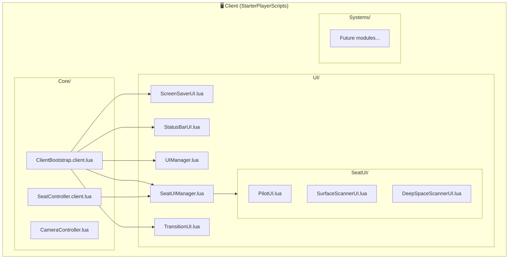
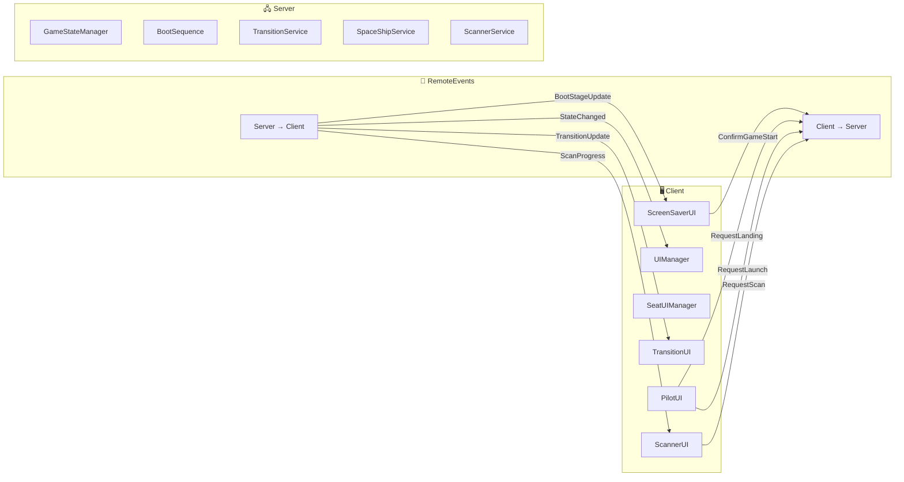
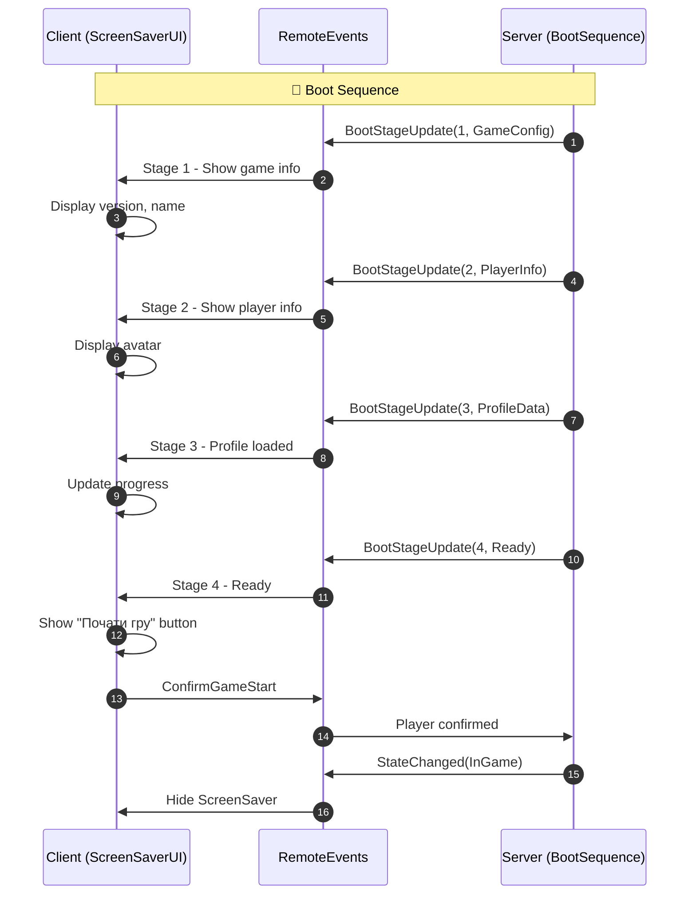
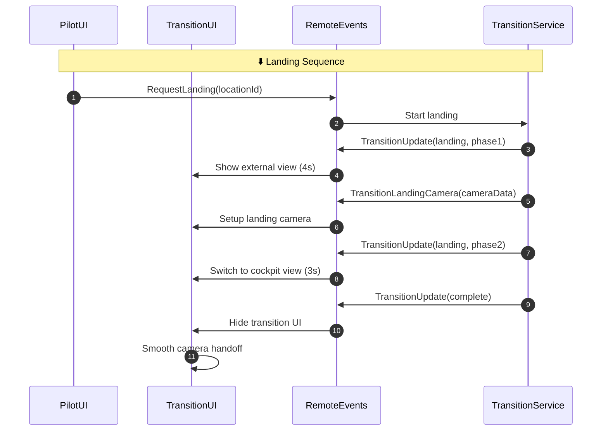
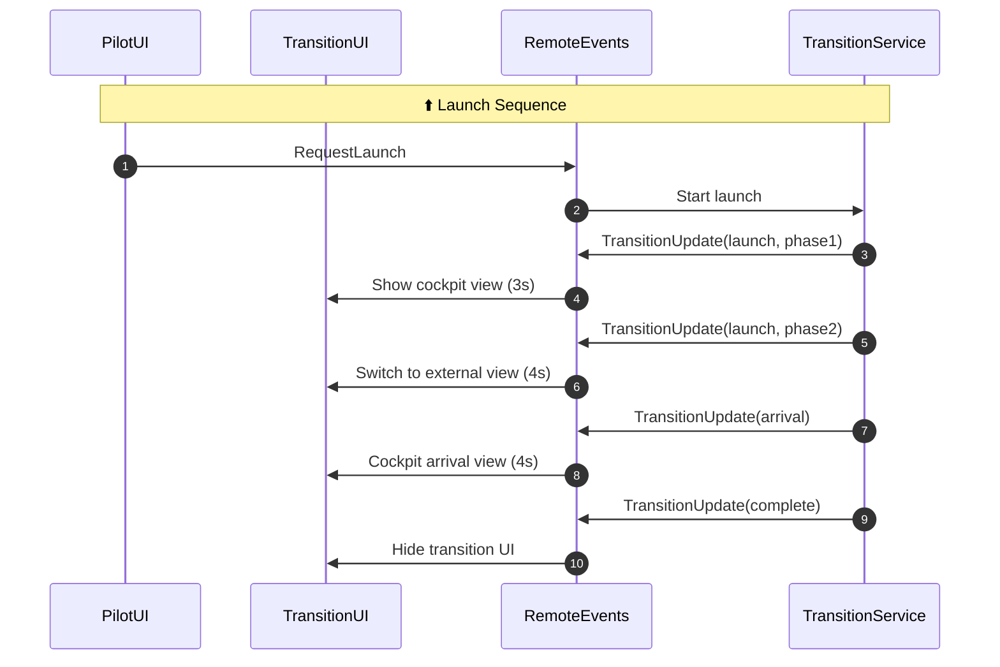
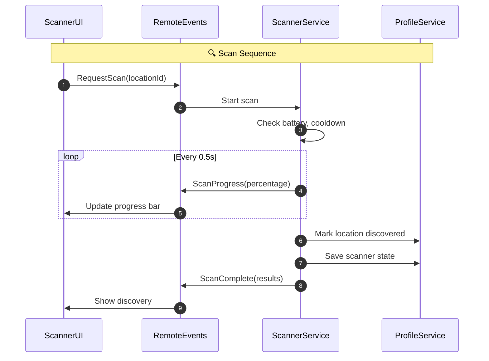

# StarterPlayerScripts Structure

## Overview

Client-side scripts organized for Script Sync compatibility and architectural clarity.



---

## Folder Structure

```
StarterPlayer/
└── StarterPlayerScripts/        ← Anchor folder (Script Sync requirement)
    ├── Core/                     ← Bootstrap and core initialization
    │   ├── ClientBootstrap.client.lua
    │   ├── SeatController.client.lua   ← Seat detection
    │   └── CameraController.lua        ← Camera management
    ├── UI/                       ← UI modules and systems
    │   ├── UIManager.lua
    │   ├── ScreenSaverUI.lua
    │   ├── StatusBarUI.lua
    │   ├── SeatUIManager.lua
    │   ├── TransitionUI.lua      ← NEW: Transition animations
    │   └── SeatUI/               ← Per-seat UI modules
    │       ├── PilotUI.lua
    │       ├── SurfaceScannerUI.lua
    │       ├── DeepSpaceScannerUI.lua
    │       ├── SystemsConsoleUI.lua
    │       └── PersonalTerminalUI.lua
    └── Systems/                  ← Client-side game systems (future)
```

---

## Core/

**Purpose:** Client initialization and bootstrap scripts.

### ClientBootstrap.client.lua (v0.3)
- Main client entry point (auto-runs)
- Initializes UI systems
- Disables default Roblox UI
- Manages boot sequence

**Boot Order:**
1. Disable CoreGui elements
2. Initialize ScreenSaverUI
3. Initialize StatusBarUI
4. Initialize UIManager
5. Show ScreenSaver

### SeatController.client.lua (v0.1)
- Detects when player sits/stands from seats
- Identifies seat type from SeatConfig
- Fires SeatOccupied/SeatVacated RemoteEvents
- Triggers SeatUIManager

### CameraController.lua (v0.2)
- Manages camera FOV per seat
- Applies SeatConfig camera settings
- Restores default camera on seat exit

---

## UI/

**Purpose:** UI modules and interface management.

### ScreenSaverUI.lua (v0.5)
- Multi-stage ScreenSaver (Stages 0-4)
- Progressive boot UI with progress bar
- Handles boot sequence visualization
- Listens to BootStageUpdate RemoteEvent
- Manages "Почати гру" button interaction

### StatusBarUI.lua (v0.2)
- In-game status bar
- Shows planet displayName and location displayName
- Version info and game state

### UIManager.lua (v0.2)
- Centralized UI state management
- Handles game state transitions
- Shows/hides UI based on server StateChanged events

### SeatUIManager.lua (v0.1)
- Manages per-seat UI modules
- Shows appropriate UI when sitting
- Hides UI when standing

### TransitionUI.lua (v0.4) — NEW
- Location transition animations
- Loading screen with messages
- Landing camera sequence (POV from landing pad)
- StatusBar integration for displayName updates

---

## UI/SeatUI/

**Purpose:** Individual UI modules for each ship seat.

### PilotUI.lua (v0.5)
- Context-aware UI (Orbit/Surface)
- Landing menu with available locations (on Orbit)
- Liftoff button (on Surface)
- DisplayName localization for locations

### SurfaceScannerUI.lua (v0.1)
- Placeholder for surface scanning UI

### DeepSpaceScannerUI.lua (v0.1)
- Placeholder for deep space scanning UI

### SystemsConsoleUI.lua (v0.1)
- Placeholder for ship systems management UI

### PersonalTerminalUI.lua (v0.1)
- Placeholder for personal terminal UI

---

## Systems/ (Future)

**Purpose:** Client-side gameplay systems.

**Planned:**
- InputHandler.lua — Player input management
- LocationRenderer.lua — Location visualization

---

## Script Sync Requirements

**CRITICAL:** StarterPlayerScripts is an **anchor folder** for Roblox Studio Script Sync.

### Setup Instructions:

1. **In Roblox Studio DataModel**, ensure StarterPlayer → StarterPlayerScripts exists
2. **Create anchor subfolders** in Studio:
   - Right-click StarterPlayerScripts
   - Insert Object → Folder → Name it "Core"
   - Insert Object → Folder → Name it "UI"
   - Inside UI, create Folder → Name it "SeatUI"
3. **Enable Script Sync** in Studio settings
4. **Sync files** from file system

### Important Notes:

- All client scripts MUST be inside StarterPlayerScripts or its subfolders
- Script Sync will NOT create top-level folders automatically
- Bootstrap scripts with `.client.lua` extension run automatically
- ModuleScripts (`.lua`) must be required by other scripts

---

## Module Loading Pattern

### From ClientBootstrap.client.lua:

```lua
-- Access parent folder (StarterPlayerScripts)
local StarterPlayerScripts = script.Parent.Parent

-- Load modules from UI folder
local UI = StarterPlayerScripts:WaitForChild("UI")
local ScreenSaverUI = require(UI:WaitForChild("ScreenSaverUI"))
local UIManager = require(UI:WaitForChild("UIManager"))
```

### From other client scripts:

```lua
local StarterPlayerScripts = game:GetService("Players").LocalPlayer
    :WaitForChild("PlayerScripts")
    :WaitForChild("StarterPlayerScripts")

local UI = StarterPlayerScripts:WaitForChild("UI")
local ScreenSaverUI = require(UI:WaitForChild("ScreenSaverUI"))
```

---

## Client-Server Communication

### Events Architecture



### RemoteEvents Used:

**Client → Server:**
- ConfirmGameStart — Player clicked "Почати гру" button
- RetryBootStage — Player wants to retry failed stage
- SeatOccupied — Player sat in seat
- SeatVacated — Player left seat
- SeatActionRequest — Request action from seat
- RequestLanding — Request landing on location
- RequestLaunch — Request launch to orbit
- RequestLocations — Request location list
- RequestScan — Request surface scan

**Server → Client:**
- StateChanged — Game state transition notification
- BootStageUpdate — Boot sequence stage data
- SeatActionResponse — Response to seat action
- TransitionUpdate — Transition state update
- TransitionLandingCamera — Landing camera data
- LocationsAvailable — List of available locations
- ScanProgress — Scan progress percentage
- ScanComplete — Scan finished with results

### Boot Sequence Protocol



### Landing Sequence Protocol



### Launch Sequence Protocol



### Scan Sequence Protocol



### Event Handlers Location:

| Module | Listens To | Sends |
|--------|------------|-------|
| **ScreenSaverUI** | BootStageUpdate | ConfirmGameStart, RetryBootStage |
| **UIManager** | StateChanged | - |
| **SeatUIManager** | SeatOccupied, SeatVacated | - |
| **TransitionUI** | TransitionUpdate, TransitionLandingCamera | - |
| **PilotUI** | LocationsAvailable | RequestLanding, RequestLaunch, RequestLocations |
| **ScannerUI** | ScanProgress, ScanComplete | RequestScan |

---

## TDD Compliance

- ✅ **Section 1.2:** State-driven client (reads server state)
- ✅ **Section 4.3:** Client boot sequence
- ✅ **Section 7.2:** ScreenSaver UI implementation
- ✅ **Section 7.4:** Contextual interfaces (SeatUI)
- ✅ **Section 13.3.1:** Script Sync anchor folders

---

## Version History

- **v0.7 (2026-01-14):** Added TransitionUI, updated PilotUI with context detection
- **v0.6 (2026-01-13):** Added SeatUI modules, CameraController, SeatController
- **v0.2 (2026-01-11):** Reorganized into Core/UI folders for Script Sync
- **v0.1 (2026-01-11):** Initial flat structure

---

**Architecture:** TDD Section 13.3
**Script Sync:** TDD Section 13.3.1
