# TECHNICAL DESIGN DOCUMENT
## Call of Relics: Orbital Silence

**Тип документа:** Архітектурний / технічний дизайн
**Версія:** Draft 0.2
**Статус:** In Progress
**Дата оновлення:** 2026-01-21
**Призначення:** Визначення технічних принципів, структур і станів гри  

---

## ВСТУП

Цей Technical Design Document (TDD) описує **архітектурну модель гри**
**Call of Relics: Orbital Silence** з фокусом на принципах та структурах,
які забезпечують стабільність та масштабованість системи.

Документ зосереджений на:
- архітектурних принципах
- ієрархії ігрових станів
- розмежуванні відповідальностей
- узагальнених структурах систем
- правилах взаємодії між підсистемами
- протоколах Client-Server комунікації

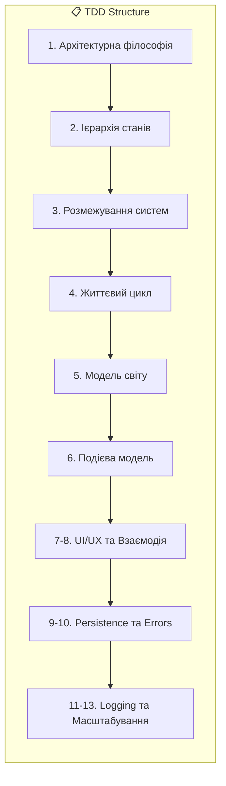

Цей TDD:
- є основою для архітектурних рішень
- містить UML-діаграми (Mermaid) для візуалізації
- є живим документом, що оновлюється з розвитком проєкту
- є основою для **Implementation TDD** та **Service Contracts**

---

## 1. АРХІТЕКТУРНА ФІЛОСОФІЯ ГРИ

### 1.1. Загальний підхід

**Call of Relics: Orbital Silence** проєктується як:

- однокористувацька RPG
- з довготривалим прогресом
- з чітко контрольованими станами
- з поступовим розширенням світу

Архітектура гри має:
- передбачувану поведінку
- детерміновані переходи між станами
- мінімальну кількість “прихованих” побічних ефектів

---

### 1.2. Принцип “State-driven Game”

Гра керується **станами**, а не подіями.

Будь-яка значуща дія:
- відбувається *в межах дозволеного стану*
- або відхиляється системою

Стан гри:
- визначає, *що дозволено*
- визначає, *які системи активні*
- визначає, *який контент присутній*

Це стосується:
- входу / виходу з гри
- завантаження світу
- телепортації
- сканування
- збереження прогресу

---

### 1.3. Server-authoritative модель (узагальнено)

Навіть у однокористувацькій грі:

- **сервер є джерелом істини**
- клієнт є відображенням стану
- прогрес ніколи не “вирішується” на клієнті

Це гарантує:
- цілісність даних
- стабільні збереження
- однакову поведінку в усіх сесіях

---

### 1.4. Принцип ізоляції контенту

У будь-який момент часу:

- активний лише **один контекст світу**
- попередній контекст повністю деактивується
- ресурси не “накладаються” один на одного

Це означає:
- або корабель на орбіті
- або корабель приземлений + одна локація
- або перехід між станами

Ніколи:
- декілька планет
- декілька активних локацій
- змішані Lighting / Sky / фізика

---

### 1.5. Архітектура як основа контенту

Контент (планети, локації, аркади):

- не керує архітектурою
- підключається до неї
- підкоряється загальним правилам

Архітектура має пережити:
- нові типи локацій
- нові планети
- нові механіки
без переписування ядра.

---

## 2. ІЄРАРХІЯ ІГРОВИХ СТАНІВ

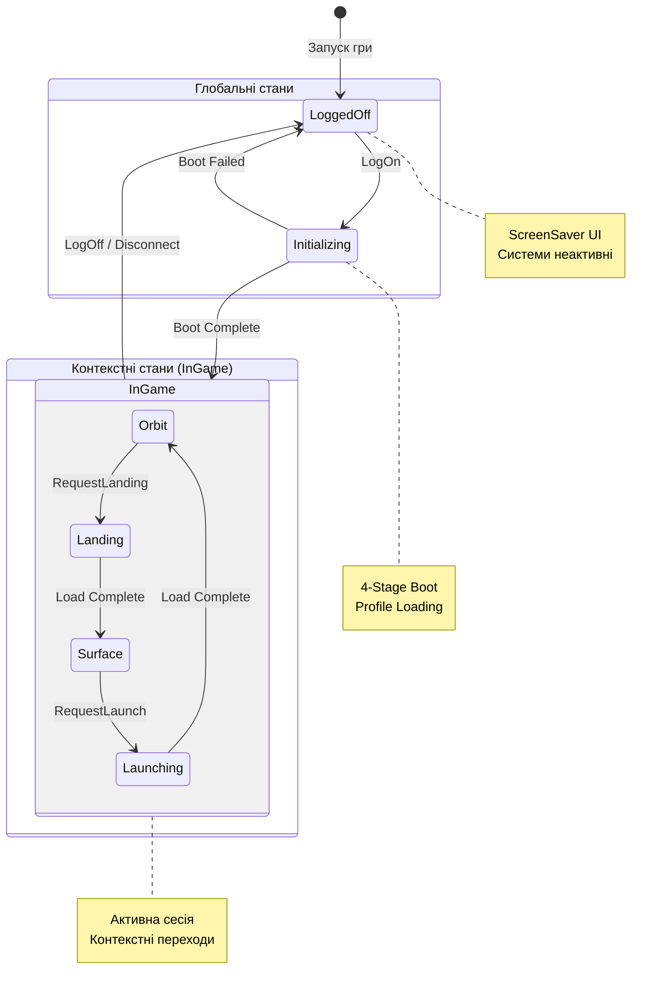

### 2.1. Поділ станів

Ігрові стани поділяються на **два рівні**:

1. **Глобальні стани гри**  
   (існування сесії гравця)

2. **Контекстні стани світу**  
   (де і в якому режимі відбувається гра)

Ці рівні **не замінюють один одного**,
а працюють **одночасно**.

---

### 2.2. Глобальні стани гри (Global Game States)

Глобальні стани описують,
чи гравець *взагалі перебуває у грі*.

Базові глобальні стани:

- **Поза грою**  
  (Logged Off / ScreenSaver)
- **Ініціалізація**  
  (Boot / Load / Restore)
- **У грі**  
  (Активна сесія)

Ці стани керують:
- доступністю UI
- активністю персонажа
- дозволом на збереження
- запуском і зупинкою систем

---

### 2.3. Контекстні стани світу (World / Level States)

Контекстні стани описують,
*у якому ігровому середовищі перебуває гравець*.

Приклади таких станів:

- Орбітальний контекст
- Приземлений контекст
- Активна локація
- Перехід між контекстами

Контекстний стан визначає:
- який контент завантажено
- які системи активні
- які дії дозволені

---

### 2.4. Заборонені переходи

Архітектура **навмисно обмежує** деякі переходи.

Наприклад:
- неможливо сканувати з поверхні
- неможливо телепортуватися під час переходу
- неможливо змінювати планету без орбіти

Ці обмеження:
- не “if-перевірки”
- а наслідок поточного стану

---

### 2.5. Єдиний координатор станів

Переходи між станами:
- не розпорошені по системах
- не ініціюються напряму контентом

Існує **єдиний координатор станів**,
який:
- приймає запити
- перевіряє дозволи
- виконує перехід
- повідомляє підсистеми

Це запобігає:
- race conditions
- подвійним ініціалізаціям
- “залипанню” світу

---
## 3. РОЗМЕЖУВАННЯ ВІДПОВІДАЛЬНОСТЕЙ СИСТЕМ

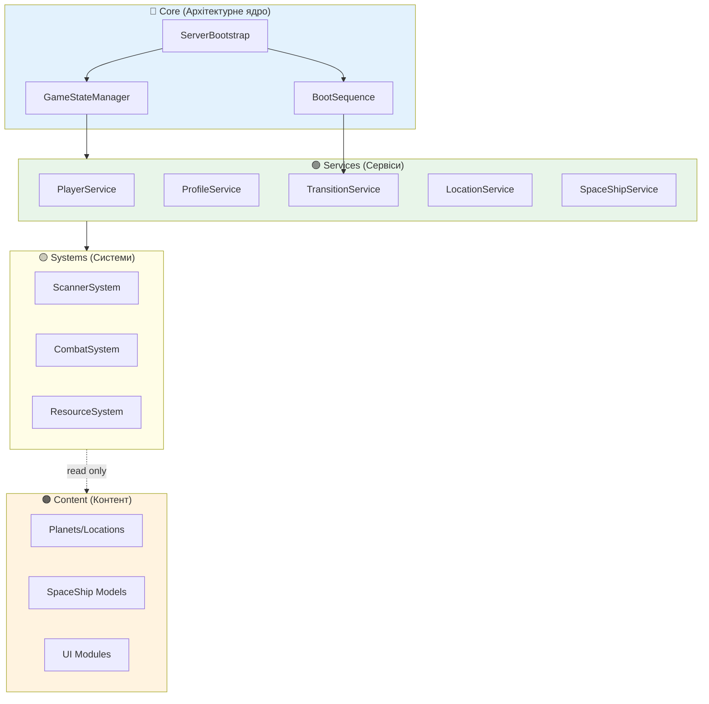

Цей розділ визначає, **які типи логіки існують у грі**
та **як вони мають бути відокремлені між собою**.

Мета — уникнути:
- монолітних скриптів
- прихованих залежностей
- логіки "випадково тут"

---

### 3.1. Поняття “Система”

**Система** — це логічна частина гри, яка:

- відповідає за одну функціональну область
- не знає деталей реалізації інших систем
- реагує на зміни станів або дозволені запити
- не керує життєвим циклом гри самостійно

Приклади систем (узагальнено):
- система сканування
- система телепортації
- система збереження
- система локацій
- система UI

Система:
- **не приймає глобальних рішень**
- **не ініціює переходи станів напряму**
- працює в межах дозволеного контексту

---

### 3.2. Поняття “Сервіс”

**Сервіс** — це координаційна або інфраструктурна одиниця,
яка:

- має довготривале існування
- знає про поточний стан гри
- керує доступом до ресурсів або даних
- надає чітко визначений контракт

Сервіси зазвичай:
- ініціалізуються під час boot
- завершують роботу при виході з гри
- є єдиними для сесії гравця

Сервіс **може**:
- взаємодіяти з кількома системами
- перевіряти дозволи
- виконувати валідацію

Сервіс **не повинен**:
- містити ігровий контент
- залежати від конкретної локації
- мати UI-логіку

---

### 3.3. Поняття “Контент”

**Контент** — це дані та сценарії,
які наповнюють гру,
але **не керують її архітектурою**.

До контенту належать:
- планети
- планетні локації
- аркадні сценарії
- сюжетні об’єкти
- ресурси
- NPC

Контент:
- підключається до систем
- виконується за правилами архітектури
- не має права змінювати глобальні стани напряму

Таким чином:
> Архітектура керує контентом,  
> а не контент архітектурою.

---

### 3.4. Принцип “Запит → Перевірка → Дозвіл”

Будь-яка значуща дія у грі
проходить через один логічний шлях:

1. **Запит**  
   (гравець або система ініціює дію)

2. **Перевірка**  
   (чи дозволяє поточний стан гри цю дію)

3. **Дозвіл або відмова**  
   (дія виконується або відхиляється)

Цей принцип:
- унеможливлює “зламані” переходи
- централізує контроль
- спрощує дебаг

---

### 3.5. Заборонені анти-патерни

Архітектурно забороняється:

- системам напряму змінювати стан гри
- контенту ініціювати завантаження світу
- UI напряму викликати логіку світу
- логіці локації зберігати прогрес самостійно

Усі ці дії:
- проходять через сервіс або координатор

---

## 4. ЖИТТЄВИЙ ЦИКЛ ГРИ (GAME LIFECYCLE)

Цей розділ описує **повний життєвий цикл гри**
від моменту запуску до завершення сесії.

### 4.0. Boot Sequence Protocol

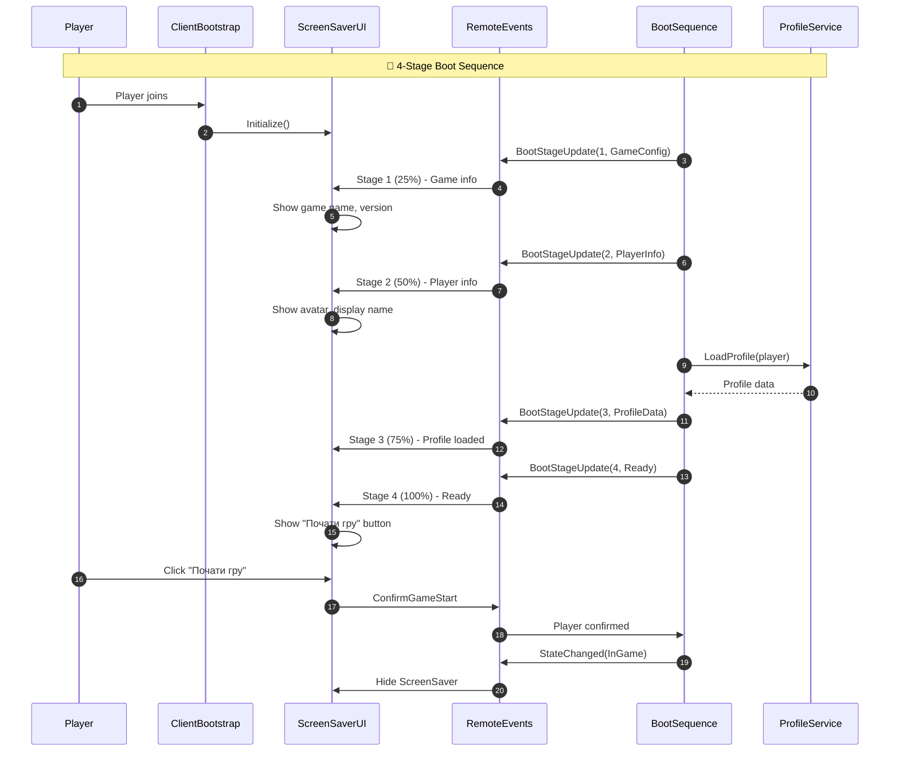

---

### 4.1. Фази життєвого циклу

Життєвий цикл гри складається з таких фаз:

1. Поза грою (ScreenSaver)
2. Ініціалізація (Boot) — **4-stage server-driven sequence**
3. Відновлення контексту
4. Активна гра
5. Призупинення або завершення

Ці фази є **послідовними**,
але деякі з них можуть повторюватися.

---

### 4.2. Фаза “Поза грою”

У фазі **Поза грою**:

- ігровий світ не активний
- контент не завантажений
- гравець не впливає на прогрес

Ця фаза використовується:
- перед початком гри
- після добровільного виходу
- після втрати з’єднання

Функціонально це:
- екран очікування
- екран ідентифікації гравця
- екран готовності до старту

---

### 4.3. Фаза ініціалізації (Boot)

Фаза Boot відповідає за:

- створення ігрової сесії
- підготовку сервісів
- завантаження збереженого контексту
- перевірку цілісності даних

На цій фазі:
- **не відображається ігровий світ**
- **не дозволені ігрові дії**
- будь-яка помилка повертає гру у “Поза грою”

Boot є:
- контрольованою
- відновлюваною
- безпечною фазою

---

### 4.4. Відновлення контексту гри

Після успішного Boot:

- відновлюється місце перебування гравця
- відновлюється стан корабля
- відновлюється прогрес планет і локацій

Важливо:
- відновлюється **контекст**, а не “мить дії”
- гравець завжди повертається у стабільний стан
  (наприклад, корабель на орбіті)

Це запобігає:
- відновленню посеред аркади
- некоректним станам світу

---

### 4.5. Активна гра

Фаза активної гри — основний ігровий цикл.

У цій фазі:
- дозволені всі дії відповідно до станів
- активні системи світу
- можливі переходи між контекстами

Активна гра:
- може тривати довго
- може перериватися
- має регулярні точки стабілізації

---

### 4.6. Призупинення та завершення

Гра може бути призупинена або завершена:

- добровільним виходом гравця
- втратою з’єднання
- системною подією

У будь-якому випадку:
- прогрес зберігається
- стан фіксується
- сесія завершується коректно

---

### 4.7. Життєвий цикл як контракт

Життєвий цикл гри є **контрактом**,
якому підкоряються:

- усі системи
- увесь контент
- усі UI-модулі

Жодна частина гри
не може існувати поза цим циклом.

---
## 5. МОДЕЛЬ СВІТУ ТА КОНТЕНТНИХ КОНТЕЙНЕРІВ

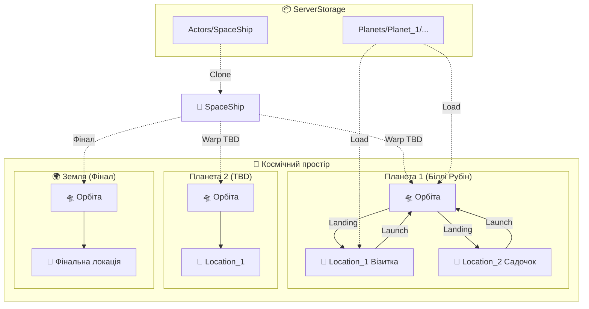

Цей розділ описує **узагальнену модель ігрового світу** та правила
організації контенту без прив'язки до конкретних рушійних об'єктів.

Мета — створити світ, який:
- легко масштабується
- має чітку ієрархію
- не допускає змішування контекстів

---

### 5.1. Світ як сукупність контекстів

Ігровий світ не є суцільним простором.
Він складається з **контекстів**, які взаємовиключні.

Контекст:
- це активне середовище гри
- має власні правила
- має власний набір активних систем
- має чіткий початок і завершення

У будь-який момент часу:
- активний **рівно один** контекст світу

---

### 5.2. Базові типи контекстів

У грі визначаються такі базові контексти:

- **Орбітальний контекст**
  - корабель у космосі
  - доступ до стратегічних систем
  - відсутність прямого ризику

- **Контекст приземлення**
  - корабель у безпечній зоні
  - обмежений доступ до систем
  - підготовка до дослідження

- **Контекст активної локації**
  - аркадна ігрова зона
  - власні правила і ризики
  - обмежений зв’язок із кораблем

- **Перехідний контекст**
  - тимчасовий
  - блокує дії
  - забезпечує коректну зміну станів

Ці контексти не перекриваються.

---

### 5.3. Планета як логічний контейнер

**Планета** — це логічний контейнер контенту, а не ігровий рівень.

Планета:
- об’єднує кілька локацій
- визначає візуальні та фізичні параметри
- є одиницею навігації у світі

Гравець:
- не перебуває “на планеті” напряму
- завжди перебуває або на орбіті, або в конкретній локації

---

### 5.4. Планетна локація як одиниця геймплею

**Локація** — це мінімальна одиниця активного геймплею.

Локація:
- має власні правила
- має власний сценарій
- має визначений тип
- має чіткі критерії завершення

Локація:
- не знає про інші локації
- не керує світом
- не зберігає прогрес самостійно

---

### 5.5. Космічний корабель як спеціальний контекст

Космічний корабель є **особливим контекстом**.

Він:
- не є планетною локацією
- не є аркадою
- є стабільною точкою повернення

Корабель:
- є точкою спавну
- є точкою збереження
- є центром прийняття рішень

З архітектурної точки зору:
> корабель — це “безпечний хаб”,  
> який існує поза ризиковими контекстами.

---

### 5.6. Принцип повного очищення контексту

При зміні контексту:

- попередній контекст повністю деактивується
- усі тимчасові об’єкти знищуються
- жоден стан не “протікає” у новий контекст

Цей принцип:
- запобігає накопиченню помилок
- полегшує відлагодження
- робить перезапуск рівня безпечним

---

## 6. ПОДІЄВА МОДЕЛЬ ТА МОДЕЛЬ СТАНІВ

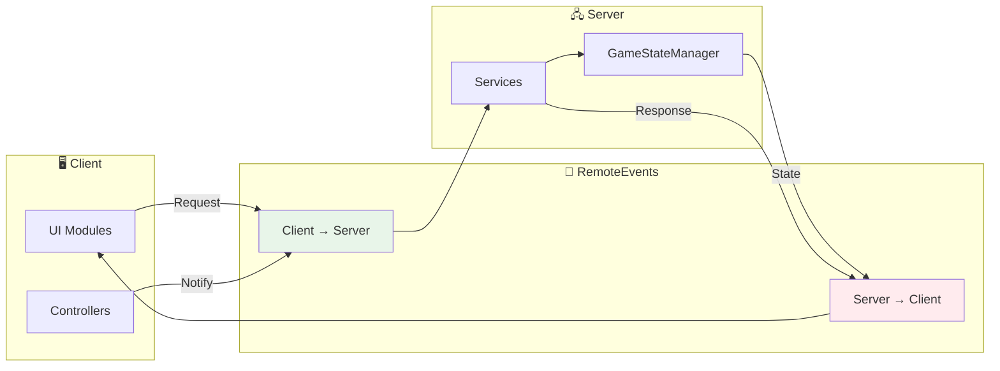

### RemoteEvents Protocol

| Direction | Event | Purpose |
|-----------|-------|---------|
| C→S | ConfirmGameStart | Player ready to start |
| C→S | RequestLanding | Request landing on location |
| C→S | RequestLaunch | Request launch to orbit |
| C→S | RequestScan | Start scanning |
| S→C | StateChanged | Global state transition |
| S→C | BootStageUpdate | Boot progress |
| S→C | TransitionUpdate | Landing/Launch progress |
| S→C | ScanProgress | Scan percentage |

Цей розділ пояснює співвідношення
між **подіями** та **станами** у грі.

---

### 6.1. Події не є джерелом істини

У грі події:
- є **сигналами**
- не є джерелом стану
- не повинні змінювати логіку самі по собі

Подія означає:
> “Щось сталося”  
але не означає:  
> “Світ тепер інший”

---

### 6.2. Стан — єдине джерело істини

**Стан** описує:
- де перебуває гравець
- що дозволено
- які системи активні
- який контент присутній

Будь-яка система:
- спочатку читає стан
- лише потім реагує на події

---

### 6.3. Типи подій

Події умовно поділяються на:

- **Події запиту**
  - ініційовані гравцем або UI
  - потребують перевірки дозволів

- **Події підтвердження**
  - сигналізують про завершення дії
  - не змінюють стан напряму

- **Системні події**
  - пов’язані з життєвим циклом
  - ініціюються архітектурою

---

### 6.4. Ланцюг “Подія → Перевірка → Стан”

Коректний архітектурний ланцюг:

1. Виникає подія (запит)
2. Координатор перевіряє поточний стан
3. Якщо дозволено — ініціюється зміна стану
4. Після зміни стану системи реагують

Зміна стану **завжди передує** ігровим наслідкам.

---

### 6.5. Заборона “реактивного хаосу”

Архітектура навмисно уникає ситуацій, де:

- багато систем реагують на одну подію
- порядок реакцій не визначений
- результат залежить від таймінгу

Натомість:
- є чітка точка зміни стану
- є послідовний порядок оновлення
- системи реагують на *факт* нового стану

---

### 6.6. Переваги стано-орієнтованої моделі

Цей підхід:
- зменшує кількість багів
- спрощує тестування
- полегшує масштабування
- робить поведінку гри передбачуваною

Особливо важливо для:
- багаторівневих ігор
- довготривалих сесій
- RPG з persistence

---
## 7. ПРИНЦИПИ UI / UX АРХІТЕКТУРИ

Цей розділ описує **архітектурні принципи побудови інтерфейсу**
та його взаємодію з ігровими станами.

UI у цій грі не є “обгорткою над логікою” —
він є **відображенням поточного стану гри**.

---

### 7.1. Поділ UI за контекстами

Інтерфейс гри поділяється на **контекстні шари**,
які взаємовиключні або ієрархічні.

Основні UI-контексти:

- **UI поза грою (ScreenSaver UI)**
- **UI активної гри (In-Game UI)**
- **Контекстні інтерфейси**
  (меню телепортації, вибору, підтверджень)

У будь-який момент часу:
- активний лише той UI,
  який відповідає поточному глобальному та контекстному стану

---

### 7.2. ScreenSaver UI (Поза грою)

ScreenSaver UI відповідає глобальному стану **“Поза грою”**.

Його призначення:
- візуальна заставка гри
- ідентифікація гравця
- запрошення до початку гри

ScreenSaver UI:
- не має доступу до ігрових систем
- не ініціює ігрові дії
- не змінює стан світу напряму

Єдина дозволена дія:
- **запит на початок гри**

---

### 7.3. In-Game UI (Активна гра)

In-Game UI активується лише у глобальному стані **“У грі”**.

Він:
- відображає інформацію про стан світу
- показує доступні дії
- інформує, але не керує напряму

In-Game UI:
- не “вирішує”, що можна зробити
- лише показує те, що дозволено станом

Таким чином:
> UI не диктує геймплей,  
> UI його пояснює.

---

### 7.4. Контекстні інтерфейси

Контекстні інтерфейси:
- з’являються лише за певних умов
- прив’язані до конкретного контексту
- автоматично зникають при зміні стану

Приклади:
- меню телепортації
- меню вибору локації
- інформаційні вікна

Контекстний UI:
- не зберігає власного стану
- повністю залежить від ігрового стану
- не існує поза дозволеним контекстом

---

### 7.5. Принцип “UI як читач стану”

Архітектурно:
- UI **читає** стан гри
- UI **реагує** на зміну стану
- UI **не змінює** стан напряму

Будь-яка дія гравця через UI:
1. Формує запит
2. Передається у логіку гри
3. Або дозволяється, або відхиляється
4. UI оновлюється відповідно до нового стану

---

### 7.6. Відмова від “розумного UI”

UI **не повинен**:
- містити бізнес-логіку
- дублювати перевірки станів
- приймати рішення за гру

Це спрощує:
- підтримку
- тестування
- повторне використання UI

---

## 8. МОДЕЛЬ ВЗАЄМОДІЇ ГРАВЦЯ ЗІ СВІТОМ

Цей розділ описує **універсальну модель взаємодії**
між гравцем та ігровим світом.

---

### 8.1. Гравець як ініціатор запитів

Гравець **ніколи не змінює світ напряму**.

Він:
- ініціює запити
- отримує результати
- адаптує свою поведінку

Гравець не “активує систему” —
він **просить виконати дію**.

---

### 8.2. Типи взаємодій

Узагальнено, усі взаємодії поділяються на:

- **Навігаційні**
  - переміщення між контекстами
- **Інформаційні**
  - запит даних
- **Сценарні**
  - запуск аркад
- **Системні**
  - збереження, вихід, підтвердження

Кожен тип:
- має свої обмеження
- дозволений лише у відповідних станах

---

### 8.3. Запит як атомарна дія

Запит гравця:
- є атомарним
- або виконується повністю
- або не виконується зовсім

Часткове виконання:
- заборонене
- призводить до неконсистентних станів

---

### 8.4. Обмеження як частина дизайну

Обмеження у взаємодії:
- не є “штучними”
- є наслідком поточного стану гри

Приклади:
- неможливо сканувати на поверхні
- неможливо телепортуватися під час переходу
- неможливо змінювати планету без орбіти

Обмеження:
- пояснюються UI
- не приховуються від гравця

---

### 8.5. Зворотний зв’язок гравцю

Кожен запит гравця має мати результат:

- **дозволено**
- **відхилено з поясненням**
- **відкладено (очікування)**

Гравець:
- завжди розуміє, що відбувається
- не залишається у “тиші системи”

---

### 8.6. Принцип відповідальності гравця

Гравець:
- сам приймає рішення
- сам несе наслідки
- сам формує темп гри

Архітектура:
- не рятує від усіх помилок
- але гарантує чесність і передбачуваність

---
## 9. ПРИНЦИПИ ЗБЕРЕЖЕННЯ ТА ВІДНОВЛЕННЯ ПРОГРЕСУ (PERSISTENCE)

Цей розділ описує **архітектурні принципи збереження прогресу гри**
як невід’ємну частину однокористувацької RPG.

Збереження прогресу розглядається не як технічна деталь,
а як **контракт між грою та гравцем**.

---

### 9.1. Persistence як частина дизайну

У **Call of Relics: Orbital Silence**:

- прогрес належить гравцю
- прогрес не є тимчасовим
- прогрес має сенс лише у довготривалій перспективі

Тому система збереження:
- проектується з самого початку
- впливає на архітектуру станів
- визначає безпечні точки гри

---

### 9.2. Що вважається прогресом

Архітектурно прогрес поділяється на кілька категорій:

- **Контекст світу**
  - поточна планета
  - доступні планети
- **Контекст локацій**
  - виявлені локації
  - відвідані локації
  - досліджені локації
- **Контекст корабля**
  - розвиток модулів
  - доступні системи
- **Контекст гравця**
  - знання
  - ресурси
  - сюжетні відкриття

Усі ці дані:
- логічно пов’язані
- зберігаються разом
- відновлюються як єдиний контекст

---

### 9.3. Принцип “безпечної точки”

Гра визначає **безпечні точки збереження** —
моменти, коли стан світу є стабільним.

Базова безпечна точка:
- гравець знаходиться на космічному кораблі

Додаткові безпечні точки:
- завершення локації
- повернення на орбіту
- добровільний вихід з гри

Гра **не зберігає прогрес**:
- у середині аркади
- у перехідному стані
- під час зміни контексту

Це запобігає:
- пошкодженим збереженням
- відновленню у небезпечних станах

---

### 9.4. Відновлення як реконструкція контексту

Відновлення гри:
- не є “поверненням у момент”
- є реконструкцією стабільного контексту

При завантаженні:
- відновлюється корабель
- відновлюється планета
- відновлюється доступний контент

Гравець завжди повертається:
- у передбачуваний стан
- у контрольоване середовище

---

### 9.5. Persistence незалежна від UI та контенту

Система збереження:
- не залежить від UI
- не залежить від типів локацій
- не залежить від конкретних аркад

Контент **не має права**:
- самостійно зберігати прогрес
- змінювати структуру збережень

---

## 10. ОБРОБКА ПОМИЛОК ТА ВІДМОВОСТІЙКІСТЬ

Цей розділ визначає,
як гра поводиться у випадку помилок,
збоїв або непередбачених ситуацій.

---

### 10.1. Філософія відмовостійкості

Основний принцип:
> **Гра має ніколи не ламати прогрес гравця.**

Помилки:
- можливі
- очікувані
- не катастрофічні

Архітектура повинна:
- локалізувати помилки
- зберігати цілісність стану
- відновлюватися до безпечного контексту

---

### 10.2. Класи помилок

Узагальнено помилки поділяються на:

- **Помилки запиту**
  - недозволена дія
  - неправильний контекст
- **Помилки систем**
  - неготовий сервіс
  - внутрішній збій
- **Помилки даних**
  - неконсистентний стан
  - відсутні дані

Кожен клас:
- має власну стратегію реакції
- не впливає на інші класи

---

### 10.3. Fail-safe стани

У разі серйозної помилки гра:

- припиняє поточну дію
- скасовує перехід
- повертається у безпечний стан

Базовий fail-safe стан:
- космічний корабель на орбіті

Цей стан:
- не потребує складних умов
- завжди може бути ініціалізований
- не загрожує прогресу

---

### 10.4. Заборона “тихих збоїв”

Архітектурно заборонено:

- ігнорувати помилки
- “ковтати” винятки
- залишати гру у невідомому стані

Кожна помилка:
- фіксується
- має наслідок
- призводить до передбачуваної поведінки

---

### 10.5. Повідомлення гравцю

Гравець:
- не повинен бачити технічних деталей
- але повинен розуміти, що сталося

Повідомлення гравцю:
- лаконічні
- контекстні
- не лякають

Приклади:
- “Дію неможливо виконати зараз”
- “Система тимчасово недоступна”
- “Повернення до безпечного стану”

---

### 10.6. Архітектурна готовність до розвитку

Система обробки помилок:
- не є одноразовою
- розрахована на ускладнення гри
- підтримує нові системи

Це дозволяє:
- безпечно додавати контент
- не боятися експериментів
- зберігати стабільність ядра

---
## 11. ЛОГУВАННЯ, ДІАГНОСТИКА ТА ДЕБАГ

Цей розділ визначає **єдиний стандарт логування та діагностики**
для всієї кодової бази гри **Call of Relics: Orbital Silence**.

Логування розглядається як:
- інструмент розуміння поведінки гри
- джерело даних для післяаналізу
- канал взаємодії з AI-асистентами

---

### 11.1. Призначення логування

Логи використовуються для:

- аналізу життєвого циклу гри
- діагностики помилок і збоїв
- перевірки коректності переходів станів
- аналізу сесій гравця
- автоматизованого аналізу (AI-assisted debugging)

Логи **не призначені** для:
- спаму
- дублювання станів UI
- виводу внутрішніх структур даних без потреби

---

### 11.2. Стандарт логування (Roblox-native)

У грі використовується **виключно стандартне логування Roblox**:

- `print()` — інформаційні повідомлення
- `warn()` — попередження, некритичні проблеми
- `error()` — критичні помилки з перериванням виконання

Жодних кастомних лог-фреймворків на рівні v0 архітектури не вводиться.

Це забезпечує:
- сумісність з Roblox Studio
- просте копіювання логів
- уніфікований формат Output

---

### 11.3. Формат лог-повідомлень

Усі лог-повідомлення повинні бути:

- **максимально стислими**
- **синтаксично однозначними**
- **людино- та машинозчитуваними**

Рекомендований формат:

[ModuleName X.Y][Function] Message

### 11.4. Використання емодзі та інфознаків

Емодзі та інфознаки **дозволені**, але з обмеженнями.

Правила:
- використовуються **лише для важливих подій**
- не використовуються у кожному повідомленні
- не замінюють текстову інформацію

Причина:
- емодзі впливають на **візуальний аналіз**
- не впливають на **семантичний аналіз**
- надлишок емодзі ускладнює AI-парсинг

Приклади допустимих випадків:
- старт гри
- успішна ініціалізація
- критичний збій
- завершення сесії

---

### 11.5. Output як джерело істини

Усі логи:

- виводяться у Roblox Studio Output
- копіюються у текстовий файл `Output.txt`
- можуть бути проаналізовані:
  - вручну
  - зовнішніми інструментами
  - AI-асистентами

Тому:
- формат має бути стабільним
- повідомлення — без “шуму”
- структура — передбачувана

---

## 11.6. Ініціалізаційні логи (Init Logging)

Кожен скрипт або модуль **зобов’язаний**:

- мати явну `init` / `Initialize` фазу
- під час ініціалізації залогувати:
  - назву модуля
  - номер версії

Це дозволяє:
- бачити порядок завантаження
- виявляти пропущені або дубльовані ініціалізації
- корелювати логи між сесіями

---

## 11.7. Діагностичні коментарі скриптів (Обов’язковий стандарт)

Кожен скрипт у проєкті **повинен** містити
детальний вступний коментар за стандартним шаблоном.

Цей коментар є:
- частиною архітектури
- джерелом правди для розробника
- точкою входу для AI-аналізу коду

---

### 11.8. Стандартний шаблон вступного коментаря скрипта

Усі скрипти повинні починатися з коментаря такого типу:


--[[
================================================================================
KOSMICMAZER — <Module Name>
================================================================================

Purpose:
<Короткий опис призначення модуля>

Version:
<X.Y>

Features:
- <Feature 1>
- <Feature 2>
- ...

API:
- <FunctionName>(...) — <Description>
- ...

Calls to:
- <Service / Module>
- ...

Called from:
- <System / Script>
- ...

Events:
- <Event> — <Description>
- ...

Dependencies:
- <Dependency 1>
- <Dependency 2>

ChangeLog:
- X.Y: <Description> (YYYY-MM-DD)
- ...
================================================================================
]]

### 11.9. ChangeLog як обов’язковий елемент

Кожна значуща зміна модуля:
відображається у ChangeLog
містить версію
містить короткий опис
містить дату

Це дозволяє:
відстежувати еволюцію модуля
співставляти зміни з логами
спрощувати регресійний аналіз

### 11.10. Логування як контракт команди

Логування та діагностика:
не є “опцією”
не є “потім”
є частиною Definition of Done
Будь-який код без:
коректного логування
вступного коментаря
версії модуля
вважається архітектурно неповним.

## 12. МАСШТАБУВАННЯ ТА ЕВОЛЮЦІЯ АРХІТЕКТУРИ

Цей розділ описує,
як архітектура гри **Call of Relics: Orbital Silence**
повинна розвиватися з часом,
не втрачаючи цілісності та передбачуваності.

---

### 12.1. Архітектура як стабільне ядро

Архітектура v0 розглядається як **стабільне ядро** гри.

Це означає:
- ядро змінюється рідко
- більшість нововведень додаються *навколо* нього
- не допускаються “швидкі рішення”, що ламають принципи

Архітектура повинна:
- пережити додавання десятків планет
- підтримувати нові типи локацій
- приймати нові системи без переробки основ

---

### 12.2. Додавання нових систем

Нова система може бути додана,
якщо вона:

- має чітке призначення
- працює в межах наявних станів
- не ініціює переходи станів напряму
- не залежить від конкретного контенту

Кожна нова система:
- інтегрується через координатор
- підкоряється життєвому циклу гри
- використовує існуючі контракти

---

### 12.3. Додавання нового контенту

Новий контент (планети, локації, аркади):

- не потребує змін архітектури
- підключається декларативно
- використовує наявні типи та правила

Контент:
- не створює нові стани
- не порушує інваріанти
- не змінює життєвий цикл гри

Якщо контент *вимагає* зміни архітектури —
це сигнал до архітектурного перегляду,
а не до локального “хака”.

---

### 12.4. Еволюція без лому сумісності

Зміни архітектури повинні:

- бути зворотно сумісними
- мати перехідний період
- супроводжуватися документацією

Особливо це стосується:
- систем збереження
- глобальних станів
- контрактів між системами

---

### 12.5. Контроль складності

Ключовий ризик масштабування — **накопичення складності**.

Архітектура протидіє цьому через:
- чіткі межі відповідальності
- мінімальну кількість глобальних рішень
- централізовану зміну станів

Будь-яке ускладнення повинно:
- мати обґрунтування
- приносити реальну цінність
- не порушувати базові принципи

---

## 13. МЕЖІ ВІДПОВІДАЛЬНОСТІ TDD v0

Цей розділ чітко визначає,
**що входить** і **що не входить**
до Technical Design Document версії v0.

---

### 13.1. Що описує TDD v0

TDD v0 описує:

- архітектурну філософію гри
- модель ігрових станів
- життєвий цикл гри
- розмежування систем, сервісів і контенту
- принципи UI / UX
- модель взаємодії гравця зі світом
- принципи збереження прогресу
- обробку помилок і відмовостійкість
- стандарти логування та діагностики

Це **концептуальний документ**.

---

### 13.2. Що навмисно НЕ входить у TDD v0

TDD v0 **не описує**:

- конкретні Roblox API
- структуру папок проєкту
- назви скриптів або класів
- конкретні алгоритми
- реалізацію DataStore
- UI-макети
- конкретні RemoteEvent / RemoteFunction

Ці аспекти будуть описані в окремих документах.

---

### 13.3. Обов'язкові вимоги до структури проєкту

#### 13.3.1. Організація "якірних" папок для Script Sync

**КРИТИЧНА ВИМОГА:**

Roblox Studio Script Sync синхронізує код **виключно всередині конкретних контейнерів**, які існують у DataModel.

Це означає:

- **Усі скрипти повинні знаходитися у відповідних контейнерах** у Roblox Studio:
  - `ServerScriptService` — для серверних скриптів
  - `ReplicatedStorage` — для загальних модулів
  - `StarterPlayer.StarterPlayerScripts` — для клієнтських скриптів
  - `StarterGui` — для UI-скриптів

- **Перед початком синхронізації** необхідно створити базову структуру папок у Roblox Studio DataModel

- **Файлова система проєкту** має дзеркально відображати структуру DataModel

- **Script Sync не створює контейнери** — він синхронізує лише вміст існуючих

**Наслідки:**

- Структура проєкту має бути узгоджена між файловою системою та Roblox Studio
- Зміна структури вимагає синхронного оновлення обох сторін
- Будь-які нові модулі мають розміщуватися у правильних контейнерах

**Відповідальність:**

- При створенні нових систем / сервісів необхідно спочатку визначити їх місце у DataModel
- Implementation TDD має враховувати цю вимогу при проектуванні структури

---

#### 13.3.2. Поточна структура проєкту (v0.14)

```mermaid
flowchart TB
    subgraph SSS["📁 ServerScriptService"]
        subgraph Core["Core/"]
            GSM[GameStateManager v0.2]
            BS[BootSequence v0.4]
            SB[ServerBootstrap v0.3]
        end
        subgraph Services["Services/"]
            PS[PlayerService v0.2]
            PRS[ProfileService v0.2]
            LS[LocationService v0.7]
            TS[TransitionService v0.8]
            SSS2[SpaceShipService v0.8]
            PSS[PlanetScannerService v0.3]
        end
        subgraph Setup["Setup/"]
            RES[RemoteEventsSetup v0.5]
        end
    end

    subgraph SPS["📁 StarterPlayerScripts"]
        subgraph CoreC["Core/"]
            CB[ClientBootstrap v0.3]
            SC[SeatController v0.2]
            CC[CameraController v0.2]
        end
        subgraph UIM["UI/"]
            SSU[ScreenSaverUI v0.5]
            SBU[StatusBarUI v0.2]
            SUIM[SeatUIManager v0.2]
            TUI[TransitionUI v0.15]
            subgraph SeatUI["SeatUI/"]
                PUI[PilotUI v0.4]
                PSSUI[PlanetScannerUI v0.2]
            end
        end
    end

    subgraph RS["📁 ReplicatedStorage"]
        subgraph Game["Game/"]
            GC[GameConfig v0.9]
            SSC[SpaceShipConfig v0.1]
            TC[TransitionConfig v0.4]
        end
        RE[RemoteEvents/]
    end

    subgraph SS["📁 ServerStorage"]
        Actors[Actors/SpaceShip]
        subgraph Planets["Planets/"]
            P1[Planet_1/]
            P1O[Orbit/Config.luau]
            P1S[Surface/Location_1/Config.luau]
        end
    end
```

**Поточна файлова структура:**

```
ServerScriptService/
├── Core/
│   ├── GameStateManager.lua      -- Єдиний координатор станів (v0.2)
│   ├── BootSequence.lua          -- 4-stage boot sequence (v0.4)
│   └── ServerBootstrap.server.lua -- Точка входу (v0.3)
│
├── Services/
│   ├── PlayerService.lua         -- Керування гравцями (v0.2)
│   ├── ProfileService.lua        -- DataStore integration (v0.2)
│   ├── LocationService.lua       -- Завантаження локацій, LevelController (v0.7)
│   ├── TransitionService.lua     -- Landing/Launch sequences (v0.8)
│   ├── SpaceShipService.lua      -- Ship + Seat management (v0.8)
│   └── PlanetScannerService.lua  -- Scanning system (v0.3)
│
└── Setup/
    └── RemoteEventsSetup.server.lua -- RemoteEvents infrastructure (v0.5)
```

**Принципи організації:**

**Core/** — Стабільне ядро
- Містить координатор станів та bootstrap
- Змінюється рідко (TDD 12.1: "Архітектура як стабільне ядро")
- Не залежить від контенту
- Визначає життєвий цикл гри

**Services/** — Сервіси (TDD 3.2)
- "Має довготривале існування"
- "Ініціалізуються під час boot"
- "Є єдиними для сесії гравця"
- Надають чітко визначений контракт
- Координують між системами

**Systems/** — Системи (TDD 3.1)
- "Відповідає за одну функціональну область"
- "Реагує на зміни станів"
- "Не ініціює переходи станів напряму"
- Працює в межах дозволеного контексту

**Setup/** — Одноразова ініціалізація
- Створення інфраструктури
- Виконується до основного boot
- Не містить ігрової логіки

**Вимоги до синхронізації:**

1. **Спочатку створити структуру в Roblox Studio:**
   - Вручну створити папки Core, Services, Systems, Setup
   - Перемістити існуючі скрипти у відповідні папки
   - Налаштувати Script Sync

2. **Файлова система дзеркалює Studio:**
   - Зміни у Studio → синхронізуються → файлова система
   - Зміни у файловій системі → синхронізуються → Studio

3. **Додавання нових модулів:**
   - Визначити тип (Core / Service / System / Setup)
   - Створити в правильній папці
   - Дотримуватися принципів TDD розділу 3

**Переваги цієї структури:**

- Чітке розмежування відповідальностей
- Легко знайти потрібний модуль
- Масштабується без реорганізації
- Відповідає принципам TDD
- Запобігає "монолітним скриптам" (TDD 3)

---

---

### 13.4. Наступні рівні документації

Після затвердження TDD v0
передбачається створення таких документів:

- **Implementation TDD**
  - конкретні сервіси
  - конкретні API
  - життєвий цикл скриптів

- **Service Contracts**
  - формальні інтерфейси
  - вхідні/вихідні дані
  - помилки та обмеження

- **Content Guidelines**
  - правила створення локацій
  - шаблони аркад
  - баланс та ризики

- **Lore Bible**
  - повний наративний канон
  - рівні відкриття лору

---

### 13.5. Роль TDD v0 у проєкті

TDD v0 є:

- фундаментом архітектури
- точкою узгодження команди
- захистом від хаотичної розробки
- опорою для масштабування

Цей документ:
- не “заморожує” гру
- але задає її рамки
- і визначає, *як* гра може змінюватися

---

## 14. TRANSITION SYSTEM (Реалізація v0.8)

Система переходів забезпечує плавну зміну контекстів між орбітою та поверхнею.

### 14.1. Landing Sequence Protocol

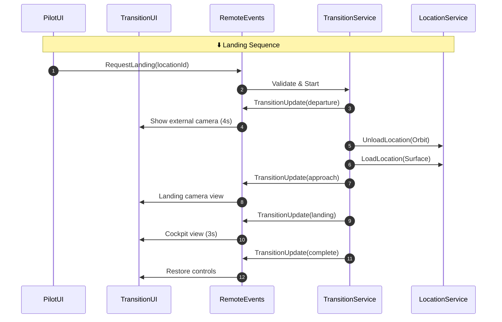

### 14.2. Launch Sequence Protocol

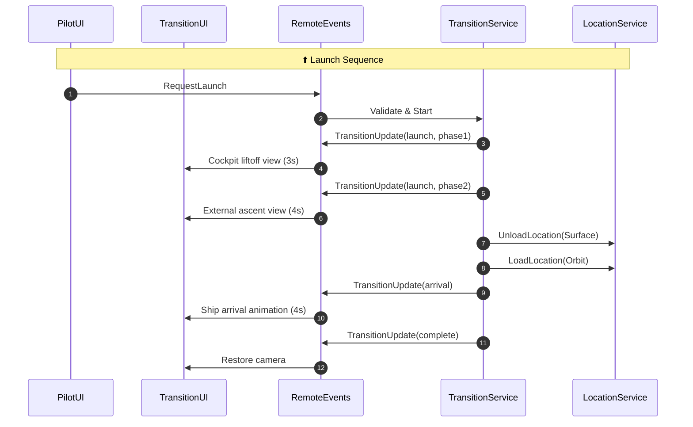

### 14.3. Transition States

| State | Duration | Camera | Description |
|-------|----------|--------|-------------|
| departure | 4s | External | Ship leaving current context |
| approach | 2s | Landing cam | Approaching destination |
| landing | 3s | Cockpit | Final touchdown |
| launch | 3s | Cockpit | Liftoff |
| ascent | 4s | External | Rising to orbit |
| arrival | 4s | Cockpit | Arriving at destination |
| complete | 0s | Player | Controls restored |

---

## 15. SEAT CONTROL SYSTEM (Реалізація v0.2)

Система керування сидіннями корабля для доступу до різних функцій.

### 15.1. SpaceShip Seats Architecture

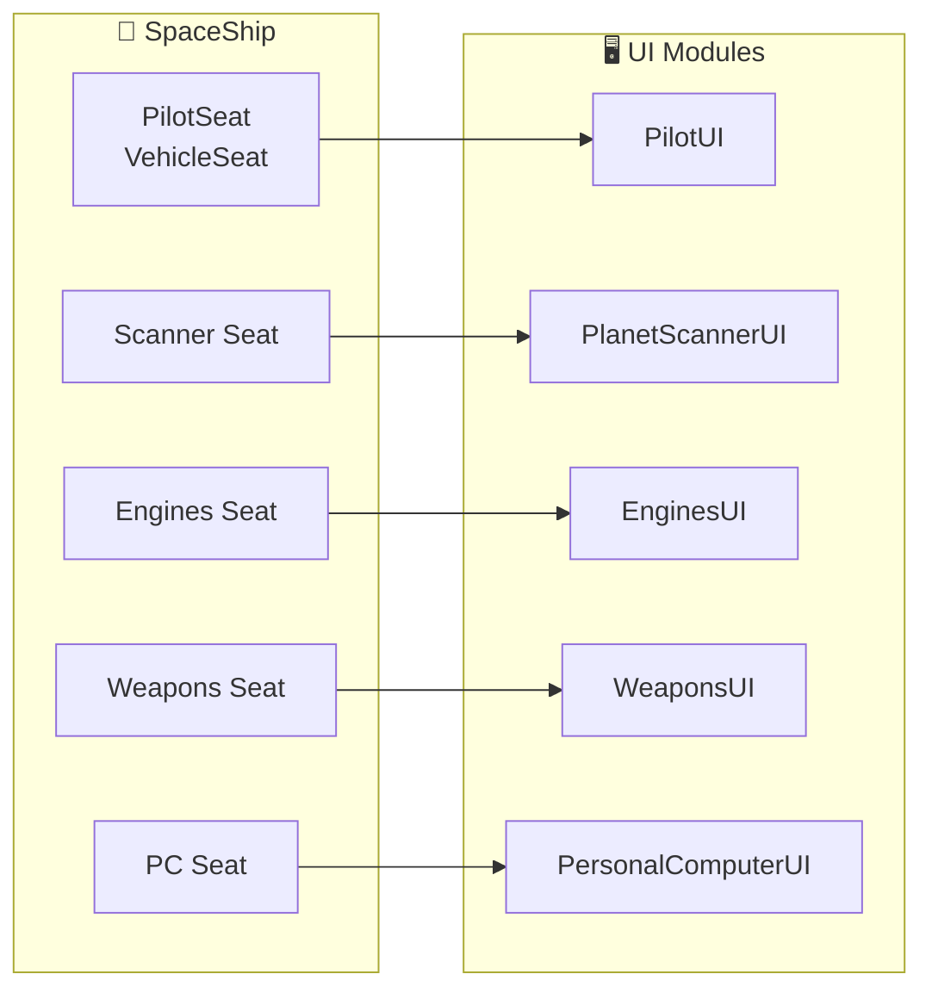

### 15.2. Seat Detection Flow

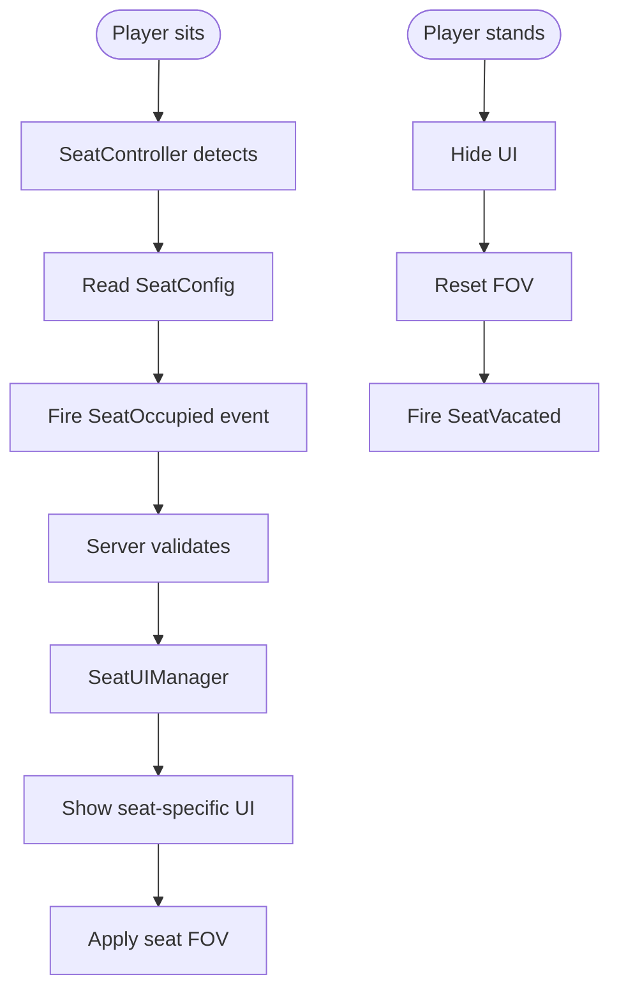

### 15.3. Seat Configuration

| Seat | Display Name | UI Module | FOV | Functionality |
|------|--------------|-----------|-----|---------------|
| PilotSeat | Пілотське крісло | PilotUI | 70 | Navigation, Landing/Launch |
| Seat Engines | Двигуни | EnginesUI | 60 | Engine control |
| Seat Planet Surface Scanner | Сканер поверхні | PlanetScannerUI | 60 | Surface scanning |
| Seat Weapons | Озброєння | WeaponsUI | 70 | Weapons control |
| Seat Personal Computer | Персональний комп'ютер | PersonalComputerUI | 60 | Inventory, Knowledge |

---

## CHANGELOG

| Версія | Дата | Зміни |
|--------|------|-------|
| Draft 0.2 | 2026-01-21 | Додано Mermaid діаграми для всіх основних розділів; оновлено структуру проєкту до v0.14; додано секції Transition System та Seat Control System; оновлено RemoteEvents Protocol |
| Draft 0.1 | 2026-01-11 | Початкова версія архітектурного документа |

---

**КІНЕЦЬ TECHNICAL DESIGN DOCUMENT v0.2**
